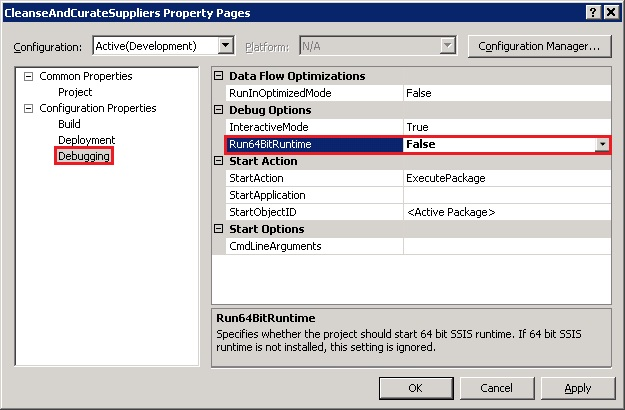
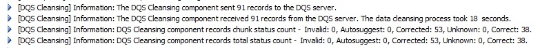
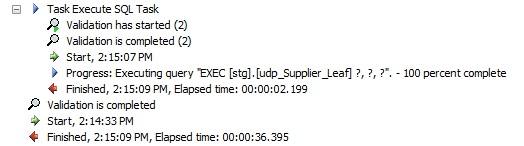

# Task 15: Building and Running the SSIS Project
  In this task, you build and run the SSIS project. If you have the 64-bit version of Excel 2010 installed on your computer, you should set the value of **Run64BitRuntime** to **False** for the Excel source to work.  
  
1.  In the **Solution Explorer** window, click **Project** on the menu, and click **CleanseAndCurateSuppliers Properties**.  
  
2.  In the **Properties** dialog box, expand **Configuration Properties** on left, and click **Debugging**.  
  
3.  Set **Run64BitRuntime** to **False**.  
  
       
  
4.  Click **OK** to close the **Properties** dialog box.  
  
5.  Click **Build** on menu bar and click **Build CleanseAndCurateSuppliers**. Make sure that there are no build errors.  
  
6.  Click **Debug** on the menu bar and click **Start Debugging**.  
  
7.  Review messages in the **Progress** window and verify that package executed and ended successfully.  
  
       
  
       
  
8.  Click **Debug** on menu bar and click **Stop Debugging** to stop the debugging session. If the package fails, you should enable data viewers and see how the data flows between components.  
  
## Next Step  
 [Task 16: Verifying with Master Data Manager](../../2014/tutorials/task-16-verifying-with-master-data-manager.md)  
  
  
