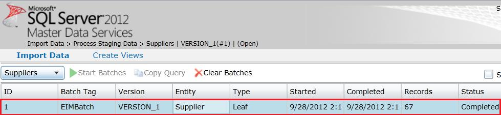

# Task 16: Verifying with Master Data Manager
  In this task, you check the status of the batch job submitted by the SSIS package and verify that the data was uploaded to MDS server by using Master Data Manager.  
  
1.  Launch **Master Data Manager** ([http://localhost/MDS](http://localhost/MDS)). If it is already open, click **Microsoft SQL Server Master Data Services** at the top to switch to the **home page**.  
  
2.  Click **Integration Management**.  
  
3.  Notice that there is a batch with named **EIMBatch** that you submitted in the list. Click **Import Data** on the menu bar if you do not see the following screen.  
  
       
  
4.  Switch back to the home page by click **SQL Server 2012 Master Data Services** at the top.  
  
5.  Make sure that **Suppliers** model is selected for **Model** and **VERSION_1** is selected for **Version**, and click **Explorer**.  
  
6.  You can see the data SSIS package imported into MDS. The data should be cleansed and have no duplicates **Code** values (Note: **SupplierID** column in Excel corresponds to **Code** attribute of Supplier entity in MDS).  
  
## Next Step  
 [Task 17: Reviewing DQS Cleansing Project Created by the SSIS package](../../2014/tutorials/task-17-reviewing-dqs-cleansing-project-created-by-the-ssis-package.md)  
  
  
