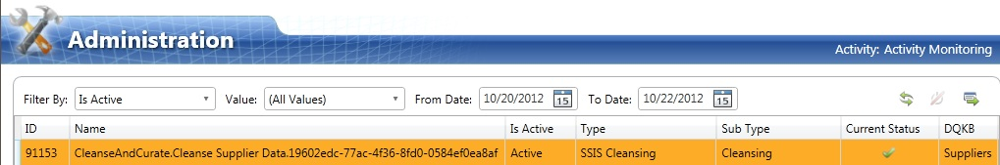

# Task 17: Reviewing DQS Cleansing Project Created by the SSIS package
  In this task, you open the DQS project created by the SSIS package in DQS Client, review the results from the cleansing process, and optionally perform interactive cleansing and export the results.  
  
1.  Launch **Data Quality Client**.  
  
2.  Click **Activity Monitoring** in the **Administration** pane.  
  
3.  Sort the list based on **Activity Start Time** to see the latest record.  
  
4.  Notice that you see a name of the project in the following format: **CleanseAndCurate.Cleanse Supplier Data.GUID**.  
  
       
  
5.  Notice that the value in the **Is Active** field is **Active**.  
  
6.  Click **Profiler** tab in the bottom pane to see profiler statistics for the Cleansing activity that the SSIS package performed.  
  
7.  Click **Close** to close the **Administration** screen.  
  
8.  In the main page of **DQS Client**, click **Open Data Quality Project** in the **Data Quality Projects** pane.  
  
9. In the list of projects, select the project created by SSIS DQS Cleansing component. The name of the project should be in format:  **CleanseAndCurate.Cleanse Supplier Data.GUID (in red color)**. You may need to sort the list based on **Date Created** column and look for the latest record.  
  
10. Click **Next**.  
  
11. The **Manage and View Results** page should be familiar to you from the interactive cleansing you did earlier in this tutorial.  
  
12. Review the cleansing results. You can also perform interactive cleansing and export results to an Excel file or to a database in the next page.  
  
13. Click **Next**. In this **Export** page, you can export results to an excel file, CSV file, or to a SQL database.  
  
14. Click **Finish** to finish the activity.  
  
15. In the main page of **DQS Client**, click **Activity Monitoring** in the **Administration** pane.  
  
16. Notice that the value of **IsActive** field for the project is **Ended** now.  
  
## Next Step  
 [Conclusion](../../2014/tutorials/conclusion.md)  
  
  
