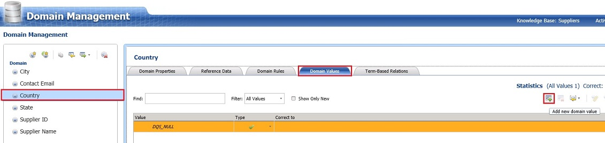
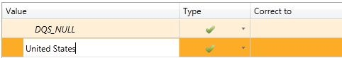

# Task 2: Adding Domain Values Manually
  In this task, you add a value for the **Country** domain manually. See [Change Domain Values](https://msdn.microsoft.com/library/hh510408.aspx) topic for more details about the fields on this page.  
  
1.  Click **Country** domain in the **Domain list**.  
  
2.  In the right pane, switch to the **Domain Values** tab.  
  
3.  Click **Add new domain value** button on the toolbar in the right pane.  
  
       
  
4.  Type **United States** for the **Value** field and press **ENTER**. You can see that, by default, the **Type** is set to **Correct** (green check). The Type can be set to **Error** (red cross) or **Invalid** (orange triangle), and a correct value can be entered in the **Correct To** field.  
  
       
  
## Next Step  
 [Task 3: Importing Domain Values from an Excel File](../../2014/tutorials/task-3-importing-domain-values-from-an-excel-file.md)  
  
  
