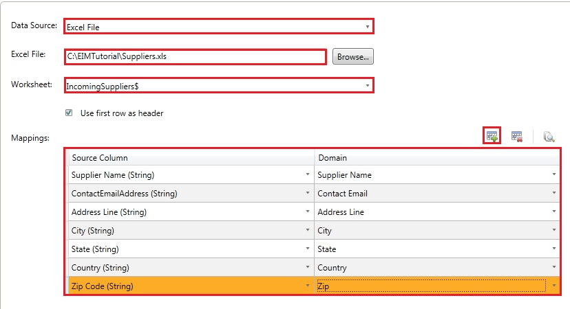
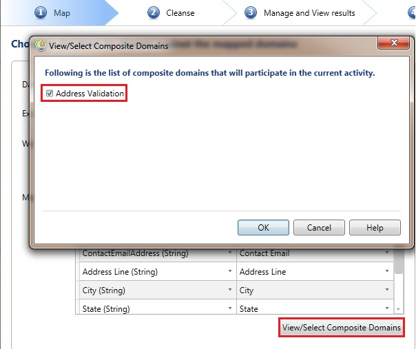

# Task 2: Mapping Excel Columns to DQS Domains
    
1.  In the **Map** page, select **Excel File** for **Data Source**.  
  
2.  Click **Browse**, select **Suppliers.xlsx**, and click **Open**.  
  
3.  Select **IncomingSuppliers$** for the **Worksheet**.  
  
4.  Map columns as shown in the following table and screenshot. When creating mappings for the **State** domain, click **Add a column mapping** button on the toolbar located just above the list.  
  
    > [!TIP]  
    >  You are not using **Supplier ID** column/domain for cleansing. You will use the **Supplier ID** domain later in the matching activity.  
  
    |Excel column|DQS Domain|  
    |------------------|----------------|  
    |Supplier Name|Supplier Name|  
    |ContactEmailAddress|Contact Email|  
    |Address Line|Address Line|  
    |City|City|  
    |State|State|  
    |Country (Click **+(Add a column mapping)** toolbar to add a row)|Country|  
    |Zip Code|Zip|  
  
       
  
5.  As you have mapped all the individual domains within the **Address Validation** composite domain, the composite domain automatically participates in the cleansing process. Click **View/Select Composite Domains** button to see that the **Address Validation** composite domain is automatically selected, and then click **OK**.  
  
       
  
6.  Click **Next** to switch to the **Cleanse** page.  
  
## Next Step  
 [Task 3: Cleansing Data against the Suppliers Knowledge Base](../../2014/tutorials/task-3-cleansing-data-against-the-suppliers-knowledge-base.md)  
  
  
