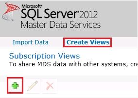
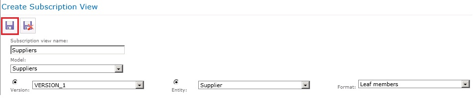

# Task 2 (Optional): Creating a MDS Subscription View using Master Data Manager
  In this task, you create a subscription view to expose the **Supplier** entity in the **Suppliers** model to other applications. You do not consume this view in the current version of the tutorial.  
  
1.  Switch to the main page of **Master Data Manager** ([http://localhost/MDS](http://localhost/MDS)) by clicking **SQL Server 2012 Master Data Services** at the top.  
  
2.  Click **Integration Management**.  
  
3.  Click **Create Views** on the menu bar.  
  
       
  
4.  Click **+ (Plus)** icon on the toolbar to create a subscription view.  
  
5.  In the **Create Subscription View** pane, type **Suppliers** for **Subscription view name**.  
  
6.  Select **Suppliers** for **Model**.  
  
7.  Select **VERSION_1** for **Version**.  
  
8.  Select **Supplier** for **Entity**.  
  
9. Select **Leaf members** for **Format**.  
  
       
  
10. Click **Save** on the toolbar to save the subscription view. This action creates a view in SQL Server named **Suppliers**. You can verify this using SQL Server Management Studio (SSMS).  
  
## Next Step  
 [Task 3 &#40;Optional&#41;: Reviewing the Subscription Views](task-3-optional-reviewing-the-subscription-views.md)  
  
  
