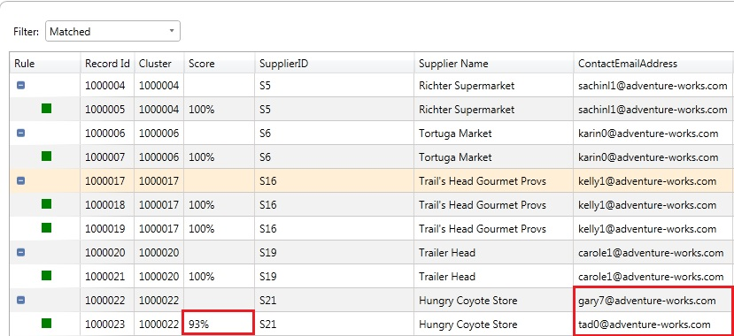
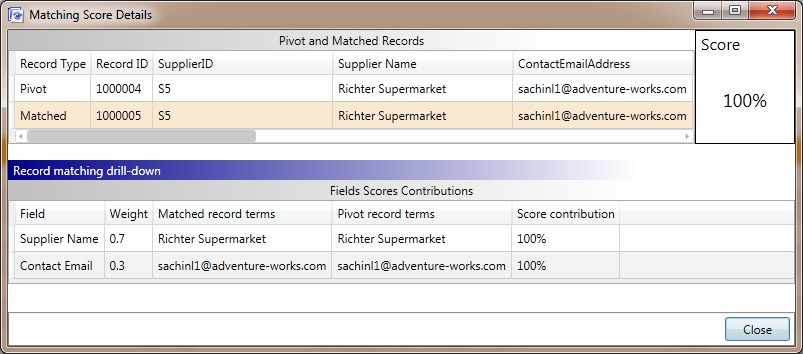
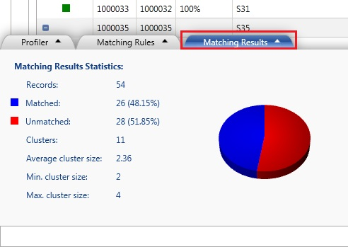

# Task 2: Testing and Publishing the Matching Policy
  In this task, you test and publish the **Remove Duplicate Suppliers** matching policy.  
  
1.  In the **Matching Results** page, click **Start** to test the entire policy. In your case, you have only rule in the policy, so the results from testing the rule and the policy should be the same.  
  
2.  Review all the matched records and their matching score in the list box. A record that has a **Green** icon associated with it is a duplicate of the pivot record that precedes it. Here are couple of examples:  
  
    1.  The record with **Record ID: 1000005** is a match of the record with **Record Id: 1000004** with **Score: 100%** because both the records have the same values for **SupplierID (prerequisite)**, **Supplier Name**, and **ContactEmailAddress columns**. DQS randomly picks a record as the pivot record for a cluster.  
  
    2.  The record **1000023** is a match of the record **1000022** with the matching score: 93% because the two records have the same values for **SupplierID (prerequisite)** and **Supplier Name** columns, but different values for the **ContactEmailAddress** column.  
  
    3.  Scroll to the bottom of the list to see two records with records IDs: **1000051** and **1000052**. Record **1000052** is considered a match with matching score **91%** because the two records have the same values for the **SupplierID** and **ContactEmailAddress** columns, but different values for the **Supplier Name** column.  
  
       
  
3.  Right-click on any matched record (with green icon) and click **View Details** to see more details about the matching such as contribution of each field score to the overall matching score.  
  
       
  
4.  Click **Close** to close the **Matching Score Details** dialog box.  
  
5.  Click **Matching Results** tab at the bottom of the page. This tab gives you detail such as number of matched records, number of unmatched records, number of clusters with matched records, the average cluster size, minimum cluster size, and maximum cluster size. See [Create a Matching Policy](https://msdn.microsoft.com/library/hh270290.aspx) for more details. You cannot export results from this activity. You are just defining a matching policy by using the sample data to test rules and the policy against the sample data.  
  
       
  
6.  Click **Finish** to finish creating the matching policy.  
  
    > [!NOTE]  
    >  You have defined the matching policy here; therefore you cannot export results to an output file. You basically used a sample input file, created rules, and tested the rules and policy against the sample data with the goal of defining the policy.  
  
7.  In the SQL Server Data Quality Services dialog box, click **Publish** and click **OK** on the message box. Now, the matching policy you defined is published into the **Suppliers** Knowledge Base. You can use the knowledge base to run the matching process against an input file to identify and remove duplicates.  
  
## Next Step  
 [Task 3: Creating and Running a Data Quality Project for Matching](../../2014/tutorials/task-3-creating-and-running-a-data-quality-project-for-matching.md)  
  
  
