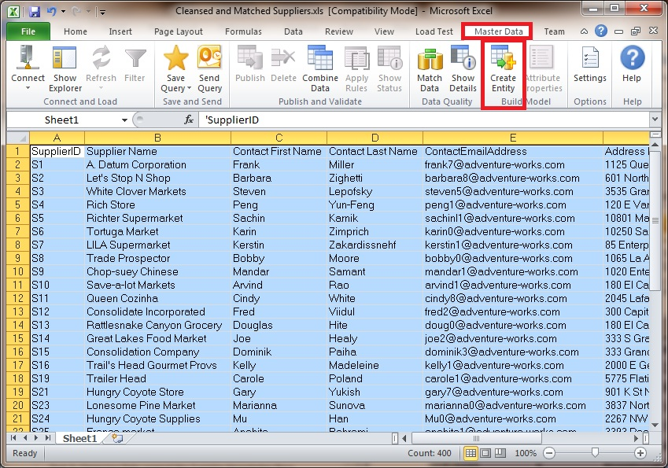
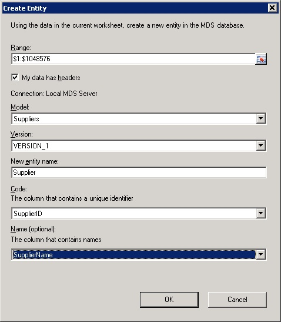
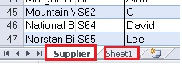
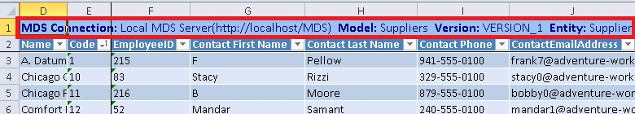

# Task 2: Uploading Supplier Data to MDS using MDS Add-in for Excel
  In this task, you publish the cleansed and supplier data to **MDS** using the **MDS Add-in for Excel**. You create an entity named **Supplier** in the **Suppliers** model you created in the previous lesson. The entity will have an attribute for each column in the Excel file. The Code and Name attributes of the Supplier entity correspond to the **SupplierID** and **Supplier Name** columns in Excel.  
  
1.  Open **Cleansed and Matched Suppliers.xls** in **Excel**.  
  
2.  Press **CTRL+A** to select entire data. It is **important** that you select the entire data in the spreadsheet.  
  
3.  Click **Master Data** on the menu bar.  
  
4.  Click **Create Entity** button on the ribbon.  
  
       
  
5.  In **Manage Connections** dialog box, if you do not see the connection to **local MDS server** under **Existing connections**, do the following:  
  
    1.  Select **Create a new connection**, and click **New** button.  
  
    2.  In the **Add New Connection** dialog box, type **Local MDS Server** for **Description** and **http://localhost/MDS** for **MDS server address**, and click **OK** to close the dialog box.  
  
6.  In **Manage Connections** dialog box, select **Local MDS Server** (http://localhost/MDS), click **Test** to test the connection. Click **OK** on the message box.  
  
7.  Click **Connect** to connect to the MDS server.  
  
8.  In the **Create Entity** dialog box, select **Suppliers** for the **Model**.  
  
9. Ensure that **VERSION_1** is selected for **Version**.  
  
10. Enter **Supplier** for **New entity name**.  
  
11. Select **SupplierID** for **the column that contains a unique identifier** field (you can also generate a code automatically). You are essentially mapping the **SupplierID** column in **Excel** to the **Code** attribute of **Supplier** entity.  
  
12. Select **Supplier Name** for **the column that contains names** field. You are essentially mapping the **Supplier Name** column in **Excel** to the **Name** attribute of the **Supplier** entity. The **Code** and **Name** attributes are mandatory attributes for an entity in MDS.  
  
       
  
13. Click **OK** to create the entity on MDS, publish the master data to the entity, and close **Create Entity** dialog box.  
  
14. Now, you should see a new sheet titled **Supplier**, which is the name of the entity, added to your Excel spreadsheet and at the top of the worksheet you should see that the worksheet is connected to the MDS server. Notice that the original worksheet (titled **Sheet1**) still exists.  
  
       
  
       
  
15. Keep **Excel** open.  
  
## Next Task  
 [Task 3: Verifying the Data in Master Data Manager](../../2014/tutorials/task-3-verifying-the-data-in-master-data-manager.md)  
  
  
