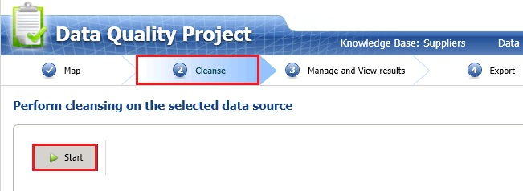
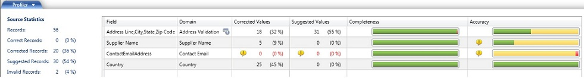

# Task 3: Cleansing Data against the Suppliers Knowledge Base
  In this task, you run the computer-assisted cleansing process. DQS uses advanced algorithms and confidence levels based on the threshold values specified to analyze the data against the selected knowledge base, and then cleanse it. See [Cleansing Data Using DQS (Internal) Knowledge](https://msdn.microsoft.com/library/hh213061.aspx) for more details.  
  
1.  Click **Start** to start the computer-assisted cleansing process.  
  
       
  
2.  When the cleansing process is completed, review **statistics** in the **Profiler** tab. The Source Statistics provide the number of records processed, number of records that are found to be correct, number of records that DQS corrects, number of records that have changes suggested by DQS, and the number of records that are invalid. In the list box to the right, you can see the corrected values, suggested values, and the completeness (the extent to which the data is present) and accuracy (the extent to which the data can be used for intended purposes) of values for each domain involved in the cleansing process.  
  
       
  
3.  Click **Next** to switch to **Manage and View Results** page.  
  
## Next Step  
 [Task 4: Manaing and Viewing Results](../../2014/tutorials/task-4-manaing-and-viewing-results.md)  
  
  
