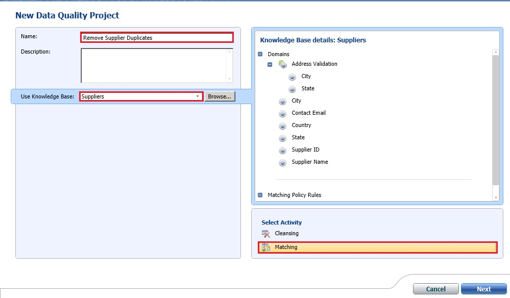

# Task 3: Creating and Running a Data Quality Project for Matching
  In this task, you create a Data Quality Project for the matching activity and run the matching process on cleansed supplier data to remove any duplicates in the data.  
  
1.  On the main page of **DQS Client**, click **New Data Quality Project**.  
  
2.  Type **Remove Supplier Duplicates** from the **Name of the project**.  
  
3.  Select **Suppliers** from the list of KBs for the **Use Knowledge Base** field. You have created a matching policy in this knowledge base in the previous lesson.  
  
4.  Select **Matching** from the **list of activities** from the bottom-right pane.  
  
       
  
5.  Click **Next**.  
  
6.  In the **Map** page, select **Excel File** for **Data Source**.  
  
7.  Click **Browse** and select **Cleansed Supplier List.xls**, which is the output file from the cleansing activity.  
  
8.  Map **SupplierID** source column to the **Supplier ID** domain, **Supplier Name** column to **Supplier Name** domain, and **ContactEmailAddress** column to **Contact Email** domain.  
  
9. Click **Next** to switch to the **Matching** page.  
  
10. Click **Start** to start the matching process. You should see results similar to those from the previous task because you used the same input file for defining the matching policy.  
  
11. Review all the matched records and their matching score in the list box. The results should be same as the ones you saw in the previous task. See the steps in the previous task to analyze the results from this matching activity.  
  
12. Click **Next** to switch to the **Export** page.  
  
## Next Step  
 [Task 4: Exporting the Results from Matching Activity to an Excel File](../../2014/tutorials/task-4-exporting-the-results-from-matching-activity-to-an-excel-file.md)  
  
  
