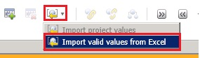
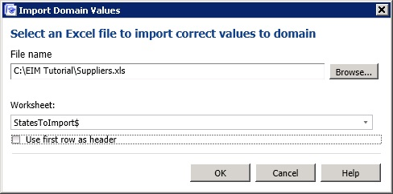
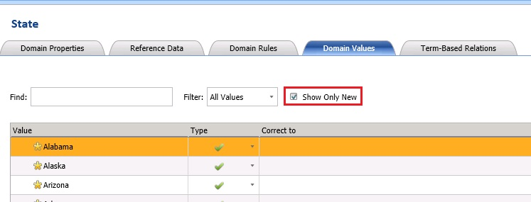

# Task 3: Importing Domain Values from an Excel File
  In this task, you import values for the **State** domain from a worksheet of an Excel file.  
  
1.  Click **State** domain in the **Domain list**.  
  
2.  Ensure that the **Domain Values** tab is active in the right pane.  
  
3.  In the right pane, from the toolbar, click **down arrow** next to the **Import Values** button, and click **Import Valid Values from Excel**.  
  
       
  
4.  Click **Browse**, select **Suppliers.xls**, and click **Open**.  
  
5.  Select **StatesToImport$** for the **Worksheet**.  
  
       
  
6.  Click **OK** to close the **Import Domain Values** dialog box. You should see all the names of states you imported in the list. Notice that **Show Only New** option is automatically selected after importing. When you import values and you don't see the old values in the list, it is because this option is automatically enabled after importing. To see all the values, clear the check box. If you import the same set of values again, none of the values are imported as they already exist in the domain.  
  
       
  
## Next Step  
 [Task 4: Setting Domain Rules](../../2014/tutorials/task-4-setting-domain-rules.md)  
  
  
