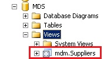

# Task 3 (Optional): Reviewing the Subscription Views
  In this task, you confirm that the SQL views are created by using SQL Server Management Studio.  
  
1.  Launch **SQL Server Management Studio**. Click the **Start** button, click **All Programs**, click **Microsoft SQL Server 2012**, and then click **SQL Server Management Studio**.  
  
2.  In the **Connect to Server** window, set **Server Type** to **Database Engine**, type the **server name** (or select **(local)**, and select appropriate **authentication**, and click **Connect**.  
  
3.  In the **Object Explorer** pane, expand **Databases**, expand **MDS**, and then expand **Views**.  
  
4.  Confirm that you see the **mdm.Suppliers** view in the list.  
  
       
  
## Next Step  
 [Task 4: Creating an SSIS Project using SQL Server Data Tools](../../2014/tutorials/task-4-creating-an-ssis-project-using-sql-server-data-tools.md)