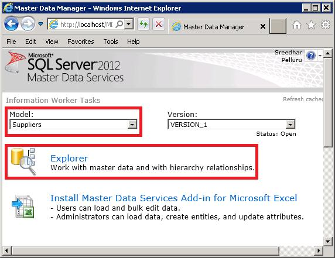

# Task 3: Verifying the Data in Master Data Manager
  In this task, you verify that the **Supplier** entity is created on **MDS** using **Master Data Manager Web Application**.  
  
1.  If **Master Data Manager** is already open, click **SQL Server 2012 Master Data Services** at the top to navigate to the home page. Otherwise, navigate to [http://localhost/mds](http://localhost/mds) to launch **Master Data Manager**.  
  
2.  Select **Suppliers** for **Model**, and click **Explorer**.  
  
       
  
3.  Review the data stored on MDS. If you do not see the data, confirm that you selected **Suppliers** for the **Model** on the home page before launching **Explorer**. You can add to or delete from the supplier list by using **Add Member** and **Delete Member** buttons on the toolbar.  
  
## Next Step  
 [Task 4 &#40;Optional&#41;: Combining, Matching, and Publishing New Set of Data](../../2014/tutorials/task-4-optional-combining-matching-and-publishing-new-set-of-data.md)  
  
  
