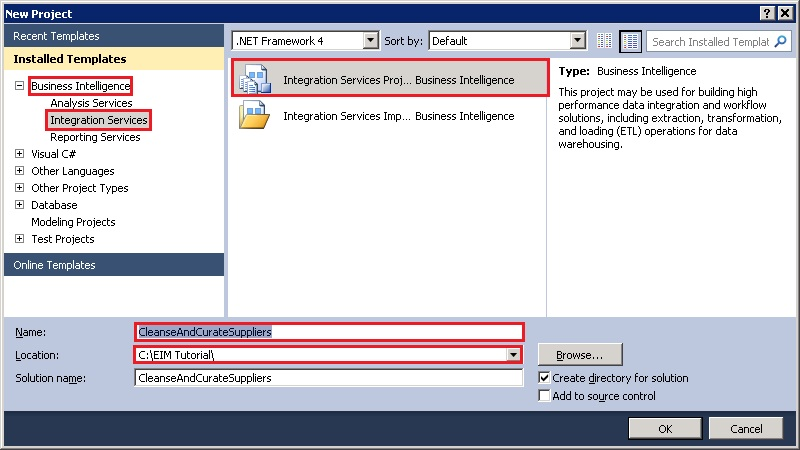
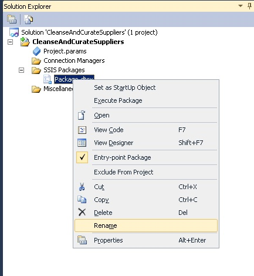

# Task 4: Creating an SSIS Project using SQL Server Data Tools
  In this task, you create an SSIS project by using **SQL Server Data Tools** to automate cleansing and matching supplier data.  
  
1.  Launch **SQL Server Data Tools**. Click Start, point to **All Programs**, expand **Microsoft SQL Server 2012**, and click **SQL Server Data Tools**.  
  
2.  On the **File** menu, point to **New**, and click **Project**.  
  
3.  Expand **Business Intelligence** in the **Installed Templates** pane, and select **Integration Services**.  
  
       
  
4.  Select **Integration Services Project** in the **list of project types**.  
  
5.  Type **CleanseAndCurateSuppliers** for **Name** and click **OK**.  
  
6.  In **Solution Explorer** window, right-click **Package.dtsx** and select **Rename**. If you don't see **Solution Explorer** window, click **View** on the menu bar and click **Solution Explorer**.  
  
       
  
7.  Type **CleanseAndCurate.dtsx** and press **ENTER**. Make sure that the **extension** remains **.dtsx**.  
  
## Next Step  
 [Task 5: Adding Data Flow Task](task-5-adding-data-flow-task.md)  
  
  
