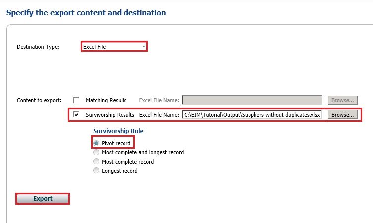

# Task 4: Exporting the Results from Matching Activity to an Excel File
  In this task, you export the results from the matching activity to an Excel file.  
  
1.  In the **Export** page, select **Excel File** for the **Destination Type**.  
  
2.  Select **Survivorship Results** option. In the survivorship process, DQS determines a survivor record for each cluster based on the **Survivorship Rule** you selected.  
  
3.  Click **Browse** and navigate to the folder where you want to store the output file.  
  
4.  Type **Cleansed and Matched Suppliers.xls** for the name and click **Open**.  
  
5.  Confirm that **Pivot Record** is selected for the **Survivorship Rule**. When you select this option, the pivot record for each cluster is picked for the output from a cluster. The other options for the Survivorship Rule are:  
  
    1.  **Most complete record:** Survivor record is the one with the largest number of populated fields.  
  
    2.  **Longest record:** Survivor record is the one with the largest number of terms in source fields.  
  
    3.  **Most complete and longest record:** Survivor record is the one with the largest number of populated fields, and has the largest number of terms in each field.  
  
       
  
6.  Click **Export** to export the results to an Excel file.  
  
7.  Click **Close** to close the **Matching Export** dialog box.  
  
8.  Click **Finish** to finish the matching activity.  
  
9. Open the **Cleansed and Matched Suppliers.xlsx** file and confirm that you do not see any duplicates (SupplierID).  
  
 Now, you have supplier data that has been cleansed and matched to remove duplicates.  
  
## Next Step  
 [Lesson 4: Storing Supplier Data in MDS](../../2014/tutorials/lesson-4-storing-supplier-data-in-mds.md)  
  
  
