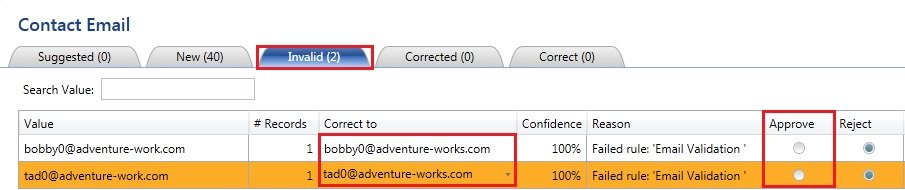
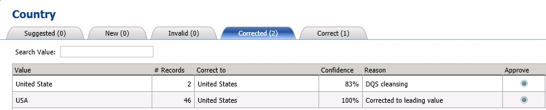
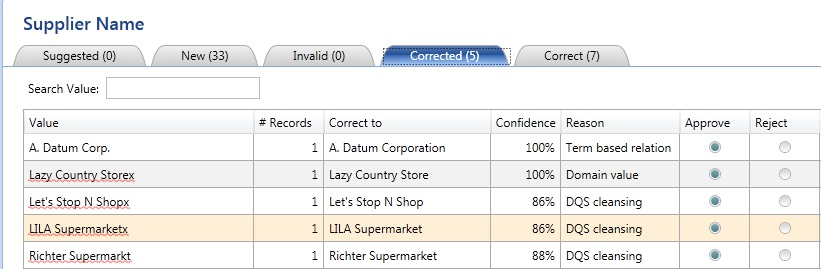
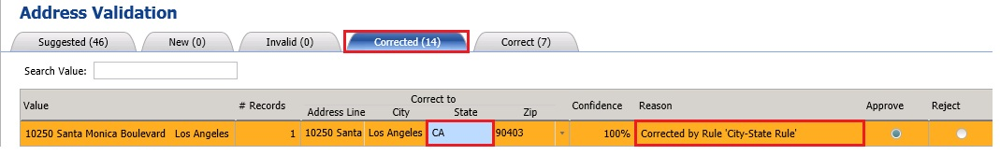
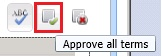

# Task 4: Manaing and Viewing Results
  In this task, you review the results of computer-assisted cleansing and also perform interactive cleansing on the supplier data. See [Interactive Cleansing Stage](https://msdn.microsoft.com/library/hh213061.aspx#Interactive) for more details.  
  
1.  Select **Contact Email** domain from the list of domains.  
  
2.  Switch to the **Invalid** tab in the right pane. Notice that two email addresses that were missing character 's' at the end. These two emails that were found to be invalid by the domain rule that requires all email addresses to end with **@adventure-works.com** (with 's'). DQS uses the domain rule while cleansing to determine whether an email is a valid one or not. This tab displays the domain values that were either marked as invalid in the knowledge base or failed a domain rule. In this case, these values failed the domain rule (Email Validation).  
  
3.  In the **Correct To** column, type the right email address that end with **@adventure-works.com** (with 's').  
  
       
  
4.  Click **Approve** for both the records to approve both the changes. When you approve, the records move to the **Corrected** tab. Instead of approving each item separately, you can approve all the changes at once using the **Approve all terms** toolbar button.  
  
5.  Switch to the **New** tab in the right pane. The values on this tab are the values for which DQS does not have enough information in the knowledge base yet to determine whether the values are correct. Therefore, it cannot change or suggest changes to the domain values.  
  
6.  Review the values to confirm that all the emails end with **@adventure-works.com** and click **Approve all terms** on the toolbar. The approved values from this tab move to the **Correct** tab.  
  
7.  Select the **Country** domain from the list of domains.  
  
8.  Switch to the **Corrected** tab in the right pane and notice that **United State** value is automatically corrected to the **United States** with 's' at the end. This rule is not a rule you defined for the **Country** domain, but DQS is **83%** confident that the correct value is **United States**. The **Approve** button is automatically selected for all the **Corrected** items. You can override this behavior and reject a change.  
  
9. Notice that **USA** is corrected to **United States** because they are synonyms and **United States** is the leading (preferred) value.  
  
       
  
10. Notice that the **Approve** button is already selected for these corrected values. This behavior is the default for the corrected values. You can reject a change and when you do so, the value moves to the **Invalid** tab.  
  
11. Select **Supplier Name** from the list of domains.  
  
12. Switch to the **Corrected** tab in the right pane.  
  
       
  
    1.  Notice that **A. Datum Corp.** is corrected to **A. Datum Corporation** and the **Reason** is set to **Term based relation. A. Datum Corporation** is a known domain value to DQS because it was discovered during the knowledge discovery process. Therefore, DQS is **100% confident** about this correction.  
  
    2.  Notice that **Lazy Country Storex** is corrected to **Lazy Country Store**, **Confidence Level** is set to **100%**, and the **Reason** is set to **Domain Value**. During the knowledge discovery process, you set **Lazy Country Storex** as an error with **Lazy Country Store** as the **correction**, so DQS is **100% confident** about making this correction.  
  
    3.  DQS is not familiar with the other values in the list, but it found the corrections for these values using the **Spell Checker** and proposes the appropriate corrections. DQS is **not 100%** confident about these corrections, but the confidence level is above 80%, which is the threshold level for making corrections, so DQS proposes the corrections.  
  
13. Notice that the **Approve** is automatically enabled for all the values. You can override the corrected value or reject the change as appropriate. By default the **Approve** button is selected for all the values on the **Corrected** tab.  
  
14. Switch to the **New** tab.  
  
15. Notice that **Corp.** is corrected to **Corporation**, **Co.** is corrected to **Company**, and **Inc.** is corrected to **Incorporated**. For example, **Consolidate Inc.** is corrected to **Consolidate Incorporated** and **Consolidated Co.** is corrected to **Consolidated Company**, and **Frabrikam Corp.** is corrected to **Fabrikam Corporation**.  You can see that **term-based relation** is mentioned as the reason. These changes are proposed by using the term-based relations you defined during the domain management activity. You can change the **Correct To** values manually here.  
  
16. Scroll the list to see **Hunxgry Coyote Store** with a red squiggly line. Right-click on it and click **Hungy Coyote Store** (with no 'x'). The **Correct To** column should be automatically populated with **Hungry Coyote Store**. You can also manually type a value in the Correct To column.  
  
17. Click **Approve all terms** from the toolbar. The domain values with the **Correct To** value specified move to the **Corrected** tab and the new values with no associated **Correct To** values move to the **Correct** tab.  
  
18. Select the **Address Validation** composite domain from the domain list.  
  
19. In the right pane, switch to the **Correct** tab. You should see the addresses that are found to be correct by the **Melissa Data - Address Check** DQS service on the **Azure Marketplace**.  
  
20. Switch to the **Corrected** tab.  
  
21. Notice that **State** for the record that has **City** as **Los Angeles** is set to **CA** now. Notice in the **Reason** field is that **Corrected by Rule 'City-State Rule'**.  
  
       
  
22. Notice that the **Approve** radio button is already selected for this item in the list. This is the default behavior for items on the **Corrected** tab.  
  
23. Switch to the **Suggested** tab. Review the changes suggested by the **Melissa Data - Address Check** service.  
  
24. **Click Approve all terms** on the toolbar button and click **OK** on the **Confirmation** message box.  
  
       
  
25. Click **Next** to switch to the **Export** page.  
  
## Next Step  
 [Task 5: Exporting Cleansing Results to an Excel File](../../2014/tutorials/task-5-exporting-cleansing-results-to-an-excel-file.md)  
  
  
