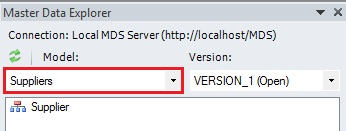
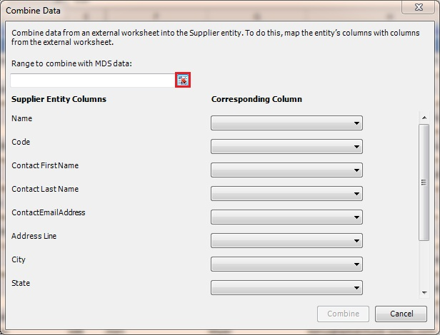
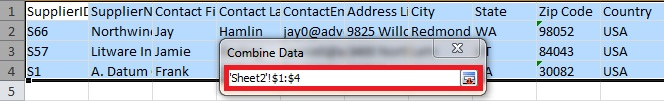
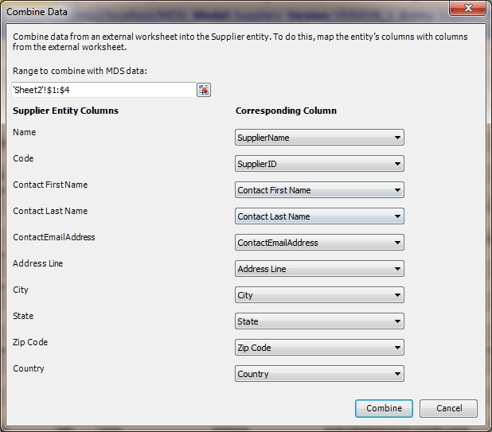
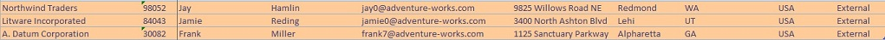
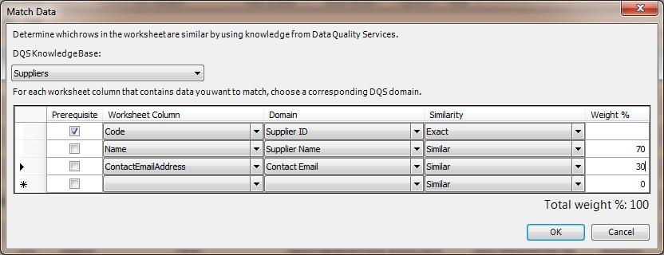
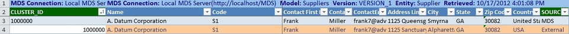

# Task 4 (Optional): Combining, Matching, and Publishing New Set of Data
  Over time, you will want to add more data to the MDS repository. Before adding data, it can be useful to compare the new data to the data that's already managed in MDS, to ensure that you are not adding duplicate or inaccurate data. In the Master Data Services Add-in for Excel, you can combine data from two worksheets and the compare the data to identify and remove duplicates before publishing the data to MDS. The matching feature of MDS Excel Add-in uses the DQS matching functionality to identify matches in the data. In this task, you will combine data from a two worksheets into one and then perform the matching activity to identify and remove duplicates before publishing to MDS. See [Data Quality Matching in the MDS Add-in for Excel](https://msdn.microsoft.com/library/hh548681.aspx) and [Combine Data](https://msdn.microsoft.com/library/hh548680.aspx) topics for more details.  
  
1.  Launch new instance of **Excel**. Click **Start**, point to **Run**, type **Excel**, and click **OK**.  
  
2.  Switch to the **Master Data** tab by clicking **Master Data** on the menu bar.  
  
3.  Click **Connect** on the ribbon in the **Connect and Load** group to connect to the **MDS server**. You have configured this connection earlier in this lesson.  
  
       
  
4.  You should see the **Master Data Explorer** pane to the right. If you do not see the Master Data Explorer, click **Show Explorer** button on the ribbon.  
  
5.  In the **Master Data Explorer** Window, select **Suppliers** in the drop-down list for the **Model**. You should see that the model has one entity: **Supplier**.  
  
       
  
6.  Double-click **Supplier** in the entity list to load the entity members into the Excel worksheet.  
  
7.  Click **Sheet2** at the bottom to switch to the **Sheet2** tab. If you do not see **Sheet2**, add a new worksheet.  
  
8.  Open **Suppliers.xls** file (the original input file that is included in the tutorial files) and copy all (three) rows from the **CombineAndCleanse** worksheet to **Sheet2**.  
  
9. Switch back to the **Supplier** sheet in the **Book 1 - Microsoft Excel** (not the **Cleansed and Matched Supplier List** Excel) that is connected to **MDS**.  
  
10. Click **Master Data** on the menu bar.  
  
11. Click **Combine Data** on the ribbon. You will see the **Combine Data** dialog box.  
  
12. In the **Combine Data** dialog box, click the button next to **Range to combine with MDS data** text box as shown in the following image.  
  
       
  
13. You should see the shrunken dialog box now. Now, click **Sheet2** to switch to the **Sheet2** tab that has the new supplier data with 4 rows (including one header row).  
  
14. In the **Sheet2**, select **all rows including the header row** (even if they seem to be already selected). You should see the **Range to combine with MDS data** is automatically updated.  
  
       
  
15. Switch back to the **Suppliers** tab without closing the **Combine Data** dialog box.  
  
16. Click the **button** next to the **text box**. You should see that the dialog box is expanded now. You should see all the mappings between columns of the **Supplier** MDS **entity** to **Excel** columns are automatically populated.  
  
       
  
17. Ensure that **Code** entity column is mapped to the **SupplierID** column in the worksheet and **Zip Code** entity column is mapped to the **Zip Code** column in the worksheet.  
  
18. On the **Combine Data** dialog box, click **Combine**.  
  
19. Confirm that three data rows are added to the bottom of the worksheet and they should be color coded.  
  
       
  
20. Click **Math Data** on the ribbon to identify duplicates. This feature uses the matching functionality of DQS.  
  
21. In the **Match Data** dialog box, select **Suppliers** for **DQS Knowledge Base**.  
  
       
  
22. Map worksheet columns to domains as shown in the following table.  
  
    |Worksheet Column|Domain|  
    |----------------------|------------|  
    |Code (you uploaded Supplier ID as the Code for the Supplier entity in MDS)|Supplier ID|  
    |Name (you uploaded Supplier Name as the Name for the Supplier entity to MDS)|Supplier Name|  
    |ContactEmailAddress|ContactEmail|  
  
23. Select **Prerequisite** for the **Code** column mapping.  
  
24. Enter **70%** as the **weight** for **Supplier Name** and **30%** as the **weight** for **Contact Email** as shown in the image.  
  
25. Click **OK**.  
  
26. The matching process should identify one duplicate for the supplier with **Code: S1**.  
  
       
  
27. Select the **duplicate row (orange)**, right-click, and click **Delete** to delete the row.  
  
28. Delete the **CLUSTER_ID** column since you don't need it anymore.  
  
29. Click **Publish** to publish the other two new records with **Codes S66** and **S57** to MDS.  
  
30. In the **Publish and Annotate** dialog box, add an **annotation**, and click **Publish**.  
  
31. Switch to the **Master Data Manager Web application**.  
  
32. On the home page, ensure that **Suppliers** is selected for the **Model**, and click **Explorer**. If you already have the **Explorer** open, refresh the internet browser.  
  
33. **Sort** the list by **Code** and look for records with **S57** and **S66** as codes. You can also use the **Filter** button on the toolbar to search for a specific record in the list.  
  
34. Now, close **Book1 - Microsoft Excel** window without saving the file.  
  
## Next Step  
 [Task 5: Creating a Domain-Based Attribute from Excel](../../2014/tutorials/task-5-creating-a-domain-based-attribute-from-excel.md)  
  
  
