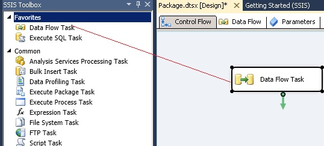

# Task 5: Adding Data Flow Task
  In this task, you add a Data Flow Task to the control flow of SSIS package.  
  
1.  Drag and drop **Data Flow Task** from **SSIS Toolbox** to the **Control Flow** tab in the SSIS Designer. If you do not see the **SSIS Toolbox**, click anywhere in the **Control Flow** tab, click **SSIS** on the menu bar, and click **SSIS Toolbox**.  
  
       
  
2.  Right-click the **Data Flow Task** in the **Control Flow** tab and click **Rename**.  
  
3.  Type **Receive, Cleanse, Match, and Curate Supplier Data** and press **ENTER**.  
  
4.  Double-click the **Data Flow Task** to switch to the **Data Flow** tab.  
  
## Next Step  
 [Task 6: Adding Excel Source to the Data Flow](task-6-adding-excel-source-to-the-data-flow.md)  
  
  
