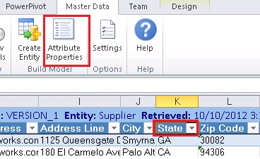
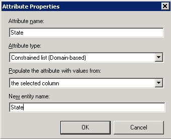
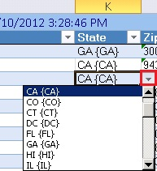

# Task 5: Creating a Domain-Based Attribute from Excel
  In this task, you convert the **State** attribute of the **Supplier** entity as a **domain-based attribute**. After you configure the State attribute to be a domain-based one and publish it to MDS, a new entity named **State** will be created on MDS server with all the values in the column and the **State** attribute of the **Supplier** entity will be populated with values from the **State** entity. Now, the **Suppliers** model should have two entities: **Supplier** and **State** where the **State** attribute of the **Supplier** entity is a domain-based attribute that depends on **State** entity.  
  
1.  Switch to **Excel** window that has **Cleansed and Matched Suppliers.xlsx** open.  
  
2.  Click **Refresh** button on the ribbon to get the latest updates from MDS. You should see the two more records if you have performed the optional **Task 4**.  
  
3.  Click column name **State** (cell **I1**) in the **header row**.  
  
       
  
4.  Click **Attribute Properties** on the ribbon.  
  
5.  In the **Attribute Properties** dialog box, select **Constrained list (Domain-based)** for the **Attribute type**.  
  
6.  Type **State** for the **New entity name** and click **OK**.  
  
       
  
7.  Now, in Excel, you should see **down arrow** when you click any value in the **State** column. You can change the value by using the drop-down list if you need.  
  
       
  
## Next Step  
 [Task 6: Verify that the Domain-Based Attribute is Created using Master Data Manager](../../2014/tutorials/task-6-verify-domain-based-attribute-master-data-manager.md)  
  
  
