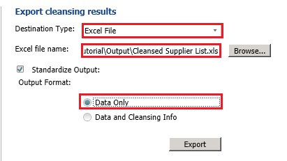

# Task 5: Exporting Cleansing Results to an Excel File
  In this task, you export results from the cleansing activity to an Excel file. See [Export Stage](https://msdn.microsoft.com/library/hh213061.aspx#Export) topic for more details.  
  
1.  In the right pane, select **Excel** for the **Destination Type**.  
  
2.  Click **Browse**, specify the output file name as **Cleansed Supplier List.xls**, and then click **Open**.  
  
3.  Select **Data Only** for the **Output** format to export just the cleansed data. The second option, **Data and Cleansing Info**, lets you export cleansing activity details along with the cleansed data. The **Standardize Format** option lets you apply any output formats you define on a domain to the values of that domain. You have not defined an output format on any domain in the tutorial.  
  
       
  
4.  Click **Export** to export the data. Do not click **Finish** yet.  
  
5.  Click **Close** on the **Exporting** dialog box.  
  
6.  Click **Finish** to finish the activity. If you forgot to export results before clicking **Finish**, click **Open Data Quality Project** in the main page of **DQS Client**, select **Cleanse Supplier List** from the list of projects, and click **Next** at the bottom of the screen to get to the **Export** stage of cleansing process again. You can also switch to **Manage and View Results** tab by clicking **Back** button.  
  
7.  Open the **Cleansed Supplier List.xls** and do the following:  
  
    1.  Ensure that there are no email addresses that end with adventure-work.com (without character 's') by searching for adventure-work.com in the worksheet.  
  
    2.  See that there is no **USA** value in the **Country** column.  
  
    3.  Search for **Los Angeles** and see that the **State** is set to **CA**.  
  
    4.  Confirm that there are no terms **Co.**, **Corp.**, and **Inc.**.  
  
    5.  Delete the **Address Validation** column from the spreadsheet and save the excel file. This additional column corresponds to the Address Validation composite domain.  
  
## Next Step  
 [Task 6: Importing Values from the Cleanse Supplier List Project](../../2014/tutorials/task-6-importing-values-from-the-cleanse-supplier-list-project.md)  
  
  
