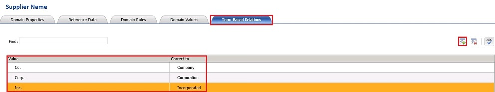

# Task 5: Setting Term Based Relationships
  In this task, you define a few term-based relations for values for the **Supplier Name** domain. A term-based relation enables you to make a correction to a term that is part of a value in a domain. It enables multiple values that are identical except for the spelling of a common part of them to be considered identical synonyms. For example, **Inc.** can be corrected to **Incorporated**. DQS uses these relations in the knowledge discovery, cleansing, or matching processes. See [Create Term-based Relations](https://msdn.microsoft.com/library/hh510404.aspx) for more details.  
  
1.  Select **Supplier Name** in the **Domain list**.  
  
2.  Switch to the **Term-Based Relationships** tab in the right pane.  
  
3.  Click **Add new relation** button on the toolbar to add a relation to the table.  
  
4.  Type **Co.** for the **Value** field and **Company** for the **Correct To** field.  
  
5.  Repeat the previous two steps for the following values:  
  
    |Value|Correct To|  
    |-----------|----------------|  
    |Corp.|Corporation|  
    |Inc.|Incorporated|  
  
       
  
## Next Step  
 [Task 6: Setting Synonyms](../../2014/tutorials/task-6-setting-synonyms.md)  
  
  
