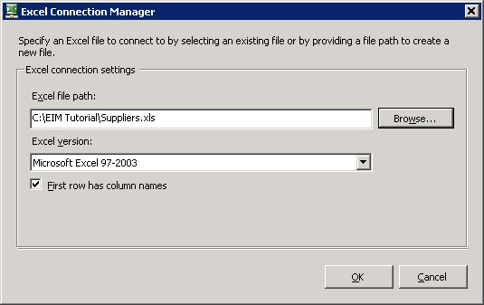
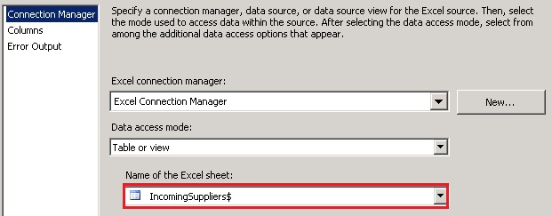

# Task 6: Adding Excel Source to the Data Flow
  In this task, you add an Excel Source to the data flow to read supplier data from the source Excel file. The Excel Source extracts data from worksheets or ranges in Microsoft Excel workbooks. See [Excel Source](../integration-services/data-flow/excel-source.md) topic for more details.  
  
1.  Drag-drop **Excel Source** from **Other Sources** in **SSIS Toolbox** to the **Data Flow** tab.  
  
2.  Right-click on **Excel Source** in the **Data Flow** tab, and click **Rename**.  
  
3.  Type **Read Supplier Data from Excel File** and press **ENTER**.  
  
4.  Double-click **Read Supplier Data from Excel File** to launch the **Excel Source Editor** dialog box.  
  
5.  In the **Excel Source Editor** dialog box, click **New** to create an Excel connection.  
  
6.  In the **Excel Connection Manager** dialog box, click **Browse**, and then select the **Suppliers.xls** file in the **EIM Tutorial** folder. Confirm that **Microsoft Excel 97-2003** is selected in the **Excel Version** box and then click **OK**.  
  
       
  
7.  In the **Excel Source Editor** dialog box, select **IncomingSuppliers$** in the **Name of the Excel sheet** list box.  
  
       
  
8.  Click **Preview** to preview the data in Excel file.  
  
9. Click **OK** to close the dialog box.  
  
10. Drag-drop **DQS Cleansing** transform in **Other Transforms** on the **SSIS Toolbox** to the **Data Flow** tab under **Read Supplier Data from Excel File**. The DQS Cleansing transformation uses Data Quality Services (DQS) to correct data by applying approved rules in the knowledge base. This transform, at runtime, creates a DQS cleansing project on the DQS server. See [DQS Cleansing Transformation](https://msdn.microsoft.com/library/ee677619.aspx) topic for more details.  
  
## Next Step  
 [Task 7: Adding DQS Cleansing Transform to the Data Flow](../integration-services/data-flow/data-flow.md)  
  
  
