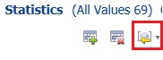
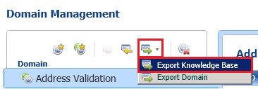

# Task 6: Importing Values from the Cleanse Supplier List Project
  In this task, you import the data quality knowledge gathered during the cleansing process. See [Importing Cleansing Project Values into a Domain](https://msdn.microsoft.com/library/hh479581.aspx) topic for more details. You also export the knowledge base into a DQS file before publishing the updated **Suppliers** knowledge base.  
  
1.  In the main page of **DQS Client**, click **right-arrow** next to **Suppliers** under **Recent Knowledge Bases** and click **Domain Management**.  
  
2.  Click **Contact Email** in the list of domains, and switch to the **Domain Values** tab in the right pane.  
  
3.  Click **down arrow** next to the **Import Values** icon on the toolbar and click **Import Project Values**.  
  
       
  
4.  In the **Import Project Values** dialog box, select the **Cleanse Supplier List** project, and click **OK**.  
  
5.  Notice that all the emails are imported along with the two corrections you did during interactive cleansing. Scroll to see the two corrections.  
  
    |Value|Correct To|  
    |-----------|----------------|  
    |bobby0@adventure-work.com|bobby0@adventure-works.com|  
    |tad0@adventure-work.com|tad0@adventure-works.com|  
  
6.  Repeat the previous step of importing project values for the **Country** domain and notice that a new entry is added for correcting **United State** to **United States** (with 's').  
  
    |Value|Correct To|  
    |-----------|----------------|  
    |United State|United States|  
  
7.  To see the old domain values, clear **Show Only New** checkbox.  
  
8.  Repeat the previous step of importing project values for the **Supplier Name** domain. By default, after importing, you will only see the new values. To see all the values, clear **Show Only New** check box. You have enriched the **Suppliers** knowledge base with what you learned from the cleansing activity. The stronger the knowledge base is, the better the cleansing results are.  
  
    > [!NOTE]  
    >  It is not possible import values for a composite domain.  
  
9. Click **Export Knowledge Base** icon on the toolbar and then click **Export Knowledge Base**.  
  
       
  
10. Navigate to the Tutorial folder, type **Suppliers.dqs** for the **file name**, and click **Save**. You can use this DQS file to create a new knowledge base based on it.  
  
11. Click **OK** to close the **Export Knowledge Base - Suppliers** message box.  
  
12. Click **Finish** to finish the activity.  
  
13. Click **Publish**.  
  
14. Click **OK** on the message box.  
  
## Next Step  
 [Lesson 3: Matching Data to Remove Duplicates from Supplier List](../../2014/tutorials/lesson-3-matching-data-to-remove-duplicates-from-supplier-list.md)  
  
  
