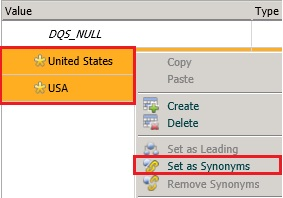
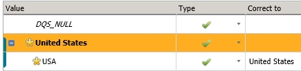

# Task 6: Setting Synonyms
  In this task, you set two domain values, **USA** and **United States**, of the **Country** domain as synonyms with **United States** as the leading value. Since the **Use Leading Values** option was selected when creating the **Country** domain, any **USA** values for the **Country** domain will be output as **United States** (as United States is the leading value). See [Change Domain Values](https://msdn.microsoft.com/library/hh510408.aspx) for more details.  
  
1.  Select **Country** from the list of domains.  
  
2.  Switch to the **Domain Values** tab.  
  
3.  Click **Add new domain value** button on the toolbar.  
  
4.  Type **USA** for the value and press **ENTER**.  
  
5.  Multiselect **United States** and **USA** using CTRL or SHIFT keys, right-click the selected items, and then click **Set as Synonyms**. DQS groups these values and designate one of the values as the leading value that the other values are replaced with.  
  
       
  
6.  Notice that **United States** is set as the leading value. If you want USA to be the leading value, you can right-click on USA and select **Set as Leading** option. For this tutorial, we use **United States** as the leading value.  
  
       
  
## Next Step  
 [Task 7: Creating a Composite Domain](../../2014/tutorials/task-7-creating-a-composite-domain.md)  
  
  
