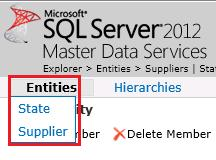
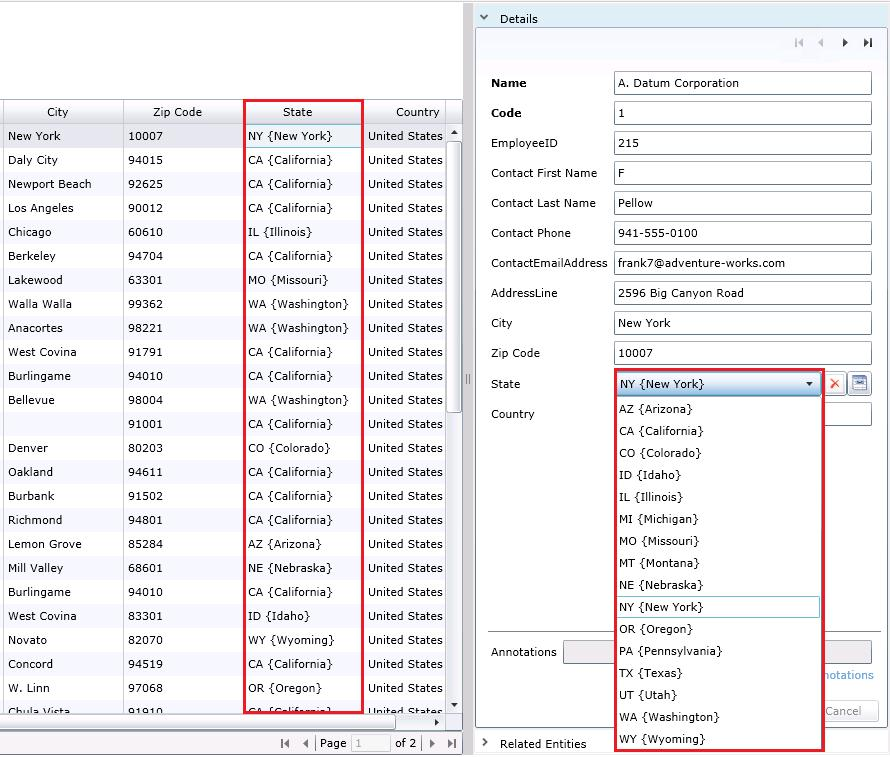

# Task 6: Verify that the Domain-Based Attribute is Created using Master Data Manager
  In this task, you verify that the **State** entity is created in **MDS** and the **State** attribute of the **Supplier** entity is a domain-based attribute that depends on the **State** entity by using **Master Data Manager**.  
  
1.  Switch to the **Master Data Manger** web application.  
  
2.  Click **SQL Server 2012 Master Data Services** at the top to get to the home page.  
  
3.  Ensure that **Suppliers** model is selected and click **Explorer**. You could refresh the page if you already had **Explorer** open.  
  
4.  Hover your mouse over **Entities** on the menu bar and notice that now there are two entities: **Supplier** and **State**.  
  
       
  
5.  Click **State** if the entity is not open already.  
  
6.  Select **GA** from the list.  
  
7.  In the **Details** pane to the right, change the **Name** to **Georgia** in the **right pane**, and click **OK**.  
  
8.  Repeat the previous steps for other states.  
  
    |Code|Name|  
    |----------|----------|  
    |CA|California|  
    |CO|Colorado|  
    |IL|Illinois|  
    |DC|District of Columbia|  
    |FL|Florida|  
    |AL|Alabama|  
    |KY|Kentucky|  
    |MA|Massachusetts|  
    |AZ|Arizona|  
    |MI|Michigan|  
    |MN|Minnesota|  
    |NJ|New Jersey|  
    |NV|Nevada|  
    |NY|New York|  
    |OH|Ohio|  
    |OK|Oklahoma|  
    |OR|Oregon|  
    |PA|Pennsylvania|  
    |SC|South Carolina|  
    |KS|Kansas|  
    |TN|Tennessee|  
    |TX|Texas|  
    |UT|Utah|  
    |VA|Virginia|  
    |WA|Washington|  
    |WI|Wisconsin|  
    |HI|Hawaii|  
    |MD|Maryland|  
    |CT|Connecticut|  
  
9. Select any of the state entries and click **View Transactions** from the Toolbar. You should see the transaction for the update you just made is in the list of transactions.  
  
10. Hover the mouse over **Entities** menu and click **Supplier**.  
  
11. Now, notice that a value for the **State** field can be changed in the **Details** pane by using the drop-down list. You can also see that, in the list to the left and in the drop-down list in the **Details** pane, code is displayed first and then the name in curly braces. You can also change any other value in the **Details** pane.  
  
       
  
## Next Step  
 [Task 7: Viewing Updates Made using Master Data Manager in Excel](../../2014/tutorials/task-7-viewing-updates-made-using-master-data-manager-in-excel.md)  
  
  
