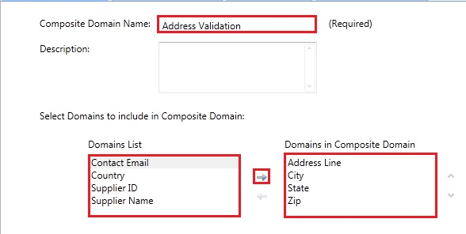

# Task 7: Creating a Composite Domain
  In this task, you create a composite domain, **Address Validation**, which comprises **Address Line**, **City**, **State**, and **Zip** domains. A composite domain lets you define a cross-domain rule that involves multiple domains in a rule. There are other advantages to a composite domain such as being able to parse a field value into multiple domains.  For example, a value for a Full Name field can be parsed into separate First Name, Middle Name, and Last Name domains. In this tutorial, you only define a cross-domain rule. See [Managing a Composite Domain](https://msdn.microsoft.com/library/hh510399.aspx) for more details.  
  
1.  In the left pane, click **Create a composite domain** button on the toolbar.  
  
       
  
2.  Enter **Address Validation** for the **Composite Domain Name**.  
  
       
  
3.  From the domain list select **Address Line**, **City**, **State**, and **Zip** and click **right arrow** to add them to the **Domains in Composite Domain** list.  
  
4.  Click **OK** to close the dialog box.  
  
## Next Step  
 [Task 8: Creating a Composite Domain Rule](../../2014/tutorials/task-8-creating-a-composite-domain-rule.md)  
  
  
