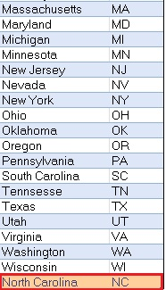
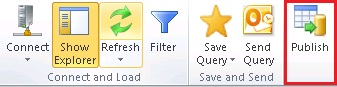
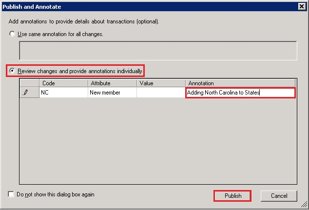

# Task 8: Adding a New Value for State Entity in Excel
  In this task, you add a value for the State entity in Excel and publish the change to the MDS server.  
  
1.  Add a **work sheet** in Excel by clicking the new tab at the bottom.  
  
       
  
2.  In **Excel**, click the **Master Data** tab on the menu, and then click **Show Explorer** on the ribbon.  
  
3.  In the **Master Data Explorer**, select **Suppliers** for **Model**. You should see two entities: **Supplier** and **State** in the entity list.  
  
4.  Double-click **State** in the list. All the members of the **State** entity from MDS should be displayed in the worksheet.  
  
5.  Now, add a row at the end with the following values: **North Carolina** for **Name** and **NC** for **Code**. The color coding differentiates any new/updated records from the other records.  
  
       
  
6.  Click **Publish** on the ribbon to publish the change to MDS.  
  
       
  
7.  On the **Publish and Annotate** dialog box, notice that the **Use same annotation for all changes** is selected. You can enter a single annotation for all the changes here.  
  
8.  Select **Review changes and provide annotations individually** option to provide annotation for each change (in this case, only one).  
  
       
  
9. Click **Publish** to publish data to MDS.  
  
10. Notice that **color coding** for the row with **North Carolina** as the **State** is same as other records now.  
  
11. **Optional:** Verify that the new member (NC) is added to the **State** entity by using the **Explorer** in **Master Data Manager**.  
  
12. In Excel, right-click the **State** worksheet at the bottom, and click **Delete** to delete the worksheet. Deleting the worksheet does not delete any data from the MDS server.  
  
## Next Step  
 [Task 9: Creating a Derived Hierarchy using Master Data Manager](../../2014/tutorials/task-9-creating-a-derived-hierarchy-using-master-data-manager.md)  
  
  
