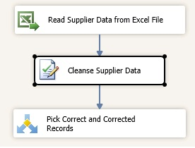
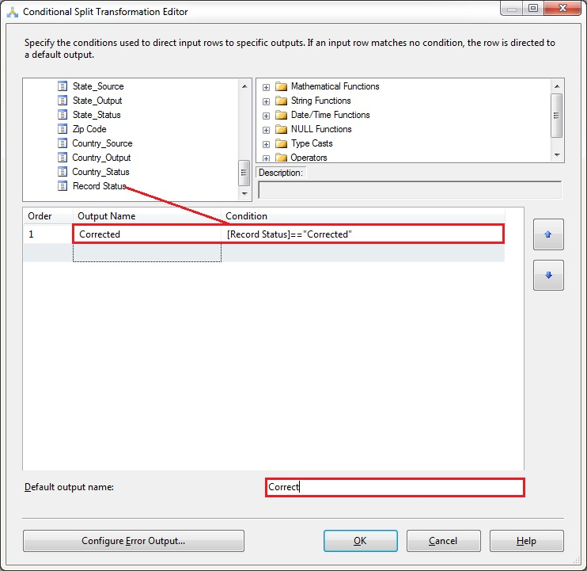

# Task 8: Adding Conditional Split Transform to Split Cleansing Output
  In this transform, you add a Conditional Split Transform to the data flow. The Conditional Split transformation can route rows to different outputs based on the content of the data. For this tutorial, you use the **Record Status** output column from the DQS Cleansing transform. You will upload only correct or corrected records to MDS server in this tutorial. Therefore you check if the **Record Status** is **Correct** or **Corrected**, and combine the records before uploading the records to MDS.  
  
1.  Drag-drop **Conditional Split Transform** from **Common** section in the **SSIS Toolbox** to the **Data Flow** tab under **Cleanse Supplier Data**.  
  
2.  Right-click **Conditional Split**, and click **Rename**. Type **Pick Correct and Corrected Records** and press **ENTER**.  
  
3.  Connect **Cleanse Supplier Data** and **Pick Correct and Corrected Records** using the blue connector.  
  
       
  
4.  Double-click **Pick Correct and Corrected Records** in the **Data Flow** tab.  
  
5.  Change the **Default Output Name** at the bottom of the screen to **Correct**.  
  
6.  Expand **Columns** in the **top-left pane**.  
  
       
  
7.  Drag-drop **Record Status** to the **Condition** column.  
  
8.  Type **=="Corrected"** next to **[Record Status]** for the **Condition** column.  
  
9. Click **Case 1** in the **Output Name Column**, and change the name to **Corrected**.  
  
10. Click **OK** to close the **Conditional Split Transformation Editor** dialog box.  
  
## Next Step  
 [Task 9: Adding Union All Transform to Combine Correct and Corrected Records](../../2014/tutorials/task-9-adding-union-all-transform-to-combine-correct-and-corrected-records.md)  
  
  
