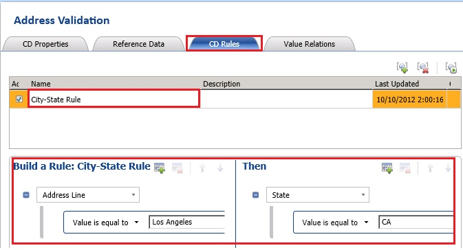

# Task 8: Creating a Composite Domain Rule
  In this task, you create a rule for the **Address Validation** composite domain. You define a cross-domain rule: if **City** is **Los Angeles**, **State** must be **CA** where **City** and **State** are two domains.  
  
1.  In the right pane, switch to the **CD Rules** tab.  
  
2.  Click **Add a new domain rule** from the toolbar.  
  
3.  Type **City-State Rule** for **Name** and press **ENTER**.  
  
4.  In the **Build a Rule** pane, select **City** in the domain list, and select condition **Value is equal to** and type **Los Angeles** for the value.  
  
5.  In the **Then** pane, select **State** in the domain list, and select **Value is equal to**, type **CA** for the value, and press **TAB**.  
  
       
  
6.  Click **Close** button at the bottom of the page to switch to the main page of DQS Client. You will publish the knowledge base in the next lesson. Notice that the knowledge base is in locked state (lock icon).  
  
## Next Step  
 [Task 9: Configuring a Reference Data Service](../../2014/tutorials/task-9-configuring-a-reference-data-service.md)  
  
  
