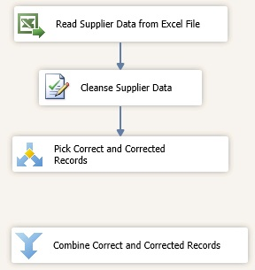
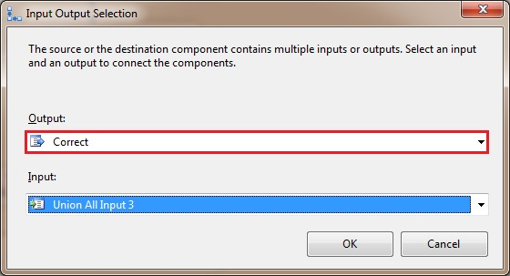
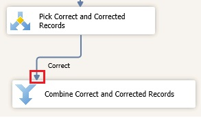
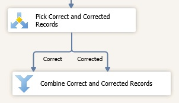

# Task 9: Adding Union All Transform to Combine Correct and Corrected Records
  In this task, you add the Union All Transform to the data flow. The Union All transformation combines multiple inputs into one output. In your scenario, it combine both Correct and Corrected records into one stream.  
  
1.  Drag-drop **Union All** Transform from **Common** section of the **SSIS Toolbox** to the **Data Flow** tab and place it under **Pick Correct and Corrected Records**.  
  
2.  Right-click **Union All** Transform in the **Data Flow** tab, and click **Rename**. Type **Combine Correct and Corrected Records**, and press **ENTER**.  
  
       
  
3.  Connect **Pick Correct and Corrected Records** to **Combine Correct and Corrected Records** in the **Data Flow** tab by using the blue connector. You should see the **Input Output Selection** dialog box.  
  
4.  In the **Input Output** dialog box, select **Correct** for **Output** and click **OK**.  
  
       
  
5.  Move the connector titled **Correct** to the left by dragging and dropping the dot at the end of the connector to left.  
  
       
  
6.  If you select **Pick Correct and Corrected Records** transform, you should see another blue connector. Drag that blue connector to **Combine Correct and Corrected Records**.  
  
       
  
7.  This **connector** should be titled **Corrected**. Since you have only two conditions **Correct** and **Corrected**, and one condition was already used, the **Input Output Selection** dialog box is not displayed this time. If the connectors overlap, move one to left and the other one to right by dragging the connector to left or right.  
  
## Next Step  
 [Task 10: Adding Fuzzy Group Transform to Identify Duplicates](../../2014/tutorials/task-10-adding-fuzzy-group-transform-to-identify-duplicates.md)  
  
  
