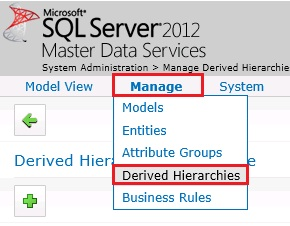
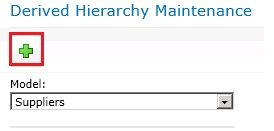
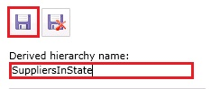
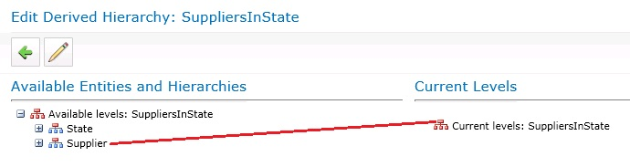
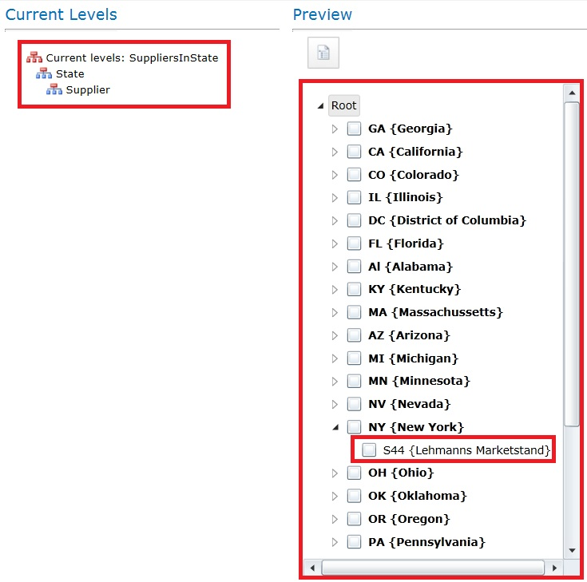
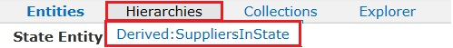
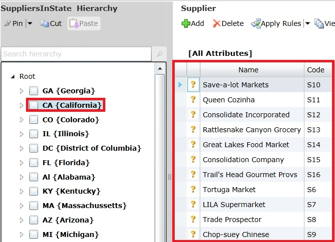

# Task 9: Creating a Derived Hierarchy using Master Data Manager
  In this task, you create a derived hierarchy by using Master Data Manager. This derived hierarchy is derived from the domain-based attribute relationships between the **Supplier** and **State** entities.  
  
1.  Switch to the main page of **Master Data Manager** by clicking **SQL Server 2012 Master Data Services** at the top of the page.  
  
2.  Click **System Administration** in the **Administrative Tasks** section.  
  
3.  Hover the mouse over **Manage** on the menu bar, and click **Derived Hierarchies**.  
  
       
  
4.  Click **Add Derived Hierarchy (+)** button on the toolbar.  
  
       
  
5.  Type **SuppliersInState** for the **Derived hierarchy name**.  
  
6.  Click **Save** button on the toolbar.  
  
       
  
7.  Drag **Supplier** from **Available Levels: SuppliersInState** to **Current Levels: SuppliersInState**.  
  
       
  
8.  Drag **State** from **Available Levels: SuppliersInState** to **Current Levels: SuppliersInState**. The screen should have **Current Levels** as shown in the following picture.  
  
       
  
9. In the **Preview** window, expand **NY { New York}** and you should see one supplier in that state as shown in the preceding image.  
  
10. Switch to the main page of **Master Data Manager** by clicking **SQL Server 2012 Master Data Services** at the top of the page.  
  
11. Click **Explorer**.  
  
12. Hover the mouse over **Hierarchies** and click **Derived:SuppliersInState**.  
  
       
  
13. Click on any **state** node in the **tree view** and you should see the suppliers in that state in the right pane.  
  
       
  
## Next Step  
 [Lesson 5: Automating the Cleansing and Matching using SSIS](../../2014/tutorials/lesson-5-automating-the-cleansing-and-matching-using-ssis.md)  
  
  
