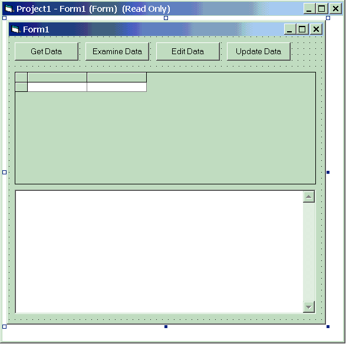

# HelloData: A Simple ADO Application
This simple application steps through each of the four major ADO operations: getting, examining, editing, and updating data. These operations are performed against the Northwind sample database included with Microsoft® SQL Server. To focus on the fundamentals of ADO and to prevent code clutter, error handling in the example is minimal.  
  
### To run HelloData  
  
1.  Create a new Standard EXE Visual Basic project that references the ADO library. For more information, see [Referencing the ADO Libraries](../referencing-the-ado-libraries.md).  
  
2.  Create four command buttons at the top of the form, setting the **Name** and **Caption** properties to the values shown in the table at the end of this topic.  
  
3.  Below the buttons, add a **Microsoft DataGrid Control** (Msdatgrd.ocx). The Msdatgrd.ocx file is included with Visual Basic and is located in your \windows\system32 or \winnt\system32 directory. To add the DataGrid control to your Visual Basic toolbox pane, select **Components...** from the **Project** menu. Then check the box next to "Microsoft DataGrid Control 6.0 (SP3) (OLEDB)" and then click **OK**. To add the control to the project, drag the DataGrid control from the Toolbox to the Visual Basic form.  
  
4.  Create a **TextBox** on the form below the grid and set its properties as shown in the table. The form should resemble the following figure when you are finished.  
  
5.  Finally, copy the code listed in [HelloData Code](./hellodata-code.md), and paste it into the code editor window of the form. Press **F5** to run the code.  
  
> [!NOTE]
>  In the following example, and throughout the guide, the user id "MyId" with a password of "123aBc" is used to authenticate against the server. You should substitute these values with valid logon credentials for your server. Also, substitute the "MySQLServer" value with the name of your server.  
  
 For a detailed description of the code, see [Comments on HelloData](./comments-on-hellodata.md).  
  
   
  
|Control Type|Property|Value|  
|------------------|--------------|-----------|  
|Form|Name|Form1|  
||Height|6500|  
||Width|6500|  
|MS DataGrid|Name|grdDisplay1|  
|TextBox|Name|txtDisplay1|  
||Multiline|true|  
|Command Button|Name|cmdGetData|  
||Caption|Get Data|  
|Command Button|Name|cmdExamineData|  
||Caption|Examine Data|  
|Command Button|Name|cmdEditData|  
||Caption|Edit Data|  
|Command Button|Name|cmdUpdateData|  
||Caption|Update Data|