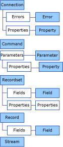

# ADO Object Model
The following figures show the ADO objects and their collections.  
  
   
  
## See Also  
 [ADO Collections](../../../ado/reference/ado-api/ado-collections.md)   
 [ADO Dynamic Properties](../../../ado/reference/ado-api/ado-dynamic-properties.md)   
 [ADO Enumerated Constants](../../../ado/reference/ado-api/ado-enumerated-constants.md)   
 [Appendix B: ADO Errors](../../../ado/guide/appendixes/appendix-b-ado-errors.md)   
 [ADO Events](../../../ado/reference/ado-api/ado-events.md)   
 [ADO Methods](../../../ado/reference/ado-api/ado-methods.md)   
 [ADO Objects and Interfaces](../../../ado/reference/ado-api/ado-objects-and-interfaces.md)   
 [ADO Properties](../../../ado/reference/ado-api/ado-properties.md)
