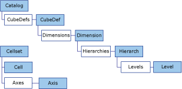

# ADO MD Object Model
This topic describes how objects are represented and related in ADO MD.  
  
   
  
 The [Axis](../../../ado/reference/ado-md-api/axis-object-ado-md.md) and [Cell](../../../ado/reference/ado-md-api/cell-object-ado-md.md) objects each have a [Positions](../../../ado/reference/ado-md-api/positions-collection-ado-md.md) collection.  
  
 The [Level](../../../ado/reference/ado-md-api/level-object-ado-md.md) and [Position](../../../ado/reference/ado-md-api/position-object-ado-md.md) objects each have a [Members](../../../ado/reference/ado-md-api/members-collection-ado-md.md) collection.  
  
 The [Axis](../../../ado/reference/ado-md-api/axis-object-ado-md.md), [Cell](../../../ado/reference/ado-md-api/cell-object-ado-md.md), [Cellset](../../../ado/reference/ado-md-api/cellset-object-ado-md.md), [CubeDef](../../../ado/reference/ado-md-api/cubedef-object-ado-md.md), [Dimension](../../../ado/reference/ado-md-api/dimension-object-ado-md.md), [Hierarchy](../../../ado/reference/ado-md-api/hierarchy-object-ado-md.md), [Level](../../../ado/reference/ado-md-api/level-object-ado-md.md), and [Member](../../../ado/reference/ado-md-api/member-object-ado-md.md) objects each have a standard ADO [Properties](../../../ado/reference/ado-api/properties-collection-ado.md) collection.  
  
## See Also  
 [ADO MD API Reference](../../../ado/reference/ado-md-api/ado-md-api-reference.md)   
 [ADO MD Code Examples](../../../ado/reference/ado-md-api/ado-md-code-examples.md)   
 [ADO MD Collections](../../../ado/reference/ado-md-api/ado-md-collections.md)   
 [ADO MD Enumerated Constants](../../../ado/reference/ado-md-api/ado-md-enumerated-constants.md)   
 [ADO MD Methods](../../../ado/reference/ado-md-api/ado-md-methods.md)   
 [ADO MD Objects](../../../ado/reference/ado-md-api/ado-md-objects.md)   
 [ADO MD Properties](../../../ado/reference/ado-md-api/ado-md-properties.md)   
 [ADO (Multidimensional) (ADO MD)](../../../ado/guide/multidimensional/ado-multidimensional-ado-md.md)   
 [Overview of Multidimensional Schemas and Data](../../../ado/guide/multidimensional/overview-of-multidimensional-schemas-and-data.md)   
 [Working with Multidimensional Data](../../../ado/guide/multidimensional/working-with-multidimensional-data.md)
