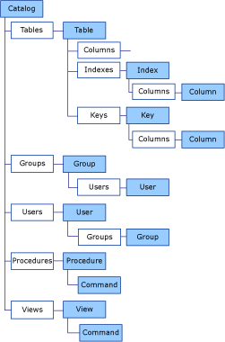

# ADOX Object Model
The following diagram illustrates how objects are represented and related in ADOX. For more information about a specific object or collection, see the specific reference topic, or [ADOX Objects](../../../ado/reference/adox-api/adox-objects.md) and [ADOX Collections](../../../ado/reference/adox-api/adox-collections.md).  
  
   
  
 Each of the [Table](../../../ado/reference/adox-api/table-object-adox.md), [Index](../../../ado/reference/adox-api/index-object-adox.md), and [Column](../../../ado/reference/adox-api/column-object-adox.md) objects also has a standard ADO [Properties](../../../ado/reference/ado-api/properties-collection-ado.md) collection.  
  
## See Also  
 [ADOX API Reference](../../../ado/reference/adox-api/adox-api-reference.md)   
 [ADOX Code Examples](../../../ado/reference/adox-api/adox-code-examples.md)   
 [ADOX Collections](../../../ado/reference/adox-api/adox-collections.md)   
 [ADOX Enumerated Constants](../../../ado/reference/adox-api/adox-enumerated-constants.md)   
 [ADOX Methods](../../../ado/reference/adox-api/adox-methods.md)   
 [ADOX Objects](../../../ado/reference/adox-api/adox-objects.md)   
 [ADOX Properties](../../../ado/reference/adox-api/adox-properties.md)   
 [ADO Extensions for Data Definition Language and Security (ADOX)](../../../ado/guide/extensions/ado-extensions-for-data-definition-language-and-security-adox.md)
