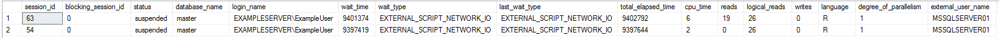
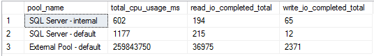

# Monitor SQL Server Machine Learning Services using dynamic management views (DMVs)
[!INCLUDE[appliesto-ss-xxxx-xxxx-xxx-md-winonly](../../includes/appliesto-ss-xxxx-xxxx-xxx-md-winonly.md)]

Use dynamic management views (DMVs) to monitor the execution of external scripts (R and Python), resources used, diagnose problems, and tune performance in SQL Server Machine Learning Services.

In this article, you will find the DMVs that are specific for SQL Server Machine Learning Services. You will also find example queries that show:

+ Settings and configuration options for machine learning
+ Active sessions running external R or Python scripts
+ Execution statistics for the external runtime for R and Python
+ Performance counters for external scripts
+ Memory usage for the OS, SQL Server, and external resource pools
+ Memory configuration for SQL Server and external resource pools
+ Resource Governor resource pools, including external resource pools
+ Installed packages for R and Python

For more general information about DMVs, see [System Dynamic Management Views](../../relational-databases/system-dynamic-management-views/system-dynamic-management-views.md).

> [!TIP]
> You can also use the custom reports to monitor SQL Server Machine Learning Services. For more information, see [Monitor machine learning using custom reports in Management Studio](../../advanced-analytics/r/monitor-r-services-using-custom-reports-in-management-studio.md).

## Dynamic management views

The following dynamic management views can be used when monitoring machine learning workloads in SQL Server. To query the DMVs, you need `VIEW SERVER STATE` permission on the instance.

| Dynamic management view | Type | Description |
|-------------------------|------|-------------|
| [sys.dm_external_script_requests](../../relational-databases/system-dynamic-management-views/sys-dm-external-script-requests.md) | Execution | Returns a row for each active worker account that is running an external script. |
| [sys.dm_external_script_execution_stats](../../relational-databases/system-dynamic-management-views/sys-dm-external-script-execution-stats.md) | Execution | Returns one row for each type of external script request. |
| [sys.dm_os_performance_counters](../../relational-databases/system-dynamic-management-views/sys-dm-os-performance-counters-transact-sql.md) | Execution | Returns a row per performance counter maintained by the server. If you use the search condition `WHERE object_name LIKE '%External Scripts%'`, you can use this information to see how many scripts ran, which scripts were run using which authentication mode, or how many R or Python calls were issued on the instance overall. |
| [sys.dm_resource_governor_external_resource_pools](../../relational-databases/system-dynamic-management-views/sys-dm-resource-governor-external-resource-pools.md) | Resource Governor | Returns information about the current external resource pool state in Resource Governor, the current configuration of resource pools, and resource pool statistics. |
| [sys.dm_resource_governor_external_resource_pool_affinity](../../relational-databases/system-dynamic-management-views/sys-dm-resource-governor-external-resource-pool-affinity-transact-sql.md) | Resource Governor | Returns CPU affinity information about the current external resource pool configuration in Resource Governor. Returns one row per scheduler in [!INCLUDE[ssNoVersion_md](../../includes/ssnoversion-md.md)] where each scheduler is mapped to an individual processor. Use this view to monitor the condition of a scheduler or to identify runaway tasks. |

For information about monitoring [!INCLUDE[ssNoVersion_md](../../includes/ssnoversion-md.md)] instances, see [Catalog Views](../../relational-databases/system-catalog-views/catalog-views-transact-sql.md) and [Resource Governor Related Dynamic Management Views](../../relational-databases/system-dynamic-management-views/resource-governor-related-dynamic-management-views-transact-sql.md).

## Settings and configuration

View the Machine Learning Services installation setting and configuration options.


Run the query below to get this output. For more information on the views and functions used, see [sys.dm_server_registry](../../relational-databases/system-dynamic-management-views/sys-dm-server-registry-transact-sql.md), [sys.configurations](../../relational-databases/system-catalog-views/sys-configurations-transact-sql.md), and [SERVERPROPERTY](../../t-sql/functions/serverproperty-transact-sql.md).

```sql
SELECT CAST(SERVERPROPERTY('IsAdvancedAnalyticsInstalled') AS INT) AS IsMLServicesInstalled
    , CAST(value_in_use AS INT) AS ExternalScriptsEnabled
    , COALESCE(SIGN(SUSER_ID(CONCAT (
                    CAST(SERVERPROPERTY('MachineName') AS NVARCHAR(128))
                    , '\SQLRUserGroup'
                    , CAST(serverproperty('InstanceName') AS NVARCHAR(128))
                    ))), 0) AS ImpliedAuthenticationEnabled
    , COALESCE((
            SELECT CAST(r.value_data AS INT)
            FROM sys.dm_server_registry AS r
            WHERE r.registry_key LIKE 'HKLM\Software\Microsoft\Microsoft SQL Server\%\SuperSocketNetLib\Tcp'
            AND r.value_name = 'Enabled'
            ), - 1) AS IsTcpEnabled
FROM sys.configurations
WHERE name = 'external scripts enabled';
```

The query returns the following columns:

| Column | Description |
|--------|-------------|
| IsMLServicesInstalled | Returns 1 if SQL Server Machine Learning Services is installed for the instance. Otherwise, returns 0. |
| ExternalScriptsEnabled | Returns 1 if external scripts is enabled for the instance. Otherwise, returns 0. |
| ImpliedAuthenticationEnabled | Returns 1 if implied authentication is enabled. Otherwise, returns 0. The configuration for implied authentication is checked by verifying if a login exists for SQLRUserGroup. |
| IsTcpEnabled | Returns 1 if the TCP/IP protocol is enabled for the instance. Otherwise, returns 0. For more information, see [Default SQL Server Network Protocol Configuration](../../database-engine/configure-windows/default-sql-server-network-protocol-configuration.md). |

## Active sessions

View the active sessions running external scripts.


Run the query below to get this output. For more information on the dynamic management views used, see [sys.dm_exec_requests](../../relational-databases/system-dynamic-management-views/sys-dm-external-script-requests.md), [sys.dm_external_script_requests](../../relational-databases/system-catalog-views/sys-configurations-transact-sql.md), and [sys.dm_exec_sessions](../../relational-databases/system-dynamic-management-views/sys-dm-exec-sessions-transact-sql.md).

```sql
SELECT r.session_id, r.blocking_session_id, r.status, DB_NAME(s.database_id) AS database_name
    , s.login_name, r.wait_time, r.wait_type, r.last_wait_type, r.total_elapsed_time, r.cpu_time
    , r.reads, r.logical_reads, r.writes, er.language, er.degree_of_parallelism, er.external_user_name
FROM sys.dm_exec_requests AS r
INNER JOIN sys.dm_external_script_requests AS er
ON r.external_script_request_id = er.external_script_request_id
INNER JOIN sys.dm_exec_sessions AS s
ON s.session_id = r.session_id;
```

The query returns the following columns:

| Column | Description |
|--------|-------------|
| session_id | Identifies the session associated with each active primary connection. |
| blocking_session_id | ID of the session that is blocking the request. If this column is NULL, the request is not blocked, or the session information of the blocking session is not available (or cannot be identified). |
| status | Status of the request. |
| database_name | Name of the current database for each session. |
| login_name | SQL Server login name under which the session is currently executing. |
| wait_time | If the request is currently blocked, this column returns the duration in milliseconds, of the current wait. Is not nullable. |
| wait_type | If the request is currently blocked, this column returns the type of wait. For information about types of waits, see [sys.dm_os_wait_stats](../../relational-databases/system-dynamic-management-views/sys-dm-os-wait-stats-transact-sql.md). |
| last_wait_type | If this request has previously been blocked, this column returns the type of the last wait. |
| total_elapsed_time | Total time elapsed in milliseconds since the request arrived. |
| cpu_time | CPU time in milliseconds that is used by the request. |
| reads | Number of reads performed by this request. |
| logical_reads | Number of logical reads that have been performed by the request. |
| writes | Number of writes performed by this request. |
| language | Keyword that represents a supported script language. |
| degree_of_parallelism | Number indicating the number of parallel processes that were created. This value might be different from the number of parallel processes that were requested. |
| external_user_name | The Windows worker account under which the script was executed. |

## Execution statistics

View the execution statistics for the external runtime for R and Python. Only statistics of RevoScaleR, revoscalepy, or microsoftml package functions are currently available.



Run the query below to get this output. For more information on the dynamic management view used, see  [sys.dm_external_script_execution_stats](../../relational-databases/system-dynamic-management-views/sys-dm-external-script-execution-stats.md). The query only returns functions that have been executed more than once.

```sql
SELECT language, counter_name, counter_value
FROM sys.dm_external_script_execution_stats
WHERE counter_value > 0
ORDER BY language, counter_name;
```

The query returns the following columns:

| Column | Description |
|--------|-------------|
| language | Name of the registered external script language. |
| counter_name | Name of a registered external script function. |
| counter_value | Total number of instances that the registered external script function has been called on the server. This value is cumulative, beginning with the time that the feature was installed on the instance, and cannot be reset. |

## Performance counters

View the performance counters related to the execution of external scripts.


Run the query below to get this output. For more information on the dynamic management view used, see  [sys.dm_os_performance_counters](../../relational-databases/system-dynamic-management-views/sys-dm-os-performance-counters-transact-sql.md).

```sql
SELECT counter_name, cntr_value
FROM sys.dm_os_performance_counters 
WHERE object_name LIKE '%External Scripts%'
```

**sys.dm_os_performance_counters** outputs the following performance counters for external scripts:

| Counter | Description |
|---------|-------------|
| Total Executions | Number of external processes started by local or remote calls. |
| Parallel Executions | Number of times that a script included the _@parallel_ specification and that [!INCLUDE[ssNoVersion_md](../../includes/ssnoversion-md.md)] was able to generate and use a parallel query plan. |
| Streaming Executions | Number of times that the streaming feature has been invoked. |
| SQL CC Executions | Number of external scripts run where the call was instantiated remotely and SQL Server was used as the compute context. |
| Implied Auth. Logins | Number of times that an ODBC loopback call was made using implied authentication; that is, the [!INCLUDE[ssNoVersion_md](../../includes/ssnoversion-md.md)] executed the call on behalf of the user sending the script request. |
| Total Execution Time (ms) | Time elapsed between the call and completion of call. |
| Execution Errors | Number of times scripts reported errors. This count does not include R or Python errors. |

## Memory usage

View information about the memory used by the OS, SQL Server, and the external pools.


Run the query below to get this output. For more information on the dynamic management views used, see [sys.dm_resource_governor_external_resource_pools](../../relational-databases/system-dynamic-management-views/sys-dm-resource-governor-external-resource-pools.md) and [sys.dm_os_sys_info](../../relational-databases/system-dynamic-management-views/sys-dm-os-sys-info-transact-sql.md).

```sql
SELECT physical_memory_kb, committed_kb
    , (SELECT SUM(peak_memory_kb)
        FROM sys.dm_resource_governor_external_resource_pools AS ep
        ) AS external_pool_peak_memory_kb
FROM sys.dm_os_sys_info;
```

The query returns the following columns:

| Column | Description |
|--------|-------------|
| physical_memory_kb | The total amount of physical memory on the machine. |
| committed_kb | The committed memory in kilobytes (KB) in the memory manager. Does not include reserved memory in the memory manager. |
| external_pool_peak_memory_kb | The sum of the The maximum amount of memory used, in kilobytes, for all external resource pools. |

## Memory configuration

View information about the maximum memory configuration in percentage of SQL Server and external resource pools. If SQL Server is running with the default value of `max server memory (MB)`, it is considered as 100% of the OS memory.


Run the query below to get this output. For more information on the views used, see [sys.configurations](../../relational-databases/system-catalog-views/sys-configurations-transact-sql.md) and [sys.dm_resource_governor_external_resource_pools](../../relational-databases/system-dynamic-management-views/sys-dm-resource-governor-external-resource-pools.md).

```sql
SELECT 'SQL Server' AS name
    , CASE CAST(c.value AS BIGINT)
        WHEN 2147483647 THEN 100
        ELSE (SELECT CAST(c.value AS BIGINT) / (physical_memory_kb / 1024.0) * 100 FROM sys.dm_os_sys_info)
        END AS max_memory_percent
FROM sys.configurations AS c
WHERE c.name LIKE 'max server memory (MB)'
UNION ALL
SELECT CONCAT ('External Pool - ', ep.name) AS pool_name, ep.max_memory_percent
FROM sys.dm_resource_governor_external_resource_pools AS ep;
```

The query returns the following columns:

| Column | Description |
|--------|-------------|
| name | Name of the external resource pool or SQL Server. |
| max_memory_percent | The maximum memory that SQL Server or the external resource pool can use. |

## Resource pools

In [SQL Server Resource Governor](../../relational-databases/resource-governor/resource-governor.md), a [resource pool](../../relational-databases/resource-governor/resource-governor-resource-pool.md) represents a subset of the physical resources of an instance. You can specify limits on the amount of CPU, physical IO, and memory that incoming application requests, including execution of external scripts, can use within the resource pool. View the resource pools used for SQL Server and external scripts.



Run the query below to get this output. For more information on the dynamic management views used, see  [sys.dm_resource_governor_resource_pools](../../relational-databases/system-dynamic-management-views/sys-dm-resource-governor-resource-pools-transact-sql.md) and [sys.dm_resource_governor_external_resource_pools](../../relational-databases/system-dynamic-management-views/sys-dm-resource-governor-external-resource-pools.md).

```sql
SELECT CONCAT ('SQL Server - ', p.name) AS pool_name
    , p.total_cpu_usage_ms, p.read_io_completed_total, p.write_io_completed_total
FROM sys.dm_resource_governor_resource_pools AS p
UNION ALL
SELECT CONCAT ('External Pool - ', ep.name) AS pool_name
    , ep.total_cpu_user_ms, ep.read_io_count, ep.write_io_count
FROM sys.dm_resource_governor_external_resource_pools AS ep;
```

The query returns the following columns:

| Column | Description |
|--------|-------------|
| pool_name | Name of the resource pool. SQL Server resource pools are prefixed with `SQL Server` and external resource pools are prefixed with `External Pool`.
| total_cpu_usage_hours | The cumulative CPU usage in milliseconds  since the Resource Govenor statistics were reset. |
| read_io_completed_total | The total read IOs completed since the Resource Govenor statistics were reset. |
| write_io_completed_total | The total write IOs completed since the Resource Govenor statistics were reset. |

## Installed packages

You can to view the R and Python packages that are installed in SQL Server Machine Learning Services by executing an R or Python script that outputs these.

### Installed packages for R

View the R packages installed in SQL Server Machine Learning Services.


Run the query below to get this output. The query use an R script to determine R packages installed with SQL Server.

```sql
EXEC sp_execute_external_script @language = N'R'
, @script = N'
OutputDataSet <- data.frame(installed.packages()[,c("Package", "Version", "Depends", "License", "LibPath")]);'
WITH result sets((Package NVARCHAR(255), Version NVARCHAR(100), Depends NVARCHAR(4000)
    , License NVARCHAR(1000), LibPath NVARCHAR(2000)));
```

The columns returned are:

| Column | Description |
|--------|-------------|
| Package | Name of the installed package. |
| Version | Version of the package. |
| Depends | Lists the package(s) that the installed package depends on. |
| License | License for the installed package. |
| LibPath | Directory where you can find the package. |

### Installed packages for Python

View the Python packages installed in SQL Server Machine Learning Services.


Run the query below to get this output. The query use an Python script to determine the Python packages installed with SQL Server.

```sql
EXEC sp_execute_external_script @language = N'Python'
, @script = N'
import pip
OutputDataSet = pandas.DataFrame([(i.key, i.version, i.location) for i in pip.get_installed_distributions()])'
WITH result sets((Package NVARCHAR(128), Version NVARCHAR(128), Location NVARCHAR(1000)));
```

The columns returned are:

| Column | Description |
|--------|-------------|
| Package | Name of the installed package. |
| Version | Version of the package. |
| Location | Directory where you can find the package. |

## Next steps

+ [Managing and monitoring machine learning solutions](../../advanced-analytics/r/managing-and-monitoring-r-solutions.md)
+ [Extended events for machine learning](../../advanced-analytics/r/extended-events-for-sql-server-r-services.md)
+ [Resource Governor Related Dynamic Management Views](../../relational-databases/system-dynamic-management-views/resource-governor-related-dynamic-management-views-transact-sql.md)
+ [System Dynamic Management Views](../../relational-databases/system-dynamic-management-views/system-dynamic-management-views.md)
+ [Monitor machine learning using custom reports in Management Studio](../../advanced-analytics/r/monitor-r-services-using-custom-reports-in-management-studio.md)