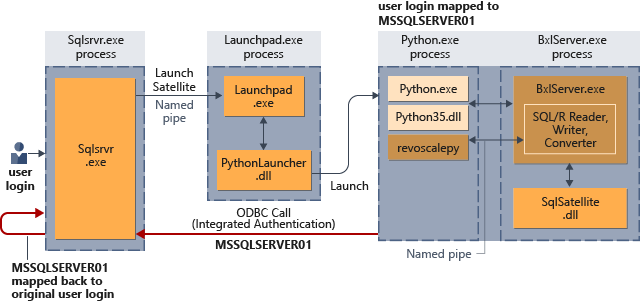

# Security overview for the extensibility framework in SQL Server Machine Learning Services

[!INCLUDE[appliesto-ss-xxxx-xxxx-xxx-md-winonly](../../includes/appliesto-ss-xxxx-xxxx-xxx-md-winonly.md)]

This article describes the overall security architecture that is used to integrate the SQL Server database engine and related components with the extensibility framework. It examines the securables, services, process identity, and permissions. For more information about the key concepts and components of extensibility in SQL Server, see [Extensibility architecture in SQL Server Machine Learning Services](extensibility-framework.md)].

## Securables for external script

An external script written in R or Python is submitted as an input parameter to a [system stored procedure](../../relational-databases/system-stored-procedures/sp-execute-external-script-transact-sql.md) created for this purpose, or is wrapped in a stored procedure that you define. Alternatively, you might have models that are pretrained and stored in a binary format in a database table, callable in a T-SQL [PREDICT](../../t-sql/queries/predict-transact-sql.md) function.

As the script is provided through existing database schema objects, stored procedures and tables, there are no new [securables](../../relational-databases/security/securables.md) for SQL Server Machine Learning Services.

Regardless of how you are using script or, what they consist of, database objects will be created and probably saved, but no new object type is introduced for storing script. As a result, the ability to consume, create, and save database objects depends largely on database permissions already defined for your users.

## Permissions

SQL Server's data security model of database logins and roles extend to R and Python script. A SQL Server login or Windows user account is required to run external scripts that use SQL Server data or that run with SQL Server as the compute context. Database users having permissions to execute an ad hoc query can access the same data from R or Python script.

The login or user account identifies the *security principal*, who might need multiple levels of access, depending on the external script requirements:

+ Permission to access the database where external scripts are enabled.
+ Permissions to read data from secured objects such as tables.
+ The ability to write new data to a table, such as a model, or scoring results.
+ The ability to create new objects, such as tables, stored procedures that use the external script, or custom functions that use R or Python job.
+ The right to install new packages on the SQL Server computer, or use packages provided to a group of users.

Each person who runs an external script using SQL Server as the execution context must be mapped to a user in the database. Rather than individually set database user permissions, you could create roles to manage sets of permissions, and assign users to those roles, rather than individually set user permissions.

For more information, see [Give users permission to SQL Server Machine Learning Services](../../advanced-analytics/security/user-permission.md).

## Permissions when using an external client tool

Users who are using R or Python in an external client tool must have their login or account mapped to a user in the database if they need to run an external script in-database, or access database objects and data. The same permissions are required whether the external script is sent from a remote data science client or run using a T-SQL stored procedure.

For example, assume that you created an external script that runs on your local computer, and you want to run that script on SQL Server. You must ensure that the following conditions are met:

+ The database allows remote connections.
+ The SQL login or Windows account that you used for database access has been added to the SQL Server at the instance level.
+ The SQL login or Windows user must have the permission to execute external scripts. Generally, this permission can only be added by a database administrator.
+ The SQL login or Window user must be added as a user, with appropriate permissions, in each database where the external script performs any of these operations:
  + Retrieving data.
  + Writing or updating data.
  + Creating new objects, such as tables or stored procedures.

After the login or Windows user account has been provisioned and given the necessary permissions, you can run an external script on SQL Server by using a data source object in R or the **revoscalepy** library in Python, or by calling a stored procedure that contains the external script.

Whenever an external script is launched from SQL Server, the database engine security gets the security context of the user who started the job, and manages the mappings of the user or login to securable objects.

Therefore, all external scripts that are initiated from a remote client must specify the login or user information as part of the connection string.

## Services used in external processing (Launchpad)

The extensibility framework adds one new NT service to the [list of services](../../database-engine/configure-windows/configure-windows-service-accounts-and-permissions.md#Service_Details) in a SQL Server installation: [**SQL Server Launchpad (MSSSQLSERVER)**](extensibility-framework.md#launchpad).

The database engine uses the SQL Server Launchpad service to instantiate an R or Python session as a separate process. The process runs under a low-privilege account; distinct from SQL Server, Launchpad itself, and the user identity under which the stored procedure or host query was executed. Running script in a separate process, under low-privilege account, is the basis of the security and isolation model for R and Python in SQL Server.

In addition to launching external processes, Launchpad is also responsible for tracking the identity of the calling user, and mapping that identity to the low-privilege worker account used to start the process. In some scenarios, where script or code calls back to SQL Server for data and operations, Launchpad is usually able to manage identity transfer seamlessly. Script containing SELECT statements or calling functions and other programming objects will typically succeed if the calling user has sufficient permissions.

> [!NOTE]
> By default, [!INCLUDE[rsql_launchpad_md](../../includes/rsql-launchpad-md.md)] is configured to run under **NT Service\MSSQLLaunchpad**, which is provisioned with all necessary permissions to run external scripts. For more information about configurable options, see [SQL Server Launchpad service configuration](../security/sql-server-launchpad-service-account.md).

## Identities used in processing (SQLRUserGroup)

**SQLRUserGroup** (SQL restricted user group) is created by SQL Server Setup and contains a pool of low-privilege local Windows user accounts. When an external process is needed, Launchpad takes an available worker account and uses it to run a process. More specifically, Launchpad activates an available worker account, maps it to the identity of the calling user, and runs the script under the worker account.

+ **SQLRUserGroup** is linked to a specific instance. A separate pool of worker accounts is needed for each instance on which machine learning has been enabled. Accounts cannot be shared between instances.

+ The size of the user account pool is static and the default value is 20, which supports 20 concurrent sessions. The number of external runtime sessions that can be launched simultaneously is limited by the size of this user account pool. 

+ Worker account names in the pool are of the format SQLInstanceName*nn*. For example, on a default instance, **SQLRUserGroup** contains accounts named MSSQLSERVER01, MSSQLSERVER02, and so forth on up to MSSQLSERVER20.

Parallelized tasks do not consume additional accounts. For example, if a user runs a scoring task that uses parallel processing, the same worker account is reused for all threads. If you intend to make heavy use of machine learning, you can increase the number of accounts used to run external scripts. For more information, see [Modify the user account pool for machine learning](../../advanced-analytics/administration/modify-user-account-pool.md).

::: moniker range=">=sql-server-ver15||=sqlallproducts-allversions"
### AppContainer isolation in SQL Server 2019

In SQL Server 2019, Setup no longer creates worker accounts for **SQLRUserGroup**. Instead, isolation is achieved through [AppContainers](https://docs.microsoft.com/windows/desktop/secauthz/appcontainer-isolation). At run time, when an external script is detected in a stored procedure or query, SQL Server calls Launchpad with a request for an extension-specific launcher. Launchpad invokes the appropriate runtime environment in a process under its identity, and instantiates an AppContainer to contain it. This change is beneficial because local account and password management is no longer required. Also, on installations where local user accounts are prohibited, elimination of the local user account dependency means you can now use this feature.

As implemented by SQL Server, AppContainers are an internal mechanism. While you won't see physical evidence of AppContainers in Process Monitor, you can find them in outbound firewall rules created by Setup to prevent processes from making network calls. For more information, see [Firewall configuration for SQL Server Machine Learning Services](../../advanced-analytics/security/firewall-configuration.md).

> [!Note]
> In SQL Server 2019, **SQLRUserGroup** only has one member which is now the single SQL Server Launchpad service account instead of multiple worker accounts.
::: moniker-end

### Permissions granted to SQLRUserGroup

By default, members of **SQLRUserGroup** have read and execute permissions on files in the SQL Server **Binn**, **R_SERVICES**, and **PYTHON_SERVICES** directories, with access to executables, libraries, and built-in datasets in the R and Python distributions installed with SQL Server. 

To protect sensitive resources on SQL Server, you can optionally define an access control list (ACL) that denies access to **SQLRUserGroup**. Conversely, you could also grant permissions to local data resources that exist on host computer, apart from SQL Server itself. 

By design, **SQLRUserGroup** does not have a database login or permissions to any data. Under certain circumstances, you might want to create a login to allow loop back connections, particularly when a trusted Windows identity is the calling user. This capability is called [*implied authentication*](#implied-authentication). For more information, see [Add SQLRUserGroup as a database user](../../advanced-analytics/security/add-sqlrusergroup-to-database.md).

## Identity mapping

When a session is started, Launchpad maps the identity of the calling user to a worker account. The mapping of an external Windows user or valid SQL login to a worker account is valid only for the lifetime of the SQL stored procedure that executes the external script. Parallel queries from the same login are mapped to the same user worker account.

During execution, Launchpad creates temporary folders to store session data, deleting them when the session concludes. The directories are access-restricted. For R, RLauncher performs this task. For Python, PythonLauncher performs this task. Each individual worker account is restricted to its own folder, and cannot access files in folders above its own level. However, the worker account can read, write, or delete children under the session working folder that was created. If you are an administrator on the computer, you can view the directories created for each process. Each directory is identified by its session GUID.

## Implied authentication (loop back requests)

*Implied authentication* describes connection request behavior under which external processes running as low-privilege worker accounts are presented as a trusted user identity to SQL Server on loop back requests for data or operations. As a concept, implied authentication is unique to Windows authentication, in SQL Server connection strings specifying a trusted connection, on requests originating from external processes such as R or Python script. It is sometimes also referred to as a *loop back*.

Trusted connections are workable from R and Python script, but only with additional configuration. In the extensibility architecture, R and Python processes run under worker accounts, inheriting permissions from the parent **SQLRUserGroup**. When a connection string specifies `Trusted_Connection=True`, the identity of the worker account is presented on the connection request, which is unknown by default to SQL Server.

To make trusted connections successful, you must create a database login for the **SQLRUserGroup**. After doing so, any trusted connection from any member of **SQLRUserGroup** has login rights to SQL Server. For step-by-step instructions, see [Add SQLRUserGroup to a database login](../../advanced-analytics/security/add-sqlrusergroup-to-database.md).

Trusted connections are not the most widely used formulation of a connection request. When R or Python script specifies a connection, it can be more common to use a SQL login, or a fully-specified user name and password if the connection is to an ODBC data source.

### How implied authentication works for R and Python sessions

The following diagram shows the interaction of SQL Server components with the R runtime and how it does implied authentication for R.

The next diagram shows the interaction of SQL Server components with the Python runtime and how it does implied authentication for Python.

## No support for Transparent Data Encryption at rest

[Transparent Data Encryption (TDE)](../../relational-databases/security/encryption/transparent-data-encryption.md) is not supported for data sent to or received from the external script runtime. The reason is that the external process (R or Python) runs outside the SQL Server process. Therefore, data used by the external runtime is not protected by the encryption features of the database engine. This behavior is no different than any other client running on the SQL Server computer that reads data from the database and makes a copy.

As a consequence, TDE **is not** applied to any data that you use in R or Python scripts, or to any data saved to disk, or to any persisted intermediate results. However, other types of encryption, such as Windows BitLocker encryption or third-party encryption applied at the file or folder level, still apply.

In the case of [Always Encrypted](../../relational-databases/security/encryption/overview-of-key-management-for-always-encrypted.md), external runtimes do not have access to the encryption keys. Therefore, data cannot be sent to the scripts.

## Next steps

In this article, you learned the components and interaction model of the security architecture built into the [extensibility framework](../../advanced-analytics/concepts/extensibility-framework.md). Key points covered in this article include the purpose of Launchpad, SQLRUserGroup and worker accounts, process isolation of R and Python, and how user identities are mapped to worker accounts. 

As a next step, review the instructions for [granting permissions](../../advanced-analytics/security/user-permission.md). For servers that use Windows authentication, you should also review [Add SQLRUserGroup to a database login](../../advanced-analytics/security/add-sqlrusergroup-to-database.md) to learn when additional configuration is required.