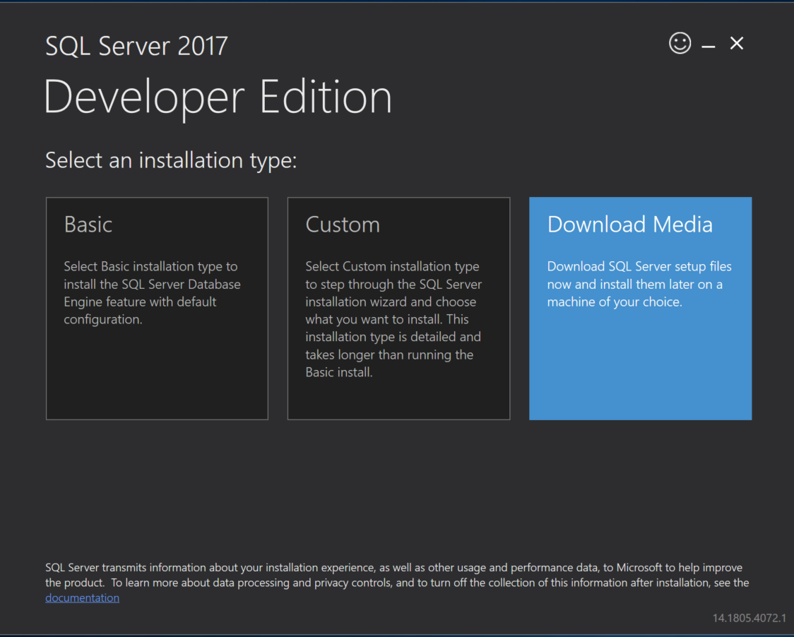
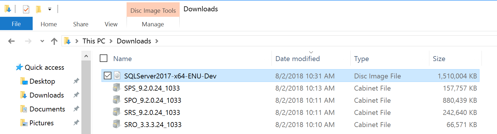
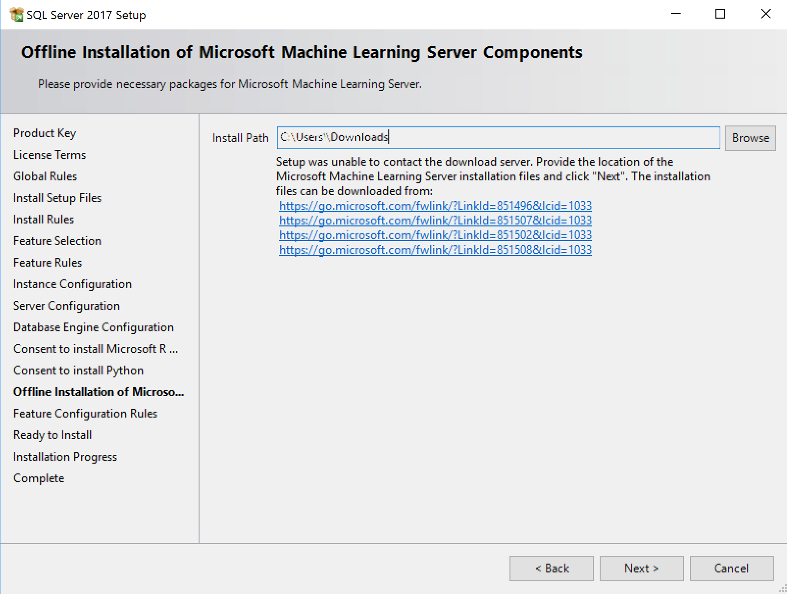
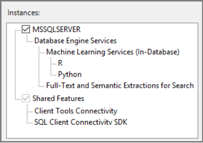

# Install SQL Server machine learning R and Python on computers with no internet access
[!INCLUDE[appliesto-ss-xxxx-xxxx-xxx-md-winonly](../../includes/appliesto-ss-xxxx-xxxx-xxx-md-winonly.md)]

By default, installers connect to Microsoft download sites to get required and updated components for machine learning on SQL Server. If firewall constraints prevent the installer from reaching these sites, you can use an internet-connected device to download files, transfer files to an offline server, and then run setup.

In-database analytics consist of database engine instance, plus additional components for R and Python integration, depending on the version of SQL Server. 

+ SQL Server 2017 includes R and Python. 
+ SQL Server 2016 is R-only. 

On an isolated server, machine learning and R/Python language-specific features are added through CAB files. 

## SQL Server 2017 offline install

To install SQL Server 2017 Machine Learning Services (R and Python) on an isolated server, start by downloading the initial release of SQL Server and the corresponding CAB files for R and Python support. Even if you plan to immediately update your server to use the latest cumulative update, an initial release must be installed first.

> [!Note]
> SQL Server 2017 does not have service packs. It's the first release of SQL Server to use the initial release as the only base line, with servicing through cumulative updates only. 

### 1 - Download 2017 CABs

On a computer having an internet connection, download the CAB files providing R and Python features for the initial release and the installation media for SQL Server 2017. 

Release  |Download link  |
---------|---------------|
Microsoft R Open     |[SRO_3.3.3.24_1033.cab](https://go.microsoft.com/fwlink/?LinkId=851496)|
Microsoft R Server      |[SRS_9.2.0.24_1033.cab](https://go.microsoft.com/fwlink/?LinkId=851507)|
Microsoft Python Open     |[SPO_9.2.0.24_1033.cab](https://go.microsoft.com/fwlink/?LinkId=851502) |
Microsoft Python Server    |[SPS_9.2.0.24_1033.cab](https://go.microsoft.com/fwlink/?LinkId=851508) |

###  2 - Get SQL Server 2017 installation media

1. On a computer having an internet connection, download the [SQL Server 2017 setup program](https://www.microsoft.com/sql-server/sql-server-downloads). 

2. Double-click setup and choose the **Download Media** installation type. With this option, setup creates a local .iso (or .cab) file containing the installation media.

   

## SQL Server 2016 offline install

SQL Server 2016 in-database analytics is R-only, with just two CAB files for product packages and Microsoft's distribution of open-source R, respectively. Start by installing any one of these releases: RTM, SP 1, SP 2. Once a base installation is in place, cumulative updates can be applied as a next step.

On a computer having an internet connection, download the CAB files used by setup to install in-database analytics on SQL Server 2016. 

### 1 - Download 2016 CABs

Release  | Microsoft R Open | Microsoft R Server |
---------|-----------------|---------------------|
**SQL Server 2016 RTM**     | [SRO_3.2.2.803_1033.cab](https://go.microsoft.com/fwlink/?LinkId=761266) |[SRS_8.0.3.0_1033.cab](https://go.microsoft.com/fwlink/?LinkId=735051) |
**SQL Server 2016 SP 1**     | [SRO_3.2.2.15000_1033.cab](https://go.microsoft.com/fwlink/?LinkId=824879) |[SRS_8.0.3.15000_1033.cab](https://go.microsoft.com/fwlink/?LinkId=824881) | 
**SQL Server 2016 SP 2**  |[SRO_3.2.2.20000_1033.cab](https://go.microsoft.com/fwlink/?LinkId=866039) |[SRS_8.0.3.20000_1033.cab](https://go.microsoft.com/fwlink/?LinkId=866038) |

### 2 - Get SQL Server 2016 installation media

You can install SQL Server 2016 RTM, SP 1, or SP 2 as your first installation on the target computer. Any of these versions can accept a cumulative update.

One way to get an .iso file containing the installation media is through [Visual Studio Dev Essentials](https://visualstudio.microsoft.com/dev-essentials/). Sign in, and then use the **Downloads** link to find the SQL Server 2016 release you want to install. The download is in the form of an .iso file, which you can copy to the target computer for an offline installation.

## Transfer files

Copy the SQL Server installation media (.iso or .cab) and in-database analytics CAB files to the target computer. Place the CAB files and installation media file in the same folder on the target machine, such as **Downloads** or the setup user's %temp* folder.

The following screenshot shows SQL Server 2017 CAB and ISO files. SQL Server 2016 downloads look different: fewer files (no Python), and the installation media file name is for 2016.

## Run Setup

When you run SQL Server Setup on a computer disconnected from the internet, Setup adds an **Offline installation** page to the wizard so that you can specify the location of the CAB files you copied in the previous step.

1. To begin installation, double-click the .iso or .cab file to access the installation media. You should see the **setup.exe** file.

2. Right-click **setup.exe** and run as administrator.

3. When the setup wizard displays the licensing page for open-source R or Python components, click  **Accept**. Acceptance of licensing terms allows you to proceed to the next step.

4. When you get to the **Offline installation** page, in **Install Path**, specify the folder containing the CAB files you copied earlier.

   

5. Continue following the on-screen prompts to complete the installation.

## Apply cumulative updates

We recommend that you apply the latest cumulative update to both the database engine and machine learning components. Cumulative updates are installed through the Setup program. 

1. Start with a baseline instance. You can only apply cumulative updates to existing installations of SQL Server:

  + SQL Server 2017 initial release
  + SQL Server 2016 initial release, SQL Server 2016 SP 1, or SQL Server 2016 SP 2

2. On an internet connected device, go to the cumulative update list for your version of SQL Server:

  + [SQL Server 2017 updates](https://sqlserverupdates.com/sql-server-2017-updates/)
  + [SQL Server 2016 updates](https://sqlserverupdates.com/sql-server-2016-updates/)

3. Select the latest cumulative update to download the executable.

4. Get corresponding CAB files for R and Python. For download links, see [CAB downloads for cumulative updates on SQL Server in-database analytics instances](sql-ml-cab-downloads.md).

5. Transfer all files, executable and CAB files, to the same folder on the offline computer.

6. Run Setup. Accept the licensing terms, and on the Feature selection page, review the features for which cumulative updates are applied. You should see every feature installed for the current instance, including machine learning features.

  

5. Continue through the wizard, accepting the licensing terms for R and Python distributions. During installation, you are prompted to choose the folder location containing the updated CAB files.

## Set environment variables

For R feature integration only, you should set the **MKL_CBWR** environment variable to [ensure consistent output](https://software.intel.com/articles/introduction-to-the-conditional-numerical-reproducibility-cnr) from Intel Math Kernel Library (MKL) calculations.

1. In Control Panel, click **System and Security** > **System** > **Advanced System Settings** > **Environment Variables**.

2. Create a new User or System variable. 

  + Set variable name to `MKL_CBWR`
  + Set the variable value to `AUTO`

This step requires a server restart. If you are about to enable script execution, you can hold off on the restart until all of the configuration work is done.

## Post-install configuration

After installation is finished, restart the service and then configure the server to enable script execution:

+ [Enable external script execution (SQL Server 2017)](sql-machine-learning-services-windows-install.md#bkmk_enableFeature)
+ [Enable external script execution (SQL Server 2016)](sql-r-services-windows-install.md#bkmk_enableFeature)

An initial offline installation of either SQL Server 2017 Machine Learning Services or SQL Server 2016 R Services requires the same configuration as an online installation:

+ [Verify installation](sql-machine-learning-services-windows-install.md#verify-installation)  (for SQL Server 2016, click [here](sql-r-services-windows-install.md#verify-installation)).
+ [Additional configuration as needed](sql-machine-learning-services-windows-install.md#additional-configuration)  (for SQL Server 2016, click [here](sql-r-services-windows-install.md#bkmk_FollowUp)).

## Next steps

To check the installation status of the instance and fix common issues, see [Custom reports for SQL Server R Services](../r/monitor-r-services-using-custom-reports-in-management-studio.md).

For help with any unfamiliar messages or log entries, see [Upgrade and installation FAQ - Machine Learning Services](../r/upgrade-and-installation-faq-sql-server-r-services.md).

