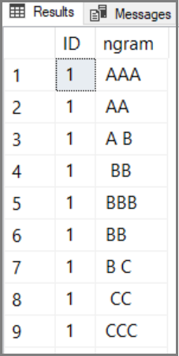

# SQL Server Regex Java Sample

This example demonstrates a Java class that receives two columns (ID and text) from SQL Server, and also takes a regular expression as an input parameter. The class returns two columns back to SQL Server (ID and text).

For a given text in the text column sent to the Java class, the code checks if the given regular expression is fulfilled, and returns that text together with the original ID. 

This particular sample uses a regular expression that checks if a text contains the word "Java" or "java".

## Microsoft Extensibility SDK for Java for Microsoft SQL Server

 In CTP 2.5, the way you implement Java code that uses the Java language extension to communicate with SQL Server has changed. 

The SDK is a helper interface that will make it easier to implement Java code running against SQL Server.

> [!NOTE]
> The SDK in CTP 2.5 is a big change from previous CTPs. Any previous samples will need to be updated to use the SDK.

You can find details about the [SDK](java-sdk.md) here.

## Prerequisites

+ SQL Server 2019 Database Engine instance with the extensibility framework and Java programming extension [on Windows](../install/sql-machine-learning-services-windows-install.md) or [on Linux](https://docs.microsoft.com/sql/linux/sql-server-linux-setup). For more information on system configuration, see [Java language extension in SQL Server 2019](extension-java.md). For more information about coding requirements, see [How to call Java in SQL Server](howto-call-java-from-sql.md).

+ SQL Server Management Studio or Azure Data Studio for running T-SQL.

+ Java SE Development Kit (JDK) 8 or JRE 8 on Windows or Linux.

+ Java Extension SDK for Microsoft SQL Server [jar file](http://aka.ms/mssql-java-lang-extension) mssql-java-lang-extension.jar.

Command-line compilation using **javac** is sufficient for this tutorial.

## 1 - Get SDK jar file

The Java Extensibility SDK for Microsoft SQL Server is packaged into a .jar file. Please download the [Java Extension SDK jar file mssql-java-lang-extension.jar](http://aka.ms/mssql-java-lang-extension).

## 1 - Create sample data in a SQL Server table

First, create and populate a *testdata* table with **ID** and **text** columns. Connect to SQL Server and run the following script to create a table:

```sql
CREATE DATABASE javatest
GO
USE javatest
GO

-- Create table for test data
DROP TABLE IF exists testdata;
GO

CREATE TABLE testdata(
id int NOT NULL,
"text" nvarchar(100) NOT NULL)
GO

TRUNCATE TABLE testdata
GO

-- Insert data into test table
INSERT INTO testdata(id, "text") VALUES (1, 'This sentence contains java')
INSERT INTO testdata(id, "text") VALUES (2, 'This sentence does not')
INSERT INTO testdata(id, "text") VALUES (3, 'I love Java!')
GO
SELECT * FROM testdata
```

## 2 - Class RegexSample.java

Start by creating the main class.

In this step, create a class called **RegexSample.java** and copy the following Java code into that file.

This main class is importing the SDK, which means that the jar file downloaded in step1 needs to be discoverable from this class.

> [!NOTE]
> Note that this class imports the Java extension SDK package.
See the article about the [Java extension SDK](java-sdk.md) for more details.

```java
TODO: JAVA CODE GOES HERE
```

## 3 Compile and create .jar file

We recommend that you package your classes and dependencies into .jar files. Most Java IDEs like Eclipse or IntelliJ support generating jar files when you build/compile the project. In this sample, we have named the jar file **regex.jar**.

If you are manually creating a .jar file, you can follow the steps, see [How to create a jar file](extension-java.md#create-jar).

> [!NOTE]
> This sample is using packages, which means that the package "pkg" given at the top of the class makes sure the compiled code is saved in a sub folder called "pkg". This is automatically taken care of if you use an IDE, but if you are manually compiling classes using **javac**, you will need to place the compiled code in the pkg sub folder manually.

## 4 - Create external libraries

By creating an external library, SQL Server will automatically have access to the jar files and you do not need to set any special permissions to the classpath.

In this sample, you will need to create two external libraries. One for the SDK, and one for the Regex Java sample.

```sql
-- Create external library for the sample
CREATE EXTERNAL LIBRARY regex
FROM (CONTENT = '<path>/regex.jar')
WITH (LANGUAGE = 'Java');
GO
```

```sql
-- Create external library for the SDK
CREATE EXTERNAL LIBRARY regex
FROM (CONTENT = '<path>/mssql-java-lang-extension.jar')
WITH (LANGUAGE = 'Java');
GO
```

## 5 - Set permissions (Skip if you performed step 4)

This step is not needed if you use external libraries. The recommended way of working is to create an external library from you jar.

If you don't want to use external libraries, you will need to set the necessary permissions. Script execution only succeeds if the process identities have access to your code. For more information about setting permissions, see [Java language extension in SQL Server 2019](extension-java.md).

### On Linux

Grant read/execute permissions on the classpath to the **mssql_satellite** user.

### On Windows

Grant 'Read and Execute' permissions to **SQLRUserGroup** and the **All application packages** SID on the folder containing your compiled Java code. 

The entire tree must have permissions, from root parent to the last sub folder. 
 
1. Right-click the folder (for example, 'C:\myJavaCode'), choose **Properties** > **Security**.
2. Click **Edit**.
3. Click **Add**.
4. In **Select Users, Computer, Service Accounts, or Groups**:
   + Click **Object Types** and make sure *Built-in security principles* and *Groups* are selected.
   + Click **Locations** to select the local computer name at the top of the list.
5. Enter **SQLRUserGroup**, check the name, and then click OK to add the group.
6. Enter **ALL APPLICATION PACKAGES**, check the name, and then click OK to add. If the name doesn't resolve, revisit the Locations step. The SID is local to your machine.

Make sure both security identities have 'Read and Execute' permissions on the folder and "pkg" sub folder.

<a name="call-method"></a>

## 2 - Call the Java class

To call the Java code from SQL Server, we will create a stored procedure that calls sp_execute_external_script. In the "script" parameter, we will define which [package].[class] we want to call. In this sample, the class belongs to a package called **pkg** and a class file called **RegexSample.java**.

> [!NOTE]
>We are not defining which method to call. By default, the **execute** method will be called. This means that you need to follow the SDK interface and implement an execute method in your Java class, if you want to be able to call the class from SQL Server.

```sql
-- This stored procedure takes an input query (input dataset) and a regular-
-- expression and returns the rows that fulfilled the given regular expression
-- This sample uses a regular expression that checks if a text contains the 
-- word "Java" or "java" ([Jj]ava)
CREATE OR ALTER PROCEDURE [dbo].[java_regex] @expr nvarchar(200), @query nvarchar(400)
AS
BEGIN
--Call the Java program by giving the package.className in @script
--The method invoked in the Java code is always the "execute" method
EXEC sp_execute_external_script
  @language = N'Java'
, @script = N'pkg.RegexSample'
, @input_data_1 = @query
, @params = N'@regexExpr nvarchar(200)'
, @regexExpr = @expr
with result sets ((ID int, text nvarchar(100)));
END
GO

--Now execute the above stored procedure and provide the regular expression and an input query
EXECUTE [dbo].[java_regex] N'[Jj]ava', N'SELECT id, text FROM testdata'
GO
```

### Results

After executing the call, you should get a result set with two of the rows.



### If you get an error

+ When you compile your classes, the "pkg" sub folder should contain the compiled code for all three classes.

+ The length of classpath cannot exceed the declared value (`DECLARE @myClassPath nvarchar(50)`). If it does, the path is truncated to the first 50 characters and your compiled code will not be loaded. You can do a `SELECT @myClassPath` to check the value. Increase the length if 50 characters is insufficient. 

+ Finally, check permissions on *each* folder, from root to "pkg" subfolder, to ensure that the security identities running the external process have permission to read and execute your code.

## See also

+ [Java extension SDK for SQL Server](java-sdk.md)
+ [How to call Java in SQL Server](howto-call-java-from-sql.md)
+ [Java extensions in SQL Server](extension-java.md)
+ [Java and SQL Server data types](java-sql-datatypes.md)
