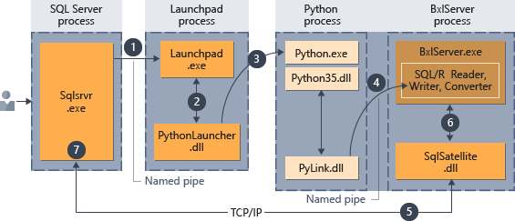
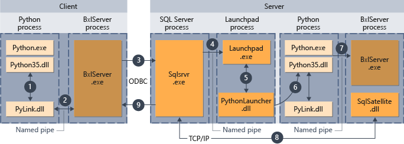

# Components in SQL Server to support Python integration

Beginning in SQL Server 2017, Machine Learning Services supports Python as an external language that can be executed from T-SQL, or executed remotely using SQL Server as the compute context.

This topic describes the components in SQL Server 2017 that support extensibility in general and the Python language specifically.

## SQL Server components and providers

To configure SQL Server 2017 to allow Python script execution is a multi-step process.

1. Install the extensibility feature.
2. Enable the external script execution feature.
3. Restart the database engine service.

Additional steps might be required to support remote script execution.

For more information, see [Set up Machine Learning Services](setup-python-machine-learning-services.md)

### Launchpad

The SQL Server Trusted Launchpad is a service introduced in SQL Server 2016 that manages and executes external scripts, similar to the way that the full-text indexing and query service launches a separate host for processing full-text queries.

The Launchpad service can start only trusted launchers that are published by Microsoft, or that have been certified by Microsoft as meeting requirements for performance and resource management.

+ SQL Server 2016 supports R
+ SQL Server 2017 supports R and Python 3.5

The [!INCLUDE[rsql_launchpad_md](../../includes/rsql-launchpad-md.md)] service runs under its own user account.

> [!TIP]
> If you change the account that runs Launchpad, be sure to do so using SQL Server Configuration Manager, to ensure that changes are written to related files.

To execute tasks in a specific supported language, the Launchpad gets a secured worker account from the pool, and starts a satellite process to manage the external runtime:

+ RLauncher.dll for the R language
+ Pythonlauncher.dll for Python 3.5

Each satellite process inherits the user account of the Launchpad and uses that worker account for the duration of script execution. If the Python script uses parallel processes, they are created under the same, single worker account.

For more information about the security context of the Launchpad, see [Security](security-overview-sql-server-python-services.md).

### BxlServer and SQL Satellite

If you run [Process Explorer](https://technet.microsoft.com/sysinternals/processexplorer.aspx) while a Python job is running, you might see one or multiple instances of BxlServer.

**BxlServer** is an executable provided by Microsoft that manages communication between [!INCLUDE[ssNoVersion_md](../../includes/ssnoversion-md.md)] and Python (or R). It creates the Windows job objects that are used to contain external script sessions, provisions secure working folders for each external script job, and uses SQL Satellite to manage data transfer between the external runtime and [!INCLUDE[ssNoVersion_md](../../includes/ssnoversion-md.md)].

In effect, BxlServer is a companion to Python that works with [!INCLUDE[ssNoVersion_md](../../includes/ssnoversion-md.md)] to transfer data and manage tasks. BXL stands for Binary Exchange language and refers to the data format used to move data efficiently between SQL Server and external processes. BxlServer is also an important part of Microsoft R Client and Microsoft R Server.

**SQL Satellite** is an extensibility API, included in the database engine starting with SQL Server 2016, that supports external code or external runtimes implemented using C or C++.

BxlServer uses SQL Satellite for these tasks:

+ Reading input data
+ Writing output data
+ Getting input arguments
+ Writing output arguments
+ Error handling
+ Writing STDOUT and STDERR back to client

SQL Satellite uses a custom data format that is optimized for fast data transfer between [!INCLUDE[ssNoVersion_md](../../includes/ssnoversion-md.md)] and external script languages. It performs type conversions and defines the schemas of the input and output datasets during communications between [!INCLUDE[ssNoVersion_md](../../includes/ssnoversion-md.md)] and the external script runtime.

The SQL Satellite can be monitored by using windows extended events (xEvents). For more information, see [Extended Events for R](../../advanced-analytics/r/extended-events-for-sql-server-r-services.md).

## Communication channels between components

+ **TCP/IP**

  By default, internal communications between [!INCLUDE[ssNoVersion_md](../../includes/ssnoversion-md.md)] and the SQL Satellite use TCP/IP.

+ **Named Pipes**

  Internal data transport between the BxlServer and [!INCLUDE[ssNoVersion_md](../../includes/ssnoversion-md.md)] through SQL Satellite uses a proprietary, compressed data format to enhance performance. Data is exchanged between Python and BxlServer in BXL format, using Named Pipes.

+ **ODBC**

  Communications between external data science clients and the [!INCLUDE[ssNoVersion_md](../../includes/ssnoversion-md.md)] instance use ODBC. The account that sends the script jobs to [!INCLUDE[ssNoVersion_md](../../includes/ssnoversion-md.md)] must have both permissions to connect to the instance and to run external scripts.

  Additionally, depending on the task, the account might need these permissions:

  + Read data used by the job
  + Write data to tables: for example, when saving results to a table
  + Create database objects: for example, if saving external script as part of a new stored procedure.

  When [!INCLUDE[ssNoVersion_md](../../includes/ssnoversion-md.md)] is used as the compute context for Python script executed from a remote client, and the Python executable must retrieve data from an external source, ODBC is used for writeback. [!INCLUDE[ssNoVersion_md](../../includes/ssnoversion-md.md)] will map the identity of the user issuing the remote command to the identity of the user on the current instance, and run the ODBC command using that user's credentials. The connection string needed to perform this ODBC call is obtained from the client code.

## Interaction of components

The following diagrams depict the interaction of SQL Server components with the Python runtime in each of the supported scenarios: running script in-database, and remote execution from a Python terminal, using a SQL Server compute context.

### Python scripts executed in-database

When you run Python "inside" [!INCLUDE[ssNoVersion_md](../../includes/ssnoversion-md.md)], you must encapsulate the Python script inside a special stored procedure, [sp_execute_external_script](../../relational-databases/system-stored-procedures/sp-execute-external-script-transact-sql.md).

After the script has been embedded in the stored procedure, any application that can make a stored procedure call can initiate execution of the Python code.  Thereafter [!INCLUDE[ssNoVersion_md](../../includes/ssnoversion-md.md)] manages code execution as summarized in the following diagram.

1. A request for the R runtime is indicated by the parameter _@language='Python'_ passed to the stored procedure. SQL Server sends this request to the Launchpad service.
2. The Launchpad service starts the appropriate launcher; in this case, PythonLauncher.
3. PythonLauncher starts the external Python35 process.
4. BxlServer coordinates with the Python runtime to manage exchanges of data, and storage of working results.
5. SQL Satellite manages communications about related tasks and processes with [!INCLUDE[ssNoVersion_md](../../includes/ssnoversion-md.md)].
6. BxlServer uses SQL Satellite to communicate status and results to [!INCLUDE[ssNoVersion_md](../../includes/ssnoversion-md.md)].
7. [!INCLUDE[ssNoVersion_md](../../includes/ssnoversion-md.md)] gets results and closes related tasks and processes.

### Python scripts executed from a remote client

You can run Python scripts from a remote computer, such as a laptop, and have them execute in the context of the SQl Server computer, if these conditions are met:

+ You design the scripts appropriately
+ The remote computer has installed the extensibility libraries that are used by Machine Learning Services

The following diagram summarizes the overall workflow when scripts are sent from a remote computer.

1. For functions that are supported in **revoscalepy**, the Python runtime calls a linking function, which in turn calls BxlServer.
2. BxlServer is included with Machine Learning Services (In-Database) and runs in a separate process from the Python runtime.
3. BxlServer determines the connection target and initiates a connection using ODBC, passing credentials supplied as part of the connection string in the Python script.
4. BxlServer opens a connection to the [!INCLUDE[ssNoVersion_md](../../includes/ssnoversion-md.md)] instance.
5. When an external script runtime is called, the Launchpad service is invoked, which in turn starts the appropriate launcher: in this case, PythonLauncher.dll. Thereafter, processing of Python code is handled in a workflow similar to that when Python code is invoked from a stored procedure in T-SQL.
6. PythonLauncher makes a call to the instance of the Python that is installed on the [!INCLUDE[ssNoVersion_md](../../includes/ssnoversion-md.md)] computer.
7. Results are returned to BxlServer.
8. SQL Satellite manages communication with [!INCLUDE[ssNoVersion_md](../../includes/ssnoversion-md.md)] and cleanup of related job objects.
9. [!INCLUDE[ssNoVersion_md](../../includes/ssnoversion-md.md)] passes results back to the client.

## Next steps

[Architecture overview for Python in SQL Server](architecture-overview-sql-server-python.md)