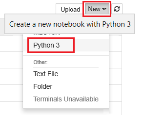
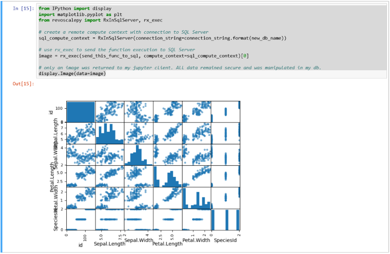

# Set up Python client tools for use with SQL Server Machine Learning
[!INCLUDE[appliesto-ss-xxxx-xxxx-xxx-md-winonly](../../includes/appliesto-ss-xxxx-xxxx-xxx-md-winonly.md)]

Python integration is available starting in SQL Server 2017 or later when you include the Python option in a Machine Learning Services (In-Database) installation. For more information, see [Install SQL Server Machine Learning Services](../install/sql-machine-learning-services-windows-install.md).

In this article, learn how to configure a client development workstation so that you can connect to a remote SQL Server enabled for machine learning and Python integration. At the end, you will have the same Python libraries as those on SQL Server plus the ability to push computations from a local session to a remote session on SQL Server.

> [!Tip]
> For a demonstration and video walkthrough, see [Run R and Python Remotely in SQL Server from Jupyter Notebooks or any IDE](https://blogs.msdn.microsoft.com/mlserver/2018/07/10/run-r-and-python-remotely-in-sql-server-from-jupyter-notebooks-or-any-ide/) or this [YouTube video](https://youtu.be/D5erljpJDjE).

> [!Note]
> An alternative option to installing just the client libraries is using a standalone server. Using a standalone server as a rich client is an option that some customers prefer for more end-to-end scenario work. If you have a [standalone server](../install/sql-machine-learning-standalone-windows-install.md) as provided in SQL Server setup, you have a Python server that is fully decoupled from a SQL Server database engine instance. A standalon server includes the open-source base distribution of Anaconda plus the Microsoft-specific libraries. You can find the Python executable at this location: `C:\Program Files\Microsoft SQL Server\140\PYTHON_SERVER`. As validation of your rich client install, open a [Jupyter notebook](#python-tools) to run commands.

## 1 - Install Python packages

Local workstations must have the same Python package versions as those on SQL Server, including the base distribution, and Microsoft-specific packages [revoscalepy](https://docs.microsoft.com//machine-learning-server/python-reference/revoscalepy/revoscalepy-package) and [microsftml](https://docs.microsoft.com/machine-learning-server/python-reference/microsoftml/microsoftml-package). The [azureml-model-management](https://docs.microsoft.com/en-us/machine-learning-server/python-reference/azureml-model-management-sdk/azureml-model-management-sdk) package is also installed, but it applies to operationalization tasks associated with a standalone (non-instance) Machine Learning Server context. For in-database analytics on a SQL Server instance, operationalization is through stored procedures.

1. Download the installation script to install Anaconda 4.2.0 with Python 3.5.2 and the three previously listed Microsoft packages.

  + [https://aka.ms/mls-py](https://aka.ms/mls-py) if SQL Server 2017 is not bound (common case). Choose this script if you aren't sure.

  + [https://aka.ms/mls93-py](https://aka.ms/mls93-py) if the remote SQL Server instance is [bound to Machine Learning Server 9.3](../r/use-sqlbindr-exe-to-upgrade-an-instance-of-sql-server.md).

2. Open PowerShell window with elevated administrator permissions (right-click **Run as administrator**).

3. Go to the folder in which you downloaded the installer and run the script. Add the `-InstallFolder` command-line argument to specify a folder location for the libraries. For example: 

   ```python
   cd {{download-directory}}
   .\Install-PyForMLS.ps1 -InstallFolder "C:\path-to-python-for-mls"
   ```

Installation takes some time to complete. You can monitor progress in the PowerShell window. When setup is finished, you have a complete set of packages. 

> [!Tip] 
> We recommend the [Python for Windows FAQ](https://docs.python.org/3/faq/windows.html) for general purppose information on running Python programs on Windows.

## 2 - Locate executables and packages

Still in PowerShell, navigate to the installation folder to confirm the location of the Python.exe, scripts, and other packages. 

1. Enter `cd \` to go to the root drive, and then enter the path you specified for `-InstallFolder` in the previous step. If you omitted this parameter during installation, the default is `cd C:\Program Files\Microsoft\PyForMLS1`.

2. Enter `dir *.exe` to list the executables. You should see **python.exe**, **pythonw.exe**, and **uninstall-anaconda.exe**.

On systems having multiple versions of Python, remember to use this particular Python.exe if you want to load **revoscalepy** and other Microsoft packages.

> [!Note] 
> The installation script does not modify the PATH environment variable on your computer so the new python interpreter and modules you just installed are not automatically available to other tools you might installed. For help on linking the Python interpreter and libraries to tools, see [Install an IDE](#install-ide).

<a name="python-tool"></a>

## 3 - Open Jupyter Notebooks

Anaconda includes Jupyter Notebooks. As a next step, create a notebook and run some Python code containing the libraries you just installed.

1. At the Powershell prompt, navigate to the scripts folder to open Jupyter Notebooks:

   ```powershell
   .\Scripts\jupyter-notebook
   ```

  A notebook should open in your default browser at `http://localhost:8889/tree`.

2. Click **New** and then click **Python 3**.

  

3. Enter `import revoscalepy` and run the command to load one of the Microsoft-specific libraries.

4. Enter a more complex series of statements. This example generates summary statitistics using [rx_summary](https://docs.microsoft.com/machine-learning-server/python-reference/revoscalepy/rx-summary). Other functions get the location of the sample data and create a data source object for a local .xdf file.

  ```Python
  import os
  from revoscalepy import rx_summary
  from revoscalepy import RxXdfData
  from revoscalepy import RxOptions
  sample_data_path = RxOptions.get_option("sampleDataDir")
  print(sample_data_path)
  ds = RxXdfData(os.path.join(sample_data_path, "AirlineDemoSmall.xdf"))
  summary = rx_summary("ArrDelay+DayOfWeek", ds)
  print(summary)
  ```

The following screenshot shows the input and a portion of the output, trimmed for brevity.

  

## 4 - Permissions

To connect to an instance of SQL Server to run scripts and upload data, you must have a valid login on the database server. You can use either a SQL login or integrated Windows authentication. We generally recommend that you use Windows integrated authentication, but using the SQL login is simpler for some scenarios, particularly when your script contains connection strings to external data.

At a minimum, the account used to run code must have permission to read from the databases you are working with, plus the special permission EXECUTE ANY EXTERNAL SCRIPT. Most developers also require permissions to create stored procedures, and to write data into tables containing training data or scored data. 

Ask the database administrator to configure the following permissions for the account, in the database where you use Python:

+ **EXECUTE ANY EXTERNAL SCRIPT** to run Python on the server.
+ **db_datareader** privileges to run the queries used for training the model.
+ **db_datawriter** to write training data or scored data.
+ **db_owner** to create objects such as stored procedures, tables, functions. 
  You also need **db_owner** to create sample and test databases. 

If your code requires packages that are not installed by default with SQL Server, arrange with the database administrator to have the packages installed with the instance. SQL Server is a secured environment and there are restrictions on where packages can be installed. Ad hoc installation of packages as part of your code is not recommended, even if you have rights. Also, always carefully consider the security implications before installing new packages in the server library.

## 5 - Test remote connection

Before trying this next step, make sure you have permissions on the SQL Server instance and a connection string to the [Iris sample database](../tutorials/demo-data-iris-in-sql.md). If the database doesn't exist and you have sufficient permissions, you can [create a database using these inline instructions](#create-iris-remotely).

Replace the connection string with valid values. The sample code uses `"Driver=SQL Server;Server=localhost;Database=irissql;Trusted_Connection=Yes;"` but your code should specify a remote server, possibly with an instance name.

### Define a function

The following code defines a function that you will send to SQL Server in the next step. When executed, it uses data and libraries (revoscalepy, pandas, matplotlib) on the remote server to create scatter plots of the iris data set. It returns the bytestream of the .png back to Jupyter Notebooks to render in the browser.

```python
def send_this_func_to_sql():
    from revoscalepy import RxSqlServerData, rx_import
    from pandas.tools.plotting import scatter_matrix
    import matplotlib.pyplot as plt
    import io
    
    # remember the scope of the variables in this func are within our SQL Server Python Runtime
    connection_string = "Driver=SQL Server;Server=localhost;Database=irissql;Trusted_Connection=Yes;"
    
    # specify a query and load into pandas dataframe df
    sql_query = RxSqlServerData(connection_string=connection_string, sql_query = "select * from iris_data")
    df = rx_import(sql_query)
    
    scatter_matrix(df)
    
    # return bytestream of image created by scatter_matrix
    buf = io.BytesIO()
    plt.savefig(buf, format="png")
    buf.seek(0)
    
    return buf.getvalue()
```

### Send the function to SQL Server

In this example, create the remote compute context and then send the execution of the function to SQL Server with [rx_exec](https://docs.microsoft.com/machine-learning-server/python-reference/revoscalepy/rx-exec). The **rx_xec** function is useful because it accepts a compute context as an argument. Any function that you want to execute remotely must have a compute context argument. Some functions, such as [rx_lin_mod](https://docs.microsoft.com/machine-learning-server/python-reference/revoscalepy/rx-lin-mod) support this argument directly. For operations that don't, you can use **rx_exec** to deliver your code in a remote compute context.

In this example, no raw data had to be transferred from SQL Server to the Jupyter Notebook. All computations occur within the Iris database and only the image file is returned to the client.

```python
from IPython import display
import matplotlib.pyplot as plt 
from revoscalepy import RxInSqlServer, rx_exec

# create a remote compute context with connection to SQL Server
sql_compute_context = RxInSqlServer(connection_string=connection_string.format(new_db_name))

# use rx_exec to send the function execution to SQL Server
image = rx_exec(send_this_func_to_sql, compute_context=sql_compute_context)[0]

# only an image was returned to my jupyter client. All data remained secure and was manipulated in my db.
display.Image(data=image)
```

The following screenshot shows the input and scatter plot output.

  


<a name="create-iris-remotely"></a>

## Create the Iris database remotely

If you have permissions to create a database on the remote server, you can run the following code to create the Iris demo database if it doesn't already exist.

### 1 - Create the irissql database

```Python
import pyodbc

# creating a new db to load Iris sample in
new_db_name = "irissql"
connection_string = "Driver=SQL Server;Server=localhost;Database={0};Trusted_Connection=Yes;" 
                        # you can also swap Trusted_Connection for UID={your username};PWD={your password}
cnxn = pyodbc.connect(connection_string.format("master"), autocommit=True)
cnxn.cursor().execute("IF EXISTS(SELECT * FROM sys.databases WHERE [name] = '{0}') DROP DATABASE {0}".format(new_db_name))
cnxn.cursor().execute("CREATE DATABASE " + new_db_name)
cnxn.close()

print("Database created")
```

### 2 - Import Iris sample from SkLearn

```Python
from sklearn import datasets
import pandas as pd

# SkLearn has the Iris sample dataset built in to the package
iris = datasets.load_iris()
df = pd.DataFrame(iris.data, columns=iris.feature_names)
```

### 3 - Use RecoscalePy APIs to create a table and load the Iris data

```Python
from revoscalepy import RxSqlServerData, rx_data_step

# Example of using RX APIs to load data into SQL table. You can also do this with pyodbc
table_ref = RxSqlServerData(connection_string=connection_string.format(new_db_name), table="iris_data")
rx_data_step(input_data = df, output_file = table_ref, overwrite = True)

print("New Table Created: Iris")
print("Sklearn Iris sample loaded into Iris table")
```

<a name="install-ide"></a>

## 6 - Install an IDE

If you are simply debugging scripts from the command line, you can get by with the standard Python tools. However, if you are developing new solutions, you might require a full-featured Python IDE. Popular options are:

+ [Visual Studio 2017 Community Edition](https://www.visualstudio.com/vs/features/python/) with Python
+ [AI tools for Visual Studio](https://docs.microsoft.com/visualstudio/ai/installation)
+ [Python in Visual Studio Code](https://code.visualstudio.com/docs/languages/python)
+ Popular third-party tools such as PyCharm, Spyder, and Eclipse

We recommend Visual Studio because it supports database projects as well as machine learning projects. For help configuring a Python environment, see [Managing Python environments in Visual Studio](https://docs.microsoft.com/visualstudio/python/managing-python-environments-in-visual-studio).

Because developers frequently work with multiple versions of Python, setup does not add Python to your PATH. To use the Python executable and libraries installed by setup, link your IDE to **Python.exe** at the path that also provides **revoscalepy** and **microsoftml**. 

For a Python project in Visual Studio, your custom environment would specify the following values, assuming a default installation.

| Configuration setting | value |
|-----------------------|-------|
| **Prefix path** | C:\Program Files\Microsoft\PyForMLS |
| **Interpreter path** | C:\Program Files\Microsoft\PyForMLS\python.exe |
| **Windowed interpreter** | C:\Program Files\Microsoft\PyForMLS\pythonw.exe |

## Next steps

Now that you have tools and a working connection to SQL Server, step through a tutorial to get a closer look at revoscalepy functions and switching compute contexts.

> [!div class="nextstepaction"]
> [Create a model using revoscalepy and a remote compute context](../tutorials/use-python-revoscalepy-to-create-model.md)