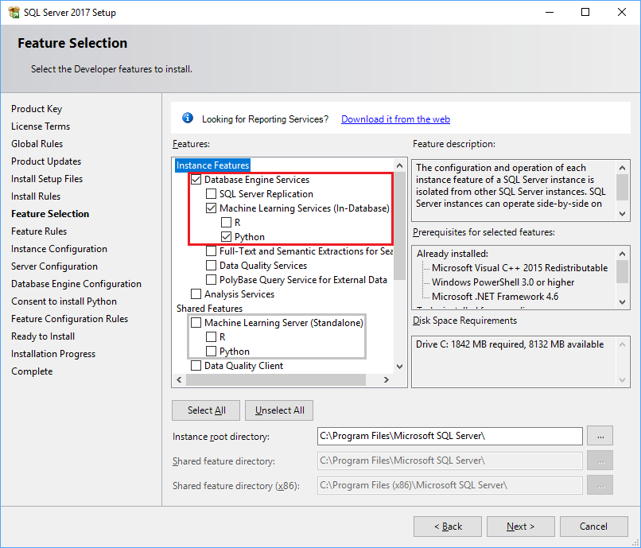
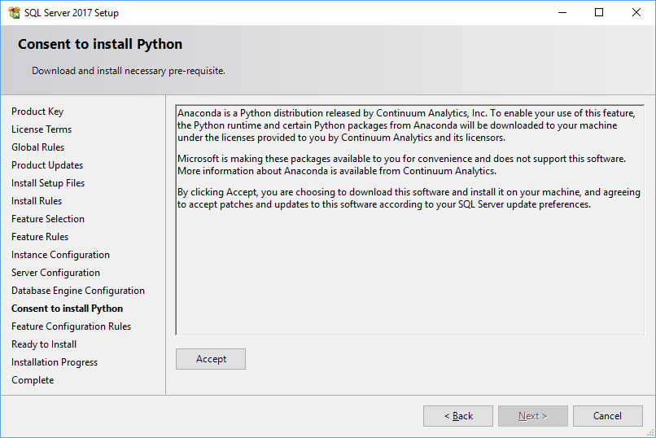
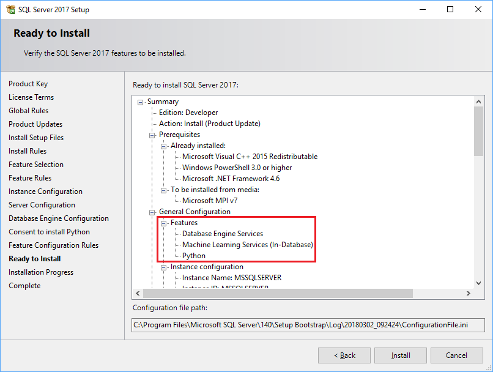

# Set up Python Machine Learning Services (In-Database)

  You install the components required for using Python by running the [!INCLUDE[ssNoVersion](../../includes/ssnoversion-md.md)] setup wizard and following the interactive prompts as described in this topic.

## Machine learning options in SQL Server setup

Choose the **Machine Learning Services** feature, and select **Python** as the language.

The **Shared Features** section contains a separate installation option, **Machine Learning Server (Standalone)**. This option supports operationalization of Python code on a server that does not have SQL Server, or that does not require use of SQL Server compute contexts. Thus, we recommend that you **do not** install this on the same computer as a SQL Server instance. Instead, install Machine Learning Server (Standalone) on a separate computer.

After installation is complete, you must reconfigure the instance to allow execution of scripts that use an external executable. You might need to make additional changes to the server to support machine learning workloads. Configuration changes generally require a restart of the instance or a restart of the Launchpad service.

### Prerequisites

+ SQL Server 2017 is required. Python integration is not supported on previous versions of SQL Server.
+ Be sure to install the database engine. An instance of SQL Server is required to run Python scripts in-database.
+ Prerequisites are installed as part of the Python component setup.
+ You cannot install Machine Learning with Python Services on a failover cluster. The reason is that the security mechanism used for isolating Python processes is not compatible with a Windows Server failover cluster environment.
   
  As a workaround, you can use replication to copy necessary tables to a standalone SQL Server instance that uses Python Services, or you can install Machine Learning with Python Services on a standalone computer that uses Always On and is part of an availability group.

+ Side-by-side installation with other versions of Python is possible, because the SQL Server instance uses its own copy of the Anaconda distribution. However, running code using Python on the SQL Server computer outside of SQL Server can lead to various problems:
    + You use a different library and different executable and get different results than when running in SQL Server.
    + Python scripts running in external libraries cannot be managed by SQL Server, leading to resource contention.
  
> [!IMPORTANT]
> After setup is complete, be sure to complete the additional post-configuration steps described in this topic. These include enabling SQL Server to use external scripts, and adding accounts required for SQL Server to run Python jobs on your behalf.

### Unattended installation

To perform an unattended installation, use the command-line options for SQL Server setup and the arguments specific to Python, as described here: [Unattended installs of SQL Server with Python Machine Learning Services](./unattended-installs-of-sql-server-python-services.md).

##  <a name="bkmk_installPythonInDatabase"></a> Step 1: Install Machine Learning Services (In-Database) on SQL Server

1. Run the setup wizard for SQL Server 2017.
  
2. On the **Installation** tab, click **New SQL Server stand-alone installation or add features to an existing installation**.
   
3. On the **Feature Selection** page, select both of these options:
  
    -   **Database Engine Services**
  
         To use Python with SQL Server, you must install an instance of the database engine. You can use either a default or named instance.
  
    -   **Machine Services (In-Database)**
  
         This option installs the database services that support Python script execution.

    -   **Python**
        Check this option to get the Python 3.5 executable and select libraries from the Anaconda distribution. We recommend you install only one language per instance.

        > [!NOTE]
        > Do not select the option in **Shared Features** for **Microsoft R Server (Standalone)**. Use this option in a separate installation if you need to add the Machine Learning components to a different computer that is used for R development, such as your data scientist's laptop.
        
        

4. On the page, **Consent to Install Python**, click **Accept**.
  
     This license agreement is required to download the Python executable, Python packages from Anaconda.
     
     
  
    > [!NOTE]
    >  If the computer you are using does not have Internet access, you can pause setup at this point to download the installers separately as described here: [Installing Components without Internet Access](../r/installing-ml-components-without-internet-access.md)
  
     Click **Accept**, wait until the **Next** button becomes active, and then click **Next**.
  
5. On the **Ready to Install** page, verify that these selections are included, and click **Install**.
  
     + Database Engine Services
     + Machine Learning Services (In-Database)
     + Python
  
    These selections represent the minimum configuration required to use Python with SQL Server.
    
    

    Optionally, make a note of the location of the folder under the path `..\Setup Bootstrap\Log` where the configuration files are stored. When setup is complete, you can review the installed components in the Summary file.

6. When installation is complete, restart the computer.

##  <a name="bkmk_enableFeature"></a> Step 2: Enable Python script execution

1. Open [!INCLUDE[ssManStudioFull](../../includes/ssmanstudiofull-md.md)]. If it is not already installed, you can run the SQL Server setup wizard again to open a download link and install it.
  
2. Connect to the instance where you installed Machine Learning Services, and run the following command:

   ```SQL
   sp_configure
   ```

    The value for the property, `external scripts enabled`, should be **0** at this point. That is because the feature is turned off by default, to reduce the surface area. The feature must be explicitly enabled by an administrator before you can run R or Python scripts.
    
3.  To enable the external scripting feature that supports Python, run the following statement:
    
    ```SQL
    EXEC sp_configure  'external scripts enabled', 1
    RECONFIGURE WITH OVERRIDE
    ```
    This is exactly the same process that is used to enable R, because the underlying extensibility feature supports both languages.

4. Restart the SQL Server service for the [!INCLUDE[ssNoVersion](../../includes/ssnoversion-md.md)] instance. Restarting the SQL Server service also automatically restarts the related [!INCLUDE[rsql_launchpad](../../includes/rsql-launchpad-md.md)] service.

    You can restart the service using the **Services** panel in Control Panel, or by using [SQL Server Configuration Manager](../../relational-databases/sql-server-configuration-manager.md).

## Step 3. Verify that the external script execution feature is running

Take a moment to verify that all components used to launch Python script are running.

1. In SQL Server Management Studio, open a new Query window, and run the following command:
    
    ```SQL
    EXEC sp_configure  'external scripts enabled'
    ```

    The **run_value** should now be set to 1.
    
2. Open the **Services** panel or SQL Server Configuration Manager, and verify that the Launchpad service for your instance is running. If the Launchpad is not running, restart the service.
  
    If you have installed multiple instances of SQL Server, using either R or Python, each instance has its own Launchpad service.

    However, if you install R and Python on a single instance, only one Launchpad is installed, but a separate language-specific launcher DLL is added for each language. For more information, see [Components to Support Python Integration](new-components-in-sql-server-to-support-python-integration.md) 
   
3. If Launchpad is running, you should be able to run simple Python scripts like the following in  [!INCLUDE[ssManStudioFull](../../includes/ssmanstudiofull-md.md)]:
    
    ```SQL
    EXEC sp_execute_external_script  @language =N'Python',
    @script=N'OutputDataSet=InputDataSet',
    @input_data_1 = N'SELECT 1 AS col'
    ```
    
    **Results**
    
    *<code>&nbsp;&nbsp;</code>*
    *1*

> [!NOTE]
> Column or headings used in the Python script are not returned, by design. To add column names for your output, you must specify the schema for the return dataset using the WITH RESULTS parameter of the stored procedure, naming the columns and specifying the SQL data type.
> For example, you could add the following line to generate an arbitrary column name: `WITH RESULT SETS ((Col1 AS int))`

## Step 4: Additional configuration

If the previous command was successful, you can run Python commands from SQL Server Management Studio, Visual Studio Code, or any other client that can send T-SQL statements to the server.

If you got an error when running the command, review the following list, and determine which you might need to make  to the configuration of the service or database.

> [!NOTE]
> 
> Not all the listed changes are required, and none might be required. Requirements depends on your security schema, where you installed SQL Server, and how you expect users to connect to the database and run external scripts.

###  <a name="bkmk_configureAccounts"></a> Enable implied authentication for Launchpad account group

During setup, a number of new Windows user accounts are created for the purpose of running tasks under the security token of the [!INCLUDE[rsql_launchpad_md](../../includes/rsql-launchpad-md.md)] service. When a user sends a Python or R script from an external client, [!INCLUDE[ssNoVersion](../../includes/ssnoversion-md.md)] activates an available worker account, maps it to the identity of the calling user, and runs the script on behalf of the user.

This is called *implied authentication*, and is a service of the database engine that supports secure execution of external scripts in SQL Server 2016 and SQL Server 2017.

You can view these accounts in the Windows user group, **SQLRUserGroup**.  By default, 20 worker accounts are created, which is usually more than enough for running external script jobs.

> [!IMPORTANT]
> The worker group is named SQLRUserGroup regardless of the type of script you are running. There is a single group for each instance.

If you need to run R scripts from a remote data science client and are using Windows authentication, these worker accounts must be given permission to log in to the [!INCLUDE[ssNoVersion](../../includes/ssnoversion-md.md)] instance on your behalf.

1. In [!INCLUDE[ssManStudioFull](../../includes/ssmanstudiofull-md.md)], in Object Explorer, expand **Security**, right-click **Logins**, and select **New Login**.
2. In the **Login - New** dialog box, click **Search**.
3. Click **Object Types** and select **Groups**. Deselect everything else.
4. In Enter the object name to select, type *SQLRUserGroup*  and click **Check Names**.
5. The name of the local group associated with the instance's Launchpad service should resolve to something like *instancename\SQLRUserGroup*. Click **OK**.
6. By default, the login is assigned to the **public** role and has permission to connect to the database engine.
7. Click **OK**.

> [!NOTE]
> If you use a SQL login for running scripts in a SQL Server compute context, this extra step is not required.

### Give users permission to run external scripts

If you installed [!INCLUDE[ssNoVersion](../../includes/ssnoversion-md.md)] yourself and are running Python scripts in your own instance, you typically execute scripts as an administrator, and thus have implicit permission over various operations and all data in the database.

However, in an enterprise scenario, most users, including those accessing the database using SQL logins, do not have such elevated permissions. Therefore, for each user who will be using Python, you must grant users of machine learning services the permission to run external scripts in each database where Python will be used.

```SQL
USE <database_name>
GO
GRANT EXECUTE ANY EXTERNAL SCRIPT  TO [UserName]
```

> [!NOTE]
> Permissions are not specific to the supported script language. In other words, there are not separate permission levels for R script vs. Python script. If you need to maintain separate permissions for these languages, you can install R and Python on separate instances.

### Give your users read, write, or DDL permissions to databases

While running scripts, the user account or SQL login might need to read data from other databases, create new tables to store results, and write data into tables.

For each user account or SQL login that will be executing R or Python scripts, be sure that the account or login has `db_datareader`, `db_datawriter`, or `db_ddladmin` permissions on the specific database.

For example, the following [!INCLUDE[tsql](../../includes/tsql-md.md)] statement gives the SQL login *MySQLLogin* the rights to run T-SQL queries in the *ML_Samples* database. To run this statement, the SQL login must already exist in the security context of the server.
  
```SQL
USE ML_Samples
GO
EXEC sp_addrolemember 'db_datareader', 'MySQLLogin'
```

For more information about the permissions included in each role, see [Database-Level Roles](../../relational-databases/security/authentication-access/database-level-roles.md).

### Ensure that the SQL Server supports remote connections

If you cannot connect from a remote computer, check whether the firewall allows access to SQL Server. In a default installation, remote connections might be disabled, or the specific port used by SQL Server might be blocked by the firewall. For more information, see [Configure Windows Firewall for Database Engine Access](../../database-engine/configure-windows/configure-a-windows-firewall-for-database-engine-access.md)

### Create an ODBC data source for the instance on your data science client

If you create a machine learning solution on a data science client computer and need to run code using the SQL Server computer as the compute context, you can use either a SQL login, or integrated Windows authentication.

+ For SQL logins: Ensure that the login has appropriate permissions on the database where you will be reading data. You can do this by adding *Connect to* and *SELECT* permissions, or by adding the login to the `db_datareader` role. Logins that create objects need `DDL_admin` rights.  Logins that must save data to tables should be added to the `db_datawriter` role.

+ For Windows authentication: You might need to create an ODBC data source on the data science client that specifies the instance name and other connection information. For more information, see [ODBC Data Source Administrator](https://docs.microsoft.com/sql/odbc/admin/odbc-data-source-administrator).


## Additional configuration

Now that you have everything working, you might also want to optimize the server to support machine learning, or install pretrained models.

### Add more worker accounts

If you expect many users to be running scripts concurrently, you can increase the number of worker accounts that are assigned to the Launchpad service. For more information, see [Modify the User Account Pool for SQL Server R Services](../r/modify-the-user-account-pool-for-sql-server-r-services.md).

### Optimize the server for script execution

The default settings for [!INCLUDE[ssNoVersion](../../includes/ssnoversion-md.md)] setup are intended to optimize the balance of the server for a variety of services supported by the database engine, which might include ETL processes, reporting, auditing, and applications that use [!INCLUDE[ssNoVersion](../../includes/ssnoversion-md.md)] data.

As a result, if you use the default settings created by SQL Server setup, you might find that resources for running external scripts are restricted or throttled, particularly in memory-intensive operations. If machine learning is a priority, you need to change default database settings to ensure that external script jobs are prioritized and resourced appropriately. These changes can include:

+ Reduce the amount of memory allocated to the [!INCLUDE[ssNoVersion](../../includes/ssnoversion-md.md)] database engine
+ Increase the number of accounts running under the [!INCLUDE[rsql_launchpad](../../includes/rsql-launchpad-md.md)] service. This does not increase the number of resources, but does increase the number of scripts that can run concurrently.

If you have Enterprise Edition, we recommend that you use Resource Governor to configure an external resource pool specific for Python. See these articles for more information:

-   Configure a resource pool for managing external resources
  
     [CREATE EXTERNAL RESOURCE POOL &#40;Transact-SQL&#41;](../../t-sql/statements/create-external-resource-pool-transact-sql.md)
  
-   Change the amount of memory reserved for the database engine
  
     [Server Memory Server Configuration Options](../../database-engine/configure-windows/server-memory-server-configuration-options.md)
  
-   Change the number of worker accounts that can be started by [!INCLUDE[rsql_launchpad](../../includes/rsql-launchpad-md.md)]
  
     [Modify the User Account Pool for SQL Server R Services](../r/modify-the-user-account-pool-for-sql-server-r-services.md)

If you are using Standard Edition and do not have Resource Governor, you can use DMVs and extended events, as well as Windows event monitoring, to help you manage server resources. For more information, see [Monitoring and Managing R Services](../r/managing-and-monitoring-r-solutions.md).

### Upgrade the machine learning components

When you install Machine Learning Services using SQL Server 2017, you get the version of the machine learning components that was up to date at the time the release was published. Each time you patch or upgrade the SQL Server instance, the machine learning components are upgraded as well.

However, you can upgrade the machine learning components on a faster schedule than is supported by SQL Server releases, by installing Microsoft Machine Learning Server. When you do so, you also get any new features supported in the latest release of Microsoft Machine Learning Server, such as:

+ Updates to Python packages for [revoscalepy](https://docs.microsoft.com/r-server/python-reference/revoscalepy/revoscalepy-package) and [microsoftml for Python](https://docs.microsoft.com/r-server/python-reference/microsoftml/microsoftml-package)
+ [Pretrained models](https://docs.microsoft.com/r-server/install/microsoftml-install-pretrained-models) for image classification and text analysis

For information about how to upgrade an instance, see [Upgrade R components through binding](..\r\use-sqlbindr-exe-to-upgrade-an-instance-of-sql-server.md).

> [!NOTE]
> 
> The current release version contains the latest version of all machine learning components. Therefore, although upgrades via Microsoft Machine Learning Server are supported for SQL Server 2017, the upgrade that is currently available applies only to SQL Server 2016 instances.

### Tutorials

See these tutorials for some examples of how you can use Python with SQL Server to build and deploy machine learning solutions.

[Using Python in T-SQL](../tutorials/run-python-using-t-sql.md)

[Create a Python model using revoscalepy](../tutorials/use-python-revoscalepy-to-create-model.md)