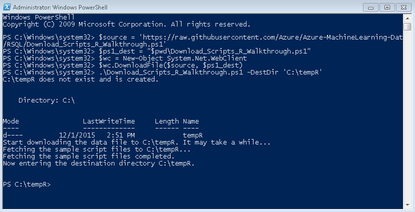

# Lesson 1: Prepare the Data (Data Science End-to-End Walkthrough)
To prepare for this walkthrough, you will need to do the following:

1. Download the data and all R scripts used in the walkthrough. A PowerShell script is provided to simplify download from GitHub.   

2. Install some additional R packages, both on the server and on your R workstation.  

3. Prepare the environment, including the database and data used for modeling and scoring.
 
    For this, you'll use a second PowerShell script, RunSQL_R_Walkthrough.ps1.
    The script configures the database and uploads the data into the table you specify.  It also creates some SQL functions and stored procedures that simplify data science tasks. 
 

## 1. Download the Data and Scripts  
All the code that you will need to complete this walkthrough has been provided in a GitHub repository. You can use a PowerShell script to make a local copy of the files.  
  
#### To download all scripts using PowerShell  
  
1.  On your data science client computer, open a Windows PowerShell command prompt as administrator.  
  
2.  If you have not run PowerShell before on this instance, or you do not have permission to run scripts, you might encounter an error. If so, run this command before running the script, to temporarily allow scripts without changing system defaults.  
  
    ```  
    Set-ExecutionPolicy Unrestricted -Scope Process -Force  
    ```  
  
3.  Run the following command to download script files to a local directory. If you do not specify a different directory, by default the folder C:\tempR is created and all files saved there.  
  
    ```  
    $source = 'https://raw.githubusercontent.com/Azure/Azure-MachineLearning-DataScience/master/Misc/RSQL/Download_Scripts_R_Walkthrough.ps1'  
    $ps1_dest = "$pwd\Download_Scripts_R_Walkthrough.ps1"  
    $wc = New-Object System.Net.WebClient  
    $wc.DownloadFile($source, $ps1_dest)  
    .\Download_Scripts_R_Walkthrough.ps1 –DestDir 'C:\tempR'  
  
    ```  
  
    If you want to save the files in a different directory, edit the values of the parameter *DestDir* and specify a different folder on your computer. If you type a folder name that does not exist, the PowerShell script will create the folder for you.  
  
4.  The Windows PowerShell command console should look like this after the download completes:  
  
      
  
5.  In the PowerShell console, you can run the command `ls` to view a list of the files that were downloaded to *DestDir*.  For a list and description of the files, see [What's Included](#What-the-Download-Includes).
  
## 2. Install Required Packages  
This walkthrough requires some R libraries that are not installed by default as part of [!INCLUDE[rsql_productname](../../includes/rsql-productname-md.md)]. You must install the packages both on the client where you will be developing the solution, and on the [!INCLUDE[ssNoVersion](../../includes/ssnoversion-md.md)] computer where you will deploy the solution.  
  
### Install required packages on the client  
The R script that you downloaded includes the commands to download and install these packages.  
  
1.  In your R environment, open the script file, RSQL_R_Walkthrough.R.  
  
2.  Highlight and execute these lines.  
  
    ```  
    # Install required R libraries for this walkthrough if they are not installed.   
  
    if (!('ggmap' %in% rownames(installed.packages()))){  
      install.packages('ggmap')  
    }  
    if (!('mapproj' %in% rownames(installed.packages()))){  
      install.packages('mapproj')  
    }  
    if (!('ROCR' %in% rownames(installed.packages()))){  
      install.packages('ROCR')  
    }  
    if (!('RODBC' %in% rownames(installed.packages()))){  
      install.packages('RODBC')  
    }  
    ```  
  
### Install required packages on the server  

  
1.  On the [!INCLUDE[ssNoVersion](../../includes/ssnoversion-md.md)] computer, open RGui.exe as administrator.  If you have installed SQL Server R Services using the defaults, RGui.exe can be found in C:\Program Files\Microsoft SQL Server\MSSQL13.MSSQLSERVER\R_SERVICES\bin\x64).  
  
    Or, if you have installed another R environment on the [!INCLUDE[ssNoVersion](../../includes/ssnoversion-md.md)] computer (such as RStudio) you can use the R console to run the commands.  
  
2.  At an R prompt, run the following R commands:  
  
    ```  
    install.packages("ggmap", lib=grep("Program Files", .libPaths(), value=TRUE)[1])  
    install.packages("mapproj", lib=grep("Program Files", .libPaths(), value=TRUE)[1]) 
    install.packages("ROCR", lib=grep("Program Files", .libPaths(), value=TRUE)[1]) 
    install.packages("RODBC", lib=grep("Program Files", .libPaths(), value=TRUE)[1]) 
    ```  
  
**Notes:**  
  
-   This example uses the R grep function to search the vector of available paths and find the one in “Program Files”. For more information, see [http://www.rdocumentation.org/packages/base/functions/grep](http://www.rdocumentation.org/packages/base/functions/grep).   
  
-   If you think the packages are already installed, check the list of installed packages by using the R function, `installed.packages()`.  
  
-   On the client, you can install to a user library if you cannot write to the main library in Program Files. However, when installing packages to the SQL Server computer, you must install them in the default library used by SQL Server R Services. Do not use a user library. For more information, see [Installing New R Packages on SQL Server](../../advanced-analytics/r-services/install-additional-r-packages-on-sql-server.md).
      

## 3. Run Powershell script RunSQL_R_Walkthrough.ps1  

You can run this PowerShell script on the computer where you will be building the solution, for example, the computer develop and test your R code. This computer must be able to connect to the [!INCLUDE[ssNoVersion](../../includes/ssnoversion-md.md)] computer using the Named Pipes protocol.  
  
The script performs these actions:  
  
-   Checks whether the SQL Native Client and command-line utilities for [!INCLUDE[ssNoVersion](../../includes/ssnoversion-md.md)] are installed. The command-line tool are needed to run the [bcp Utility](../../tools/bcp-utility.md), which is used for fast bulk loading of data into SQL tables.    
-   Connects to the specified instance of [!INCLUDE[ssNoVersion](../../includes/ssnoversion-md.md)] and runs some [!INCLUDE[tsql](../../includes/tsql-md.md)] scripts that configure the database and create the tables for the model and data.    
-   Runs a SQL script to create several stored procedures.    
-   Loads the data you downloaded previously into the table nyctaxi_sample.    
-   Rewrites the arguments in the R script file to use the database name that you specify. 

### To run the script
  
1.  Open a PowerShell command line as administrator.    
  
2.  Navigate to the folder where you downloaded the scripts, and type the name of the script as shown. Press ENTER.  
  
    ```  
    .\RunSQL_R_Walkthrough.ps1  
    ```  
  
3.  You will be prompted for each of the following parameters:  
  
    - The name of the database you want to create. 
      For example, you might type **Tutorial** or **Taxi**  
    - Credentials under which to run the script. There are two options:
        + Type the name of a SQL login that has CREATE DATABASE privileges, and provide the SQL password on a successive prompt.
        + Press ENTER without typing any name to use your own Windows identity, and at the secured prompt, type your Windows password.. PowerShell does not support entering a different Windows user name. 

          If you fail to specify a valid user, the script will default to using integrated Windows authentication.  
  
    -   The full path to the csv file you want to upload to the database  
  
        The script should download the file and load the data into the database automatically, but if this fails, you can always upload the data manually.  
  
4.  Press ENTER to run the script.  
  
## Troubleshooting  
 
 If you run into trouble, you can run all or any of the steps manually, using the lines of the PowerShell script as examples. 
 

### The PowerShell script didn't download the data
  
To download the data manually, right-click the following link and select **Save target as**.  
  
[http://getgoing.blob.core.windows.net/public/nyctaxi1pct.csv](http://getgoing.blob.core.windows.net/public/nyctaxi1pct.csv)  
  
Make a note of the path to the downloaded data file and the file name where the data was saved. You will need the path to load the data to the table using **bcp**.  
  
### I was unable to download the data
The data file is large. Use a computer that has a relatively good Internet connection, or the download might time out.  

  
### Could not connect or script failed  
  
+ Check the spelling of your instance name. 
+ Verify the complete connection string.    
+ Depending on your network's requirements, the instance name might require qualification with one or more subnet names.  For example, if MYSERVER doesn't work, try myserver.subnet.mycompany.com.
  
### Network error or protocol not found  
  
+ Verify that the instance supports remote connections.    
+ Verify that the specified SQL user can connect remotely to the database, and that Named Pipes is enabled on the instance.    
+ Check permissions for the account. The account that you specified might not have the permissions to create a new database and upload data.  

### bcp did not run  

+ Verify that the [bcp Utility](../../tools/bcp-utility.md) is available on your computer. You can run bcp from a PowerShell window or from a Windows command prompt.
+ If you get an error, add the location of the bcp utility to the PATH system environment variable and try again.  

### The table schema was created but there is no data in the table

If the rest of the script ran without problems, you can upload the data to the table manually by calling **bcp** from the command line as follows:  


 
**Using a SQL login**
    
~~~~ 
bcp TutorialDB.dbo.nyctaxi_sample in c:\tempR\nyctaxi1pct.csv -t ',' -S rtestserver.contoso.com -f C:\tempR\taxiimportfmt.xml -F 2 -C "RAW" -b 200000 -U <SQL login> -P <password  
~~~~  
  
**Using Windows authentication**  

~~~~
bcp TutorialDB.dbo.nyctaxi_sample in c:\tempR\nyctaxi1pct.csv -t ',' -S rtestserver.contoso.com -f C:\tempR\taxiimportfmt.xml -F 2 -C "RAW" -b 200000 -T 
~~~~ 
  
  
+ The **in** keyword specifies the direction of data movement.  
+ The  **-f** argument requires that you specify the full path of a format file. A format file is required if you use the **in** option.
+ Use the **-U** and **-P** arguments if running bcp with a SQL login.
+ Use the **-T** argument if you are using Windows integrated authentication. 

  
### How can I run the script without prompts?  
  
You can specify all the parameters in a single command line, using values specific to your environment. 
  
```  
.\RunSQL_R_Walkthrough.ps1 -server <server address> -dbname <new db name> -u <user name> -p <password> -csvfilepath <path to csv file>  
```  
  
For example, to run the script using a SQL login:  
  
```  
.\RunSQL_R_Walkthrough.ps1 -server MyServer.subnet.domain.com -dbname MyDB –u SqlUserName –p SqlUsersPassword -csvfilepath C:\temp\nyctaxi1pct.csv  
```  
  
This example does the following:  
  
-   Connects to the specified instance and database using the credentials of *SqlUserName*.  
-   Gets data from the file *C:\temp\nyctaxi1pct.csv*.  
-   Loads the data into the table *dbo.nyctaxi_sample*, in the database *MyDB* on the [!INCLUDE[ssNoVersion](../../includes/ssnoversion-md.md)] instance named *MyServer*.  

### The data loaded but it contains duplicates

If there is an existing table and it has the correct schema, bcp will continue to run, but will insert a new copy of the data rather than overwriting existing data. This will result in duplicate data.  Be sure to truncate any existing tables before re-running the script.

## What the Download Includes

When you download the files from the GitHub repository, you'll get the following:
+ Data in CSV format
+ A PowerShell script for preparing the environment
+ An XML format file for importing the data to SQL Server using bcp
+ Multiple T-SQL scripts
+ All the R code you need to run this walkthrough

### Training and Scoring Data  
The data is a representative sampling of the New York City taxi data set, which contains records of over 173 million individual trips in 2013, including the fares and tip amounts paid for each trip.  For more information about how this data was originally collected, and how you can get the full data set, see  
[http://chriswhong.com/open-data/foil_nyc_taxi/](http://chriswhong.com/open-data/foil_nyc_taxi/).  
  
To make the data easier to work with, the Microsoft data science team performed downsampling to get just 1% of the data.  This data has been shared in a public blob storage container in Azure, in .CSV format. The source data is an uncompressed file, just under 350MB.  
 
### Files

 
+ **RunSQL_R_Walkthrough.ps1** You'll run this script first, using PowerShell. It calls the SQL scripts to load data into the database.  
    
+ **taxiimportfmt.xml** A format definition file that is used by the BCP utility to load data into the database.
      
+ **RSQL_R_Walkthrough.R**  This is the core R script that will be used in rest of the lessons for doing your data analysis and modeling. It provides all the R code that you need to explore [!INCLUDE[ssNoVersion](../../includes/ssnoversion-md.md)] data, build the classification model, and create plots.   
  
### SQL Scripts  
This PowerShell script executes multiple [!INCLUDE[tsql](../../includes/tsql-md.md)] scripts on the server. The following table lists the [!INCLUDE[tsql](../../includes/tsql-md.md)] script files.  
  
|SQL Script file name|What it does|  
|------------------------|----------------|  
|create-db-tb-upload-data.sql|Creates database and two tables:<br /><br /> *nyctaxi_sample*: Table that stores the training data, a one-percent sample of the NYC taxi data set. A clustered columnstore index  is added to the table to improve storage and query performance.<br /><br /> *nyc_taxi_models*: An empty table that you’ll use later to save the trained classification model.|  
|PredictTipBatchMode.sql|Creates a stored procedure that calls a trained model to predict the labels for new observations. It accepts a query as its input parameter.|  
|PredictTipSingleMode.sql|Creates a stored procedure that calls a trained classification model to predict the labels for new observations. Variables of the new observations are passed in as in-line parameters.|  
|PersistModel.sql|Creates a stored procedure that helps store the binary representation of the classification model in a table in the database.|  
|fnCalculateDistance.sql|Creates a SQL scalar-valued function that calculates the direct distance between pick-up and drop-off locations.|  
|fnEngineerFeatures.sql|Creates a SQL table-valued function that creates features for training the classification model|  
  
All the SQL queries that are used in this walkthrough have been tested and can be run as-is in your R code. However, if you want to experiment further or develop your own solution using SQL queries, we recommended that you use a development environment such as [!INCLUDE[ssManStudioFull](../../includes/ssmanstudiofull-md.md)] to test and tune your queries first, before adding them to your R code.  
  
  
## Next Lesson  
[Lesson 2: View and Explore the Data &#40;Data Science End-to-End Walkthrough&#41;](../../advanced-analytics/r-services/lesson-2-view-and-explore-the-data-data-science-end-to-end-walkthrough.md)  
  
## Previous Lesson  
[Data Science End-to-End Walkthrough](../../advanced-analytics/r-services/data-science-end-to-end-walkthrough.md)  
  
  
  
