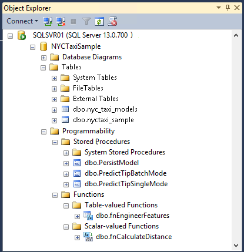

# Lesson 2: View and Explore the Data (Data Science End-to-End Walkthrough)
Data exploration is an important part of modeling data, and involves reviewing summaries of data objects to be used in the analyses, as well as data visualization. In this lesson, you'll explore the data objects and generate plots, using both [!INCLUDE[tsql](../../includes/tsql-md.md)] and R functions included in [!INCLUDE[rsql_productname](../../includes/rsql-productname-md.md)].  
  
Then you  will generate plots to visualize the data, using new functions provided by packages installed with [!INCLUDE[rsql_productname](../../includes/rsql-productname-md.md)].  
  
> [!TIP]  
> Already an R maestro?  
>   
> Now that you've downloaded all the data and prepared the environment, you are welcome to run the complete R script in RStudio or any other environment, and explore the functionality on your own. Just open the file RSQL_Walkthrough.R and highlight and run individual lines, or run the entire script as a demo.  
>   
> To get additional explanations of the RevoScaleR functions, and tips for working with [!INCLUDE[ssNoVersion](../../includes/ssnoversion-md.md)] data in R, continue with the tutorial. It uses exactly the same script.  
  
## Verify  Downloaded Data using SQL  
First, take a minute to ascertain that your data was loaded correctly.  
  
1.  Connect to your [!INCLUDE[ssNoVersion](../../includes/ssnoversion-md.md)] instance.  
  
    You can use a variety of tools to connect and view [!INCLUDE[ssNoVersion](../../includes/ssnoversion-md.md)] databases.  
  
    -   [!INCLUDE[ssManStudioFull](../../includes/ssmanstudiofull-md.md)]    
    -   Server Explorer in Visual Studio  
  
2.  Expand the database you created. The following image shows the new database, tables, and functions in **Server Explorer.**  
  
      
  
3.  You can also run simple queries on the data. For example, in [!INCLUDE[ssManStudio](../../includes/ssmanstudio-md.md)], right-click the table and select **Select top 1000 rows** to generate and run this query:  
  
    ```  
    SELECT TOP 1000 * FROM [dbo].[nyctaxi_sample]  
    ```  
    If you don't see any data in the table, refer to the [Troubleshooting](../../advanced-analytics/r-services/lesson-1-prepare-the-data-data-science-end-to-end-walkthrough.md) section in the previous topic.
      
4.  To view the schema and data types of the data, you can use the system management views in [!INCLUDE[ssNoVersion](../../includes/ssnoversion-md.md)].  
  
    ```  
    SELECT TABLE_CATALOG, TABLE_SCHEMA, TABLE_NAME, COLUMN_NAME, COLUMN_DEFAULT  
    FROM [TaxiSample].INFORMATION_SCHEMA.COLUMNS  
    WHERE TABLE_NAME = N'nyctaxi_sample';  
    ```  
  
    > [!TIP]  
    > To get details about how the data table was created, you can also review the script `create-db-tb-upload-data.sql`.  
  
### Generate Summaries using SQL  
One of the strengths of [!INCLUDE[ssNoVersion](../../includes/ssnoversion-md.md)] that makes it a good companion for R is the ability to perform set-based calculations very fast.  The code that created the table for this walkthrough also applied a [columnstore index](../../relational-databases/indexes/columnstore-indexes-overview.md) to make calculations even faster.   
  
```  
SELECT DISTINCT [passenger_count]  
    , ROUND (SUM ([fare_amount]),0) as TotalFares   
    , ROUND (AVG ([fare_amount]),0) as AvgFares  
FROM [dbo].[nyctaxi_sample]  
GROUP BY [passenger_count]   
ORDER BY  AvgFares desc  
```  

In the next step, you'll use R to generate some more sophisticated summaries and plots, using the data in SQL Server.  
  
## Next Steps  
[View and Summarize Data using R &#40;Data Science End-to-End Walkthrough&#41;](../../advanced-analytics/r-services/lesson-2-1-view-and-summarize-data-using-r.md)  
  
[Create Graphs and Plots Using R &#40;Data Science End-to-End Walkthrough&#41;](../../advanced-analytics/r-services/lesson-2-2-create-graphs-and-plots-using-r.md)  
  
## Previous Lesson  
[Lesson 1: Prepare the Data &#40;Data Science End-to-End Walkthrough&#41;](../../advanced-analytics/r-services/lesson-1-prepare-the-data-data-science-end-to-end-walkthrough.md)  
  
## See Also  
[Columnstore Indexes Guide](../../relational-databases/indexes/columnstore-indexes-overview.md)  
  
  
  
