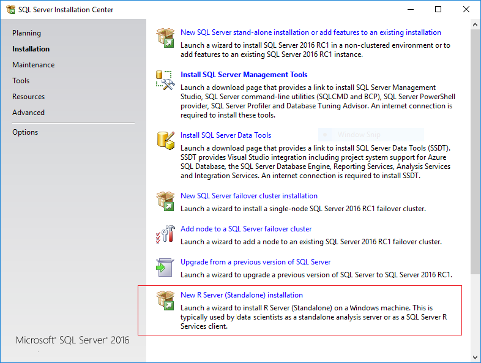

# Create a Standalone R Server

SQL Server setup includes the option to install a machine learning server that runs outside of SQL Server. 

This option might be useful if you need to develop high performance R solutions on Windows, and then share the solutions across other platforms. You can also use the server option to set up an environment for building solutions for execution on these supported remote compute contexts:
  
  + An instance of SQL Server running R Services
  + An instance of R Server using a Hadoop or Spark cluster
  + Teradata in-database analytics
  + R Server running in Linux 

This topic describes the setup steps in SQL Server setup for Microsoft R Server and Microsoft Machine Learning Server.

## Which Should I Install?

**Microsoft R Server** was first offered as a part of SQL Server 2016 and supports the R language. The last version of Microsoft R Server was 9.0.1.
In SQL Server 2017, R Server has been renamed **Microsoft Machine Learning Server**, with added support for Python. The latest version of Microsoft Machine Learning Server is 9.1.0.

Both Microsoft R Server and Microsoft Machine Learning Server require Enterprise Edition.

+ [Install Microsoft R Server (Standalone) using SQL Server setup](#bkmk_installRServer)
+ [Install Microsoft Machine Learning Server (Standalone) using SQL Server setup](#bkmk_installRServer) 

  Setup requires a SQL Server license and upgrades are typically aligned with the SQL Server release cadence. This ensures that your development tools are in synch with the version running in the SQL Server compute context.

+ [Install R Server for Windows](https://msdn.microsoft.com/microsoft-r/rserver-install-windows)

  With this option, R Server is installed using the Modern Lifecycle support policy. You can also run this installer after setup to upgrade an instance of SQL Server 2016. Currently, you _cannot_ install Python support using this option. To get Python, you must install Machine Learning Server using SQL Server 2017 setup.

##   How to Install Microsoft Machine Learning Server (Standalone)
  
1. If you have installed a previous version of Microsoft R Server, we recommend that you uninstall it first.

2. Run SQL Server 2017 setup.
  
3. Click the **Installation** tab, and select **New Machine Learning Server (Standalone) installation**.

4. After the rules check is complete, accept SQL Server licensing terms, and select a new installation.

5. On the **Feature Selection** page, the following options should be already selected:
    
    - Microsoft Machine Learning Server (Standalone)
    
    - R and Python are both selected by default.
    
    All other options should be ignored.

6.  Accept the license terms for downloading and installing the machine learning components. A separate licensing agreement is required for Microsoft R Open and for Python. 
    
    When the **Accept** button becomes unavailable, you can click **Next**. 
    
    Installation of these components (and any prerequisites they might require) might take a while. 
    
    If the computer does not have Internet access, you should download the component installers in advance. For more information, see [Installing ML components without Internet Access](./installing-ml-components-without-internet-access.md). 
    
7.  On the **Ready to Install** page, verify your selections, and click **Install**.

For more information about automated or off-line installation, see [Install Microsoft R Server from the Command Line](../../advanced-analytics/r-services/install-microsoft-r-server-from-the-command-line.md).

###   Install Microsoft R Server (Standalone)  

1. If you have installed a previous version of Microsoft R Server, or any version of the Revolution Analytics tools, you must uninstall it first.  See [Upgrading from an Older Version of Microsoft R Server](#bkmk_Uninstall).

2. Run SQL Server 2016 setup. We recommend that you install Service Pack 1 or later.

3. On the **Installation** tab, click **New R Server (Standalone) installation** .
    
     
    
4.  On the **Feature Selection** page, the following option should be already selected:
    
    **R Server (Standalone)**  
    
    All other options can be ignored. Do not install the SQL Server databae engine or SQL Server R Services.
    
5.  Accept the license terms for downloading and installing Microsoft R Open. When the **Accept** button becomes unavailable, you can click **Next**. 
    
    Installation of these components (and any prerequisites they might require) might take a while.
    
6.  On the **Ready to Install** page, verify your selections, and click **Install**.  

### Upgrade an Existing R Server to 9.0.1

If you installed an earlier version of Microsoft R Server (Standalone) you can upgrade the instance to use newer versions of the R components. The upgrade also changes the server  Modern Lifecycle Support policy. This allows the instance to be updated more frequently, on a different schedule than the SQL Server releases.

1. Install Microsoft R Server (Standalone), if it is not already installed.

2. Download the separate Windows-based installer from the locations listed here: [Run Microsoft R Server for Windows](https://msdn.microsoft.com/microsoft-r/rserver-install-windows#howtoinstall).

3. Run the installer and follow [these instructions](https://msdn.microsoft.com/microsoft-r/rserver-install-windows#download-r-server-installer).

### Change in Default Folder for R Packages

When you install using SLq Server setup, the R libraries are installed in a folder associated with the SQL Server version that you used for setup. In this folder you will also find sample data, documentation for the R base packages, and documentation of the R tools and runtime.

**R Server (Standalone) with setup using SQL Server 2016**

`C:\Program Files\Microsoft SQL Server\130\R_SERVER`

**R Server (Standalone) with setup using SQL Server 2017**

`C:\Program Files\Microsoft SQL Server\140\R_SERVER`

**Setup using the Windows standalone installer**

However, if you install using the separate Windows installer, or if you upgrade using the separate Windows installer, the R libraries are moved to the following R Server folder:

`C:\Program Files\Microsoft\R Server\R_SERVER`
      
**Setup of R Servies or Machine LEarning Services In-Databases**

If you have installed an instance of SQL Server with R Services (In-Database) or Machine Learning Services (In-Database), and that instance is on the same computer, the R libraries and tools are installed by default into a different folder:

`C:\Program Files\Microsoft SQL Server\<instance_name>\R_SERVICES`

Do not directly call the R packages or utilities associated with the [!INCLUDE[ssNoVersion_md](../../includes/ssnoversion-md.md)] instance. If both R Server and R Services are installed on the same computer, when you need to run RGui or other tools, use the R tools and packages installed by the R_SERVER folder.

### Development tools

A development IDE is not installed as part of setup. Additional tools are not required, as all the standard tools are included that would be provided with a distribution of R or Python.

We recommend that you try the the new release of [!INCLUDE[rsql_rtvs](../../includes/rsql-rtvs-md.md)], as Visual Studio  supports both R and Python, as well as SQL Server and BI tools. However, you can use any preferred development environment, including RStudio.

## Troubleshooting  

### Incompatible version of R Client and R Server

If you install the latest version of Microsoft R Client and use it to run R on SQL Server using a remote compute context, you might get the following error:

*You are running version 9.0.0 of Microsoft R client on your computer, which is incompatible with the Microsoft R server version 8.0.3. Download and install a compatible version.*

Typically, the version of R that is installed with SQL Server R Services is updated when service releases are published. To ensure that you always have the most up-to-date versions of R components, install all service packs. For compatibility with Microsoft R Client 9.0.0, you must install the updates that are described in this [support article](https://support.microsoft.com/kb/3210262). 

### Installing Microsoft R Server on an instance of SQL Server installed on Windows Core

In the RTM version of SQL Server 2016, there was a known issue when adding Microsoft R Server to an instance on Windows Server Core edition. This has been fixed.

If you encounter this issue, you can applied the fix described in [KB3164398](https://support.microsoft.com/kb/3164398) to add the R feature to the existing instance on Windows Server Core.   For more information, see [Can't install Microsoft R Server Standalone on a Windows Server Core operating system](https://support.microsoft.com/kb/3168691).

###   Upgrading from an Older Version of Microsoft R Server

If you installed a pre-release version of Microsoft R Server, you must uninstall it before you can upgrade to a newer version.

**To uninstall R Server (Standalone)**

1.  In **Control Panel**, click **Add/Remove Programs**, and select `Microsoft SQL Server 2016 <version number>`.  
  
2.  In the dialog box with options to **Add**, **Repair**, or **Remove** components, select **Remove**.  
  
3.  On the **Select Features** page, under **Shared Features**, select **R Server (Standalone)**. Click **Next**, and then click **Finish** to uninstall just the selected components.  
   
### Installation fails with error "Only one Revolution Enterprise product can be installed at a time."

You might encounter this error if you have an older installation of the Revolution Analytics products, or a pre-release version of SQL Server R Services. You must uninstall any previous versions before you can install a newer version of Microsoft R Server. Side-by-side installation with other versions of the Revolution Enterprise tools is not supported.

However, side-by-side installs are supported when using R Server Standalone with [!INCLUDE[ssSQLv14_md](../../includes/sssqlv14-md.md)] or SQL Server 2016.

### Unable to uninstall older components

If you have problems removing an older version, you might need to edit the registry to remove related keys.

> [!IMPORTANT]
> This issue applies only if you installed a pre-release version of Microsoft R Server or a CTP version of SQL Server 2016 R Services.
  
1. Open the Windows Registry, and locate this key: `HKLM\Software\Microsoft\Windows\CurrentVersion\Uninstall`.
2. Delete any of the following entries if present, and if the key contains only the value `sEstimatedSize2`:
  
    -   E0B2C29E-B8FC-490B-A043-2CAE75634972        (for 8.0.2)
  
    -   46695879-954E-4072-9D32-1CC84D4158F4        (for 8.0.1)
  
    -   2DF16DF8-A2DB-4EC6-808B-CB5A302DA91B        (for 8.0.0)
  
    -   5A2A1571-B8CD-4AAF-9303-8DF463DABE5A        (for 7.5.0)
  
## See Also

[Microsoft R Server](../../advanced-analytics/r-services/r-server-standalone.md)

