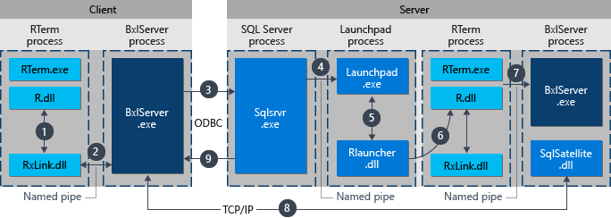

# Components in SQL Server to Support R

 In SQL Server 2016 and 2017, the database engine includes optional components that support extensibility for external script languages, including R and Python. Support for the R language was added in SQL Server 2016; support for Python was added in SQL Server 2017 Machine Learning Services

This topic describes the new components that work specifically with the R language. 
For a discussion of how these components work with open source R, see [R Interoperability](r-interoperability-in-sql-server.md)

## New Components and Providers

In addition to the shell that loads R and executes R code as described in the architecture overview, [!INCLUDE[ssNoVersion_md](../../includes/ssnoversion-md.md)] includes these additional components.

### **Launchpad** 
  The [!INCLUDE[rsql_launchpad_md](../../includes/rsql-launchpad-md.md)] is a service provided by [!INCLUDE[ssCurrent_md](../../includes/sscurrent-md.md)] for supporting execution of external scripts, similar to the way that the full-text indexing and query service launches a separate host for processing full-text queries. 
  
  The Launchpad service will start only trusted launchers that are published by Microsoft, or that have been certified by Microsoft as meeting requirements for performance and resource management. The naming for the language-specific launchers is straightforward:  
  + R -  RLauncher.dll
  + Python - PythonLauncher.dll 
  
  The [!INCLUDE[rsql_launchpad_md](../../includes/rsql-launchpad-md.md)] service runs under its own user account. Each satellite process for a specific language runtime will inherit the user account of the Launchpad. For more information about the configuration and security context of the Launchpad, see [Security Overview](../../advanced-analytics/r-services/security-overview-sql-server-r.md).

### **BxlServer and SQL Satellite**

  BxlServer is an executable provided by Microsoft that manages communication between [!INCLUDE[ssNoVersion_md](../../includes/ssnoversion-md.md)] and the R runtime and also implements ScaleR functions. It creates the Windows job objects that are used to contain R sessions, provisions secure working folders for each R job, and uses SQL Satellite to manage data transfer between R and [!INCLUDE[ssNoVersion_md](../../includes/ssnoversion-md.md)].  

  In effect, BxlServer is a companion to R that works with [!INCLUDE[ssNoVersion_md](../../includes/ssnoversion-md.md)] to support integration of R with SQL Server. BXL stands for Binary Exchange language and refers to the data format used to move data efficiently between SQL Server and external processes such as R. BxlServer.dll is also installed when you install Microsoft R Client or Microsoft R Server.  

 The SQL Satellite is a new extensibility API in SQL Server 2016 that is provided by the database engine to support external code or external runtimes implemented using C or C++. BxlServer uses SQL Satellite for communicating with [!INCLUDE[ssNoVersion_md](../../includes/ssnoversion-md.md)].
 
  The SQL Satellite uses a custom data format that is optimized for fast data transfer between [!INCLUDE[ssNoVersion_md](../../includes/ssnoversion-md.md)] and external script languages. It performs type conversions and defines the schemas of the input and output datasets during communications between [!INCLUDE[ssNoVersion_md](../../includes/ssnoversion-md.md)] and R.

  BxlServer uses SQL Satellite for these tasks: 
  - Reading input data
  - Writing output data
  - Getting input arguments
  - Writing output arguments
  - Error handling
  - Writing standard output and errors back to the client

  The SQL Satellite can be monitored by using Extended Events. For more information, see [Extended Events for SQL Server R Services](extended-events-for-sql-server-r-services.md).

## Communication Channels Between Components

+ **TCP/IP**
  By default, internal communications between [!INCLUDE[ssNoVersion_md](../../includes/ssnoversion-md.md)] and the SQL Satellite use TCP/IP.

+ **Named Pipes**

  Internal data transport between the BxlServer and [!INCLUDE[ssNoVersion_md](../../includes/ssnoversion-md.md)] via SQL Satellite uses a proprietary, compressed data format to enhance performance. Data from R memory to BxlServer is exchanged over named pipes in BXL format. 
  
+ **ODBC**
  Communications between external data science clients and the [!INCLUDE[ssNoVersion_md](../../includes/ssnoversion-md.md)] instance use ODBC. The account that sends the R jobs to [!INCLUDE[ssNoVersion_md](../../includes/ssnoversion-md.md)] must have both permissions to connect to the instance and to run external scripts. Additionally, the account must have permission to access any data used by the job, to write data (for example, if saving results to a table), or to create database objects (for example, if saving R functions as part of a new stored procedure).

  When [!INCLUDE[ssNoVersion_md](../../includes/ssnoversion-md.md)] is used as the compute context for an R job sent from a remote client, and the R command must retrieve data from an external source, ODBC is used for writeback. [!INCLUDE[ssNoVersion_md](../../includes/ssnoversion-md.md)] will map the identity of the user issuing the remote R command to the identity of the user on the current instance, and run the ODBC command using that user's credentials. The connection string needed to perform this ODBC call is obtained from the client code.
  
  Additional ODBC calls can be made inside the script by using **RODBC**. RODBC is a popular R package used to access data in relational databases; however, its performance is generally slower than comparable providers used by [!INCLUDE[ssNoVersion_md](../../includes/ssnoversion-md.md)]. Many R scripts use embedded calls to RODBC as a way of retrieving "secondary" datasets for use in analysis. For example, the stored procedure that trains a model might define a SQL query to get the data for training a model, but use an embedded RODBC call to get additional factors, to perform lookups, or to get new data from external sources such as text files or Excel.

  The following code illustrates an RODBC call embedded in an R script:
   ~~~~
  library(RODBC);
  connStr <- paste("Driver=SQL Server;Server=", instance_name, ";Database=", database_name, ";Trusted_Connection=true;", sep="");
  dbhandle <- odbcDriverConnect(connStr)
  OutputDataSet <- sqlQuery(dbhandle, "select * from table_name");
  ~~~~

+ **Other protocols**
  Processes that might need to work in "chunks" or transfer data back to a remote client can also use the .XDF format supported by Microsoft R. Actual data transfer is via encoded blobs.

## Interaction of Components

The component architecture just described has been provided to guarantee that open source R code can work "as is", while providing greatly increased performance for code that runs on a [!INCLUDE[ssNoVersion_md](../../includes/ssnoversion-md.md)] computer. The mechanism of how the components interact with the R runtime and the [!INCLUDE[ssNoVersion_md](../../includes/ssnoversion-md.md)] database engine differs somewhat, depending on how the R code is launched. The key scenarios are summarized in this section. 
 
### R scripts executed from SQL Server (in-database)

R code that is run from "inside" [!INCLUDE[ssNoVersion_md](../../includes/ssnoversion-md.md)] is executed by calling a stored procedure. Thus, any application that can make a stored procedure call can initiate execution of R code.  Thereafter [!INCLUDE[ssNoVersion_md](../../includes/ssnoversion-md.md)] manages the execution of R code as summarized in the following diagram.

1. A request for the R runtime is indicated by the parameter _@language='R'_ passed to the stored procedure, [sp_execute_external_script](../../relational-databases/system-stored-procedures/sp-execute-external-script-transact-sql.md). [!INCLUDE[ssNoVersion_md](../../includes/ssnoversion-md.md)] sends this request to the Launchpad service.
2. The Launchpad service starts the appropriate launcher; in this case, RLauncher.
3. RLauncher starts the external R process.
4. BxlServer coordinates with the R runtime to manage exchanges of data with [!INCLUDE[ssNoVersion_md](../../includes/ssnoversion-md.md)] and storage of working results.
5. SQL Satellite manages communications about related tasks and processes with [!INCLUDE[ssNoVersion_md](../../includes/ssnoversion-md.md)].
6. BxlServer uses SQL Satellite to communicate status and results to [!INCLUDE[ssNoVersion_md](../../includes/ssnoversion-md.md)].
7. [!INCLUDE[ssNoVersion_md](../../includes/ssnoversion-md.md)] gets results and closes related tasks and processes. 

### R scripts executed from a remote client

When connecting from a remote data science client that supports Microsoft R, you can run R functions in the context of [!INCLUDE[ssNoVersion_md](../../includes/ssnoversion-md.md)] by using the ScaleR functions. This is a different workflow from the previous one, and is summarized in the following diagram.

1. For RevoScaleR functions, the R runtime calls a linking function which in turn calls BxlServer. 
2. BxlServer is provided with Microsoft R and runs in a separate process from the R runtime.
3. BxlServer determines the connection target and initiates a connection using ODBC, passing credentials supplied as part of the connection string in the R data source object.
4. BxlServer opens a connection to the [!INCLUDE[ssNoVersion_md](../../includes/ssnoversion-md.md)] instance.
5. For an R call, the Launchpad service is invoked, which is turn starts the appropriate launcher, RLauncher. Thereafter, processing of R code is similar to the process for running R code from T-SQL.
6. RLauncher makes a call to the instance of the R runtime that is installed on the [!INCLUDE[ssNoVersion_md](../../includes/ssnoversion-md.md)] computer. 
7. Results are returned to BxlServer.
8. SQL Satellite manages communication with [!INCLUDE[ssNoVersion_md](../../includes/ssnoversion-md.md)] and cleanup of related job objects.
9. [!INCLUDE[ssNoVersion_md](../../includes/ssnoversion-md.md)] passes results back to the client.

## See Also
[Architecture Overview](architecture-overview-sql-server-r.md)

