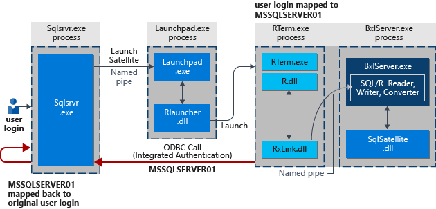

# Security for SQL Server machine learning and R

This article describes the overall security architecture that is used to connect the [!INCLUDE[ssNoVersion_md](../../includes/ssnoversion-md.md)] database engine and related components to the R runtime. Examples of the security process are provided for these common scenarios for using R in an enterprise environment:

+ Executing RevoScaleR functions in [!INCLUDE[ssNoVersion_md](../../includes/ssnoversion-md.md)] from a data science client
+ Running R directly from [!INCLUDE[ssNoVersion_md](../../includes/ssnoversion-md.md)] using stored procedures

## Security overview

A [!INCLUDE[ssNoVersion_md](../../includes/ssnoversion-md.md)] login or Windows user account is required to run R scripts that use SQL Server data or that run with SQL Server as the compute context. This requirement applies to both [!INCLUDE[rsql_productname_md](../../includes/rsql-productname-md.md)] and SQL Server 2017 [!INCLUDE[rsql-productnamenew-md](../../includes/rsql-productnamenew-md.md)].

The login or user account identifies the *security principal*, who might need multiple levels of access, depending on the R script requirements:

+ Permission to access the database where R is enabled
+ Permissions to read data from secured objects such as tables
+ The ability to write new data to a table, such as a model, or scoring results
+ The ability to create new objects, such as tables, stored procedures that use R script, or custom functions that use R job
+ The right to install new packages on the SQL Server computer, or use R packages provided to a group of users. 

Therefore, each person who runs R code using [!INCLUDE[ssNoVersion_md](../../includes/ssnoversion-md.md)] as the execution context must be mapped to a login in the database. Under SQL Server security, it is generally easiest to create roles to manage sets of permissions, and assign users to those roles, rather than individually set user permissions. 

As an example, assume that you created some R code that runs on your laptop, and you want to run that code on [!INCLUDE[ssNoVersion_md](../../includes/ssnoversion-md.md)]. You can do this only if these conditions are met:

+ The database allows remote connections.
+ A SQL login with the name and the password that you used in the R code has been added to the [!INCLUDE[ssNoVersion_md](../../includes/ssnoversion-md.md)] at the instance level. Or, if you are using Windows integrated authentication, the Windows user specified in the connection string must be added as a user on the instance.
+ The SQL login or Windows user must have the permission to execute external scripts. Generally, this permission can only be added by a database administrator.
+ The SQL login or Window user must be added as a user, with appropriate permissions, in each database where the R job performs any of these operations:
    + Retrieving data
    + Writing or updating data 
    + Creating new objects, such as tables or stored procedures

After the login or Windows user account has been provisioned and given the necessary permissions, you can run R code on [!INCLUDE[ssNoVersion_md](../../includes/ssnoversion-md.md)] by using an R data source object or by calling a stored procedure. Whenever R is started from [!INCLUDE[ssNoVersion_md](../../includes/ssnoversion-md.md)], the database engine security gets the security context of the user who started the R job or ran the stored procedure, and manages the mappings of the user or login to securable objects. 

Hence, all R jobs that are initiated from a remote client must specify the login or user information as part of the connection string.

## Interaction of [!INCLUDE[ssNoVersion_md](../../includes/ssnoversion-md.md)] security and Launchpad security

When an R script is executed in the context of the [!INCLUDE[ssNoVersion_md](../../includes/ssnoversion-md.md)] computer, the [!INCLUDE[rsql_launchpad_md](../../includes/rsql-launchpad-md.md)] service gets an available worker account (a local user account) from a pool of worker accounts established for external process and uses that worker account to perform the related tasks. 

For example, if you start an R job under your Windows domain credentials, your account might be mapped to the Launchpad worker account *SQLRUser01*.

After mapping to a worker account, [!INCLUDE[rsql_launchpad_md](../../includes/rsql-launchpad-md.md)] creates a user token that is used to start processes. 

When all [!INCLUDE[ssNoVersion_md](../../includes/ssnoversion-md.md)] operations are completed, the user worker account is marked as free and returned to the pool.

For more information about [!INCLUDE[rsql_launchpad_md](../../includes/rsql-launchpad-md.md)], see [Components in SQL Server to support R integration](../../advanced-analytics/r/new-components-in-sql-server-to-support-r.md).

### Implied authentication

**Implied authentication** is the term used for the process under which SQL Server gets the user credentials and then executes all external script tasks on behalf of the users, assuming the user has the correct permissions in the database. Implied authentication is particularly important if the R script needs to make an ODBC call outside the SQL Server database. For example, the code might retrieve a shorter list of factors from a spreadsheet or other source.

For such loopback calls to succeed, the group that contains the worker accounts, SQLRUserGroup, must have "Allow Log on locally" permissions. By default, this right is given to all new local users, but in some organizations stricter group policies might be enforced.

## Security of worker accounts

The mapping of an external Windows user or valid SQL login to a worker account is valid only for the lifetime of the lifetime of the SQL query that runs the R script.

Parallel queries from the same login are mapped to the same user worker account.

The directories used for the processes are managed by the [!INCLUDE[rsql_launchpad_md](../../includes/rsql-launchpad-md.md)] using RLauncher, and directories are access-restricted. The worker account cannot access any files in folders above its own, but it can read, write, or delete children under the session working folder that was created for the SQL query with the R script.

For more information about how to change the number of worker accounts, account names, or account passwords, see [Modify the user account pool for SQL Server machine learning](../../advanced-analytics/r/modify-the-user-account-pool-for-sql-server-r-services.md).

## Security isolation for multiple external scripts

The isolation mechanism is based on on physical user accounts. As satellite processes are started for a specific language runtime, each satellite task uses the worker account specified by the [!INCLUDE[rsql_launchpad_md](../../includes/rsql-launchpad-md.md)]. If a task requires multiple satellites, for example, in the case of parallel queries, a single worker account is used for all related tasks.

No worker account can see or manipulate files used by other worker accounts.
 
If you are an administrator on the computer, you can view the directories created for each process. Each directory is identified by its session GUID.

## See also

[Architecture overview for SQL Server machine learning](../../advanced-analytics/r/architecture-overview-sql-server-r.md)
