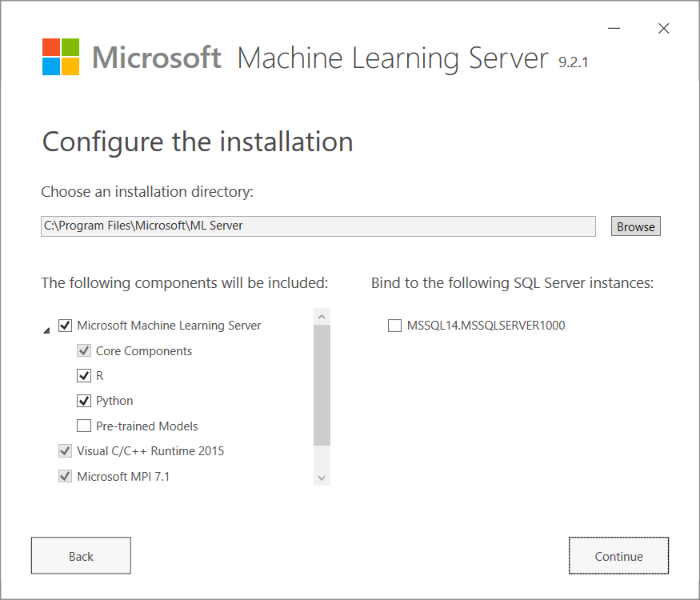

# Upgrade machine learning components in a SQL Server instance

This article explains the process of _binding_, which you can use to upgrade the machine learning components used in SQL Server. The process of binding locks the server into an update cadence based on releases of Machine Learning Server, rather than using the SQL Server release and update schedule.

> [!IMPORTANT]
> You do not need to use this upgrade process if you want to get upgrades as a part of SQL Server updates. Whenever you install a new service pack or service release, machine learning components are always automatically upgraded to the latest version. Only use the _binding_ process if you want to upgrade components at a faster pace than is afforded by SQL Server service releases.

If at any time you want to stop upgrading on the Machine Learning Server schedule, you must _unbind_ the instance as described in [this section](#bkmk_Unbind), and uninstall Machine Learning Server.

**Applies to:** SQL Server 2016 R Services, SQL Server 2017 Machine Learning Services

## Binding vs. upgrading

The process of upgrading the machine learning components is referred to as **binding**, because it changes the support model for SQL Server machine learning components to use the new Modern Software Lifecycle Policy. 

In general, switching to the new licensing model ensures that your data scientists can always use the latest version of R or Python. For more information about the terms of the Modern Lifecycle Policy, see [Support Timeline for Microsoft R Server](https://docs.microsoft.com/machine-learning-server/resources-servicing-support).

> [!NOTE]
> The upgrade does not change the support model for the SQL Server database and doesn't change the version of SQL Server.

When you bind an instance, several things happen:

+ The support model is changed. Rather than rely on SQL Server service releases, support is based on the new Modern Lifecycle Policy.
+ The machine learning components associated with the instance are automatically upgraded with each release, in lock-step with the version that is current under the new Modern Lifecycle Policy. 
+ New R or Python packages might be added. For example, previous updates based on Microsoft R Server 9.1 added new R packages, such as [MicrosoftML](../using-the-microsoftml-package.md), [olapR](../r/how-to-create-mdx-queries-using-olapr.md), and [sqlrutils](../r/how-to-create-a-stored-procedure-using-sqlrutils.md).
+ The instance can no longer be manually updated, except to add new packages.
+ You get the option to install pretrained models provided by Microsoft.

## Prerequisites

Begin by identifying instances that are candidates for an upgrade. If you run the installer and select the binding option, it returns a list of instances that are compatible with the upgrade.

Refer to the following table for a list of supported upgrades and requirements.

| SQL Server version| Supported upgrade| Notes|
|-----|-----|------|
| SQL Server 2016| Machine Learning Server 9.2.1| Requires at least Service Pack 1 plus CU3. R Services must be installed and enabled.|
| SQL Server 2017| Machine Learning Server 9.2.1| Machine Learning Services (In-Database) must be installed and enabled. |

## Bind or upgrade an instance

Machine Learning Server for Windows includes a tool that you can use to upgrade the machine learning languages and tools associated with an instance of SQL Server. There are two versions of the tool: a wizard, and a command-line utility.

Before you can run either the wizard or the command-line tool, you must download the latest version of the standalone installer for machine learning components.

+ [Install Machine Learning Server 9.2.1 for Windows](https://docs.microsoft.com/machine-learning-server/install/machine-learning-server-windows-install)

+ [Download components needed for offline installation](https://docs.microsoft.com/machine-learning-server/install/machine-learning-server-windows-offline)

### Upgrade using the new setup wizard

1. Start the new installer for Machine Learning Server. Be sure to run the installer on the computer that has the instance you want to upgrade.

    

2. On the page, **Configure the installation**, confirm the components to upgrade, and review the list of compatible instances. If no instances are displayed, check the [prerequisites](#bkmk_prereqs).

    To upgrade an instance, select the checkbox next to the instance name. If you do not select an instance, a separate installation of Machine Learning Server is created, and the SQL Server libraries are unchanged.

    

3. On the **License agreement** page, select **I accept these terms** to accept the licensing terms for Machine Learning Server. 

4. On successive pages, provide consent to additional licensing conditions for any open source components you selected, such as Microsoft R Open or the Python Anaconda distribution.

5. On the **Almost there** page, make a note of the installation folder. The default folder is `~\Program Files\Microsoft\ML Server`.

    If you want to change the installation folder, click **Advanced** to return to the first page of the wizard. However, you must repeat all previous selections.

6. If you are installing the components offline, you might be prompted for the location of required machine learning components, such as Microsoft R Open, Python Server, and Python Open.

During the installation process, any R or Python libraries used by SQL Server are replaced and Launchpad is updated to use the newer components. As a result, if the instance previously used libraries in the default R_SERVICES folder, after upgrade these libraries are removed and the properties for the Launchpad service are changed, to use the libraries in the new location.

### Upgrade using the command line

If you do not want to use the wizard, you can install Machine Learning Server, and then run the SqlBindR.exe tool from the command line to upgrade the instance.

> [!TIP]
> 
> Can't find SqlBindR.exe? You probably have not downloaded the components listed above. This utility is available only with the Windows installer for Machine Learning Server.

1. Open a command prompt as administrator and navigate to the folder containing sqlbindr.exe. The default location is `C:\Program Files\Microsoft\MLServer\Setup`

2. Type the following command to view a list of available instances:
   `SqlBindR.exe /list`
  
   Make a note of the full instance name as listed. For example, the instance name might be `MSSQL14.MSSQLSERVER` for a default instance, or something like `SERVERNAME.MYNAMEDINSTANCE`.

3. Run the **SqlBindR.exe** command with the */bind* argument, and specify the name of the instance to upgrade, using the instance name that was returned in the previous step.

   For example, to upgrade the default instance, type:
    `SqlBindR.exe /bind MSSQL14.MSSQLSERVER`

4. When the upgrade has completed, restart the Launchpad service associated with any instance that has been modified.

## Revert or unbind an instance

If you decide that you no longer want to upgrade the machine learning components using Machine Learning Server, you must first _unbind_ the instance, and then uninstall Machine Learning Server.

+ Unbind the instance

    You can unbind the instance and revert to the original libraries installed by SQL Server, by using either of these two methods:

    + [Use the setup wizard](#bkmk_wizunbind) for Machine Learning Server, and deselect all features on the instance
    + [Use the SqlBindR utility](#bkmk_cmdunbind) with the `/unbind` argument, followed by the instance name.

    When the unbinding process is complete, future machine learning upgrades based on Machine Learning Server will no longer be applied to the instance.

+ Uninstall Machine Learning Server

    For instructions, see [Uninstall Machine Learning Server for Windows](https://docs.microsoft.com/machine-learning-server/install/machine-learning-server-windows-uninstall). 

###  Unbind using the wizard

1. Locate the installer for Machine Learning Server. If you have removed the installer, you might need to download it again, or copy it from another computer.
2. Be sure to run the installer on the computer that has the instance you want to unbind.
2. The installer identifies local instances that are candidates for unbinding.
3. Deselect the check box next to the instance that you want to revert to the original configuration.
4. Accept the licensing agreement. You must indicate your acceptance of licensing terms even when installing.
5. Click **Finish**. The process takes a while.

###  Unbind using the command line

1. Open a command prompt and navigate to the folder that contains **sqlbindr.exe**, as described in the previous section.

2. Run the **SqlBindR.exe** command with the */unbind* argument, and specify the instance.

   For example, the following command reverts the default instance:
   
    `SqlBindR.exe /unbind MSSQL14.MSSQLSERVER`

## Known issues

This section lists known issues specific to use of the SqlBindR.exe utility, or to upgrades of Machine Learning Server that might affect SQL Server instances.

### Restoring packages that were previously installed

In the upgrade utility that was included with Microsoft R Server 9.0.1, the utility did not restore the original packages or R components completely, requiring that the user run repair on the instance, apply all service releases, and then restart the instance.

However, the latest version of the upgrade utility automatically restores the original R features. Therefore, you should not need to reinstall the R components or re-patch the server. However, you must install any R packages that might have been added after the initial installation.

If you have used the package management roles to install and share package, this task is much easier: you can use R commands to synchronize installed packages to the file system using records in the database, and vice versa. For more information, see [R package management for SQL Server](r-package-management-for-sql-server-r-services.md).

### Problems with multiple upgrades from SQL Server

If you have previously upgraded an instance of SQL Server 2016 R Services to 9.0.1, when you run the new installer for Microsoft R Server 9.1.0, it displays a list of all valid instances, and then by default selects previously bound instances. If you continue, the previously bound instances are unbound. As a result, the earlier 9.0.1 installation is removed, including any related packages, but the new version of Microsoft R Server (9.1.0) is not installed.

As a workaround, you can modify the existing R Server installation as follows:
1. In Control Panel, open **Add or Remove Programs**.
2. Locate Microsoft R Server, and click **Change/Modify**.
3. When the installer starts, select the instances you want to bind to 9.1.0.

### Binding or unbinding leaves multiple temporary folders

Sometimes the binding and unbinding operations fail to clean up temporary folders.
If you find folders with a name like this, you can remove it after installation is complete: `R_SERVICES_<guid>`

> [!NOTE]
> Be sure to wait until installation is complete. It can take a long time to remove R libraries associated with one version and then add the new R libraries. When the operation completes, temporary folders are removed.

## sqlbindr.exe command syntax

### Usage

`sqlbindr [/list] [/bind <SQL_instance_ID>] [/unbind <SQL_instance_ID>]`

### Parameters

|Name|Description|
|------|------|
|*list*| Displays a list of all SQL database instance IDs on the current computer|
|*bind*| Upgrades the specified SQL database instance to the latest version of R Server and ensures the instance automatically gets future upgrades of R Server|
|*unbind*|Uninstalls the latest version of R Server from the specified SQL database instance and prevents future R Server upgrades from affecting the instance|

### Errors

The tool returns the following error messages:

|Error|Resolution|
|------|------|
|An error occurred while binding the instance| The instance could not be bound. Contact support for assistance.|
|The instance is already bound| You ran the *bind* command, but the specified instance is already bound. Choose a different instance.|
|The instance is not bound| You ran the *unbind* command, but the instance you specified is not bound. Choose a different instance that is compatible.|
|Not a valid SQL instance ID| You might have typed the instance name incorrectly. Run the command again with the *list* argument to see the available instance IDs.|
|No instances found| This computer does not have an instance of SQL Server R Services.|
|The instance must have a compatible version of SQL R Services (In-Database) installed.| See the compatibility requirements in this topic for details.|
|An error occurred while unbinding the instance| The instance could not be unbound. Contact support for assistance.|
|An unexpected error has occurred| Other errors. Contact support for assistance.  |
|No SQL instances found| This computer does not have an instance of SQL Server. |

For more information, see the release notes for Microsoft R Server:

+ [Known issues in Machine Learning Server](https://docs.microsoft.com/machine-learning-server/resources-known-issues)

+ [Feature announcements from previous release of R Server](https://docs.microsoft.com/r-server/whats-new-in-r-server)

+ [Deprecated, discontinued or changed features](https://docs.microsoft.com/machine-learning-server/resources-deprecated-features)
