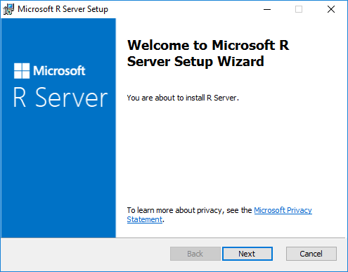

# Upgrade machine learning components in a SQL Server instance

Microsoft Machine Learning Server for Windows includes a tool that you can use to upgrade the R components associated with an instance of SQL Server. There are two versions of the tool: a wizard, and a command-line utility.

This article describes how to use these tools to upgrade a compatible instance of SQL Server, and how to revert an instance that was previously upgraded.

You do not need to use this upgrade process if you want to get upgrades as a part of SQL Server updates. Whenever you install a new service pack or service release, machine learning components are always automatically upgraded to the latest version. Only use this proess if you want to upgrade components at a faster pace than is affored by SLQ Server service releases.

**Applies to:** SQL Server 2016 R Services, SQL Server 2017 Machine Learning Services

> [!NOTE]
> At the time of this writing, upgrades apply only to compatible SQL Server 2016 instances.  Although upgrade is supported for SQL Server 2017, a new version of Microsoft Machine Learning Server to use for upgrades has not been released.

## Upgrade an instance

The upgrade process is referred to as **binding**, because it changes the support model for SQL Server machine learning components to use the new Modern Lifecycle Policy. However, the upgrade does not change the support model for the SQL Server database.

In general, this licensing system ensures that your data scientists will always be using the latest version of R. For more information about the terms of the Modern Lifecycle Policy, see [Support Timeline for Microsoft R Server](https://msdn.microsoft.com/microsoft-r/rserver-servicing-support).

When you bind an instance, several things happen:

+ The support model is changed. Rather than rely on SQL Server service releases, support is based on the new Modern Lifecycle Policy.
+ The machine learning components associated with the instance will be automatically upgraded with each release, in lock-step with the version that is current under the new Modern Lifecycle Policy. 
+ New R or Python packages might be added. For example, previous updates from Microsoft R Server added new R packages, such as [MicrosoftML](../using-the-microsoftml-package.md), [olapR](../r/how-to-create-mdx-queries-using-olapr.md), and [sqlrutils](../r/how-to-create-a-stored-procedure-using-sqlrutils.md).
+ The instance can no longer be manually updated, except to add new packages.
+ You have the option to add pretrained models.

If you later decide that you want to stop upgrading the instance at each release, you must **unbind** the instance as described in [this section](#bkmk_Unbind), and then uninstall the machine learning upgrades as described in this article: [Run Microsoft R Server for Windows](https://msdn.microsoft.com/microsoft-r/rserver-install-windows). When the process is complete, future machine learning upgrades based on Machine Learning Server will no longer be applied to the instance.

### Prerequisites for upgrade

1. Identify instances that are candidates for an upgrade.
    + SQL Server 2016 with R Services installed
    + At least Service Pack 1 plus CU3

2. Get **Microsoft R Server**, by downloading the separate Windows installer.

    [How to install R Server 9.0.1 on Windows using the standalone Windows installer](https://msdn.microsoft.com/microsoft-r/rserver-install-windows#howtoinstall)

> [!TIP]
> 
> Can't find SqlBindR.exe? You probably have not downloaded R Server yet. This utility is available only with the Windows installer for Microsoft R Server.

### Upgrade using the new setup wizard

1. Start the new installer for R Server on the computer that has the instance you want to upgrade.
  
2. Accept the licensing agreement for Microsoft R Server 9.1.0, and click **Next**.
3. Accept the licensing conditions for the R open source components, and click **Next**.
4. On **Select Installation Folder**, accept the defaults, or specify a different location where R libraries will be installed. 
5. The installer will identify any local instances that are candidates for binding. If no instances are shown, it means that no valid instances were found. You might need to patch the server, or check whether R Services was installed.
6. Select the check box next to any instance that you want to upgrade, and click **Next**.
7. The process can take a while.
    
    During the installation, the R libraries used by SQL Server R Services are replaced with the libraries for Microsoft R Server 9.1.0.
    
    Launchpad is not affected by the process, but the libraries in the R_SERVICES folder will be removed and the properties for the service will be changed, to use the libraries in `C:\Program Files\Microsoft\R Server\R_SERVER`.

### Upgrade using the command line

After Microsoft R Server has been installed, you can run just the SqlBindR.exe tool from the command line.

1. Open a command prompt as administrator and navigate to the folder containing sqlbindr.exe. The default location is `C:\Program Files\Microsoft\R Server\Setup`
2. Type the following command to view a list of available instances:
   `SqlBindR.exe /list`
  
   Make a note of the full instance name as listed. For example, the instance name might be `MSSQL13.MSSQLSERVER` for the default instance, or something like `SERVERNAME.MYNAMEDINSTANCE`.
3. Run the **SqlBindR.exe** command with the */bind* argument, and specify the name of the instance to upgrade, as returned in the previous step.

   For example, to upgrade the default instance, type:
    `SqlBindR.exe /bind MSSQL13.MSSQLSERVER`
4. When upgrade is complete, restart the Launchpad service associated with any instance that has been modified.

## Revert or unbind an instance

To restore an instance of SQL Server to use the original libraries installed by SQL Server, you must perform an **unbind** operation. You can do this either by re-running the setup wizard for Microsoft R Server, or by running the SqlBindR utility from the command line.

When unbinding is complete, the libraries for Microsoft R Server 9.1.0 are removed, and the original R libraries used by SQL Server R Services are restored.

The properties of the SQL Server Launchpad are edited to use the R libraries in the default folder for R_SERVICES, in `C:\Program Files\Microsoft\R Server\R_SERVER`.

### Unbind using the wizard

1. Download the new installer for Microsoft R Server 9.1.0.
2. Run the installer on the computer that has the instance you want to unbind.
2. The installer will identify local instances that are candidates for unbinding.
3. Deselect the check box next to the instance that you want to revert to the original SQL Server R Services configuration.
4. Accept the licensing agreement for Microsoft R Server 9.1.0. You must accept the licensing agreement even if you are removing R Server.
5. Click **Finish**. The process takes a while.

### Unbind using the command line

1. Open a command prompt and navigate to the folder that contains **sqlbindr.exe**, as described in the previous section.

2. Run the **SqlBindR.exe** command with the */unbind* argument, and specify the instance.

   For example, the following command reverts the default instance:
   
    `SqlBindR.exe /unbind MSSQL13.MSSQLSERVER`

## Known issues

This section lists known issues specific to use of the SqlBindR.exe utility, or to upgrades using the Microsoft R Server setup utility that affect SQL Server instances.

### Restoring packages that were previously installed

In the upgrade utility that was included with Microsoft R Server 9.0.1, the utility did not restore the original packages or R components completely, requiring that the user run repair on the instance, apply all service releases, and then restart the instance.

However, the latest version of the upgrade utility, for Microsoft R Server 9.1.0, will automatically restore the original R features. Therefore, you should not need to reinstall the R components or re-patch the server. However, you will still need to install any R packages that might have been added after the initial installation.

If you have used the package management roles to install and share package, this task is much easier: you can use R commands to synchronize installed packages to the file system using records in the database, and vice versa. For more information, see [Installing and managing R packages](installing-and-managing-r-packages.md)

### Cannot perform upgrade from 9.0.1

If you have previously upgraded an instance of SQL Server 2016 R Services to 9.0.1, when you run the new installer for Microsoft R Server 9.1.0, it will display a list of all valid instances, and then by default select previously bound instances. If you continue, the previously bound instances are unbound. As a result, the earlier 9.0.1 installation is removed, including any related packages, but the new version of Microsoft R Server (9.1.0) is not installed.

As a workaround, you can modify the existing R Server installation as follows:
1. In Control Panel, open **Add or Remove Programs**.
2. Locate Microsoft R Server, and click **Change/Modify**.
3. When the installer starts, select the instances you want to bind to 9.1.0.

### Binding or unbinding leaves multiple temporary folders

Sometimes the binding and unbinding operations fail to clean up temporary folders.
If you find folders with a name like this, you can remove it after installation is complete: `R_SERVICES_<guid>`

> [!NOTE]
> Be sure to wait until installation is complete. It can take a long time to remove R libraries associated with one version and then add the new R libraries. When the operation completes, temporary folders will be removed.

## sqlbindr.exe command syntax

### Usage

`sqlbindr [/list] [/bind <SQL_instance_ID>] [/unbind <SQL_instance_ID>]`

### Parameters

|Name|Description|
|------|------|
|*list*| Displays a list of all SQL database instance IDs on the current computer|
|*bind*| Upgrades the specified SQL database instance to the latest version of R Server and ensures the instance automatically gets future upgrades of R Server|
|*unbind*|Uninstalls the latest version of R Server from the specified SQL database instance and prevents future R Server upgrades from affecting the instance|

### Errors

The tool returns the following error messages:

|Error|Resolution|
|------|------|
|An error occurred while binding the instance| The instance could not be bound. Contact support for assistance.|
|The instance is already bound| You ran the *bind* command, but the specified instance is already bound. Choose a different instance.|
|The instance is not bound| You ran the *unbind* command, but the instance you specified is not bound. Choose a different instance that is compatible.|
|Not a valid SQL instance ID| You might have typed the instance name incorrectly. Run the command again with the *list* argument to see the available instance IDs.|
|No instances found| This computer does not have an instance of SQL Server R Services.|
|The instance must have a compatible version of SQL R Services (In-Database) installed.| See the compatibility requirements in this topic for details.|
|An error occurred while unbinding the instance| The instance could not be unbound. Contact support for assistance.|
|An unexpected error has occurred| Other errors. Contact support for assistance.  |
|No SQL instances found| This computer does not have an instance of SQL Server. |

For more information, see the release notes for Microsoft R Server:

+ [What's new in R Server](https://docs.microsoft.com/r-server/whats-new-in-r-server)

+ [R Server known issues](https://docs.microsoft.com/r-server/resources-known-issues)
