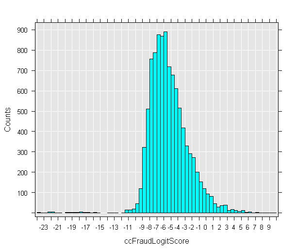

# Lesson 2-3 - Score New Data
Now that you have a model you can use for predictions, you'll feed it data from the [!INCLUDE[ssNoVersion](../../includes/ssnoversion-md.md)] database to generate some predictions.  
  
## Score New Data  
You will use the logistic regression model, *logitObj*, to create scores for another data set that uses the same independent variables as inputs.  
  
> [!NOTE]  
> You will need DDL admin privileges for some of these steps.  
  
1.  Update the data source that you set up earlier, *sqlScoreDS*, to add the required column information.  
  
    ```R  
    sqlScoreDS <- RxSqlServerData(  
        connectionString = sqlConnString,   
        table = sqlScoreTable,   
        colInfo = ccColInfo,   
        rowsPerRead = sqlRowsPerRead)    
    ```  
  
2.  To make sure you don't lose the results, you'll create a new data source object, and use that to populate a new table in the [!INCLUDE[ssNoVersion](../../includes/ssnoversion-md.md)] database.  
  
    ```R    
    sqlServerOutDS <- RxSqlServerData(table = "ccScoreOutput",   
        connectionString = sqlConnString,   
        rowsPerRead = sqlRowsPerRead )    
    ```  
     At this point, the table has not been created. This statement just defines a container for the data.
     
3.  Check the current compute context, and set the compute context to the server if needed.  
  
    ```R  
    rxSetComputeContext(sqlCompute)  
    ```  
  
4.  Before running the prediction function that generates the results, you need to check for the existence of an existing output table. Otherwise, you would get an error when you tried to write the new table  
  
    To do this, make a call to the functions *rxSqlServerTableExists* and *rxSqlServerDropTable*, passing the table name as input.  
  
    ```R  
    if (rxSqlServerTableExists("ccScoreOutput"))     rxSqlServerDropTable("ccScoreOutput")   
    ```  
  
    -   The function *rxSqlServerTableExists* queries the ODBC driver and returns TRUE if the table exists, FALSE otherwise.    
    -   The function *rxSqlServerDropTable* function executes the DDL and returns TRUE if the table is successfully dropped, FALSE otherwise.   
  
5.  Now you are ready to use the *rxPredict* function to create the scores and save them in the new table defined in data source *sqlScoreDS*.  
  
    ```R  
    rxPredict(modelObject = logitObj,   
        data = sqlScoreDS,        
        outData = sqlServerOutDS,     
        predVarNames = "ccFraudLogitScore",   
          type = "link",      
        writeModelVars = TRUE,        
        overwrite = TRUE)    
    ```  
  
    The *rxPredict* function is another function that supports running in remote compute contexts. You can use the *rxPredict* function to create scores from models created using *rxLinMod*, *rxLogit*, or *rxGlm*.  
  
    -   The parameter *writeModelVars* is set to **TRUE** here. This means that the variables that were used for estimation will be included in the new table.  
  
    -   The parameter *predVarNames* specifies the variable where results will be stored. Here you are passing a new variable, *ccFraudLogitScore*.  
  
    -   The *type* parameter for *rxPredict* defines how you want the predictions calculated. Specify the keyword **response** to generate scores based on the scale of the response variable, or use the keyword **link** to generate scores based on the underlying link function, in which case  predictions will be on a logistic scale.  

6. After a while, you can refresh the list of tables in Management Studio to see the new table and its data.

7. To add additional variables to the output predictions, you can use the *extraVarsToWrite* argument.  For example, in the following code, the variable *custID* is added from the scoring data table into the output table of predictions.  
  
    ```R   
    rxPredict(modelObject = logitObj,    
            data = sqlScoreDS,        
            outData = sqlServerOutDS,     
            predVarNames = "ccFraudLogitScore",   
              type = "link",      
            writeModelVars = TRUE,        
            extraVarsToWrite = "custID",      
            overwrite = TRUE)    
    ```  
  
## Display Scores in a Histogram  
After the new table has been created, you will compute and display a histogram of the 10,000 predicted scores. Computation will be faster if you specify the low and high values, so you'll get those from the database and add them to your working data.  
  
1.  Create a new data source, *sqlMinMax*, that queries the database to get the low and high values.  
  
    ```R  
    sqlMinMax <- RxSqlServerData(  
        sqlQuery = paste("SELECT MIN(ccFraudLogitScore) AS minVal,",   
        "MAX(ccFraudLogitScore) AS maxVal FROM ccScoreOutput"),   
        connectionString = sqlConnString)    
    ```  
     From this example, you can see how easy it is to use *RxSqlServerData* data source objects to define arbitrary datasets based on SQL queries, functions, or stored procedures, and then use those in your R code. The variable does not store the actual values, just the data source definition; the query is executed to generate the values only when you use it in a function like *rxImport*.  
      
2.  Call  the *rxImport* function to put the values in a data frame that can be shared across compute contexts.  
  
    ```R  
    minMaxVals <- rxImport(sqlMinMax)   
    minMaxVals \<- as.vector(unlist(minMaxVals))  
  
    ```  
     **Results**
 
     *> minMaxVals*
     
     *[1] -23.970256   9.786345*
  
3.  Now that the maximum and minimum values are available, use them to create the score data source.  
  
    ```R  
    sqlOutScoreDS <- RxSqlServerData(sqlQuery = "SELECT ccFraudLogitScore FROM ccScoreOutput",    
        connectionString = sqlConnString,   
        rowsPerRead = sqlRowsPerRead,   
            colInfo = list(ccFraudLogitScore = list(   
                low = floor(minMaxVals[1]),    
                        high = ceiling(minMaxVals[2]) ) ) )  
  
    ```  

  
4.  Finally, use the score data source object to get the scoring data, and compute and display a histogram. Add the code to set the compute context if needed.  
  
    ```R  
    # rxSetComputeContext(sqlCompute)   
    rxHistogram(~ccFraudLogitScore, data = sqlOutScoreDS)  
  
    ```  
  
    **Results**  
  
      
  
## Next Step  
[Lesson 3: Transform Data Using R &#40;Data Science Deep Dive&#41;](../../advanced-analytics/r-services/lesson-3-transform-data-using-r-data-science-deep-dive.md)  
  
## Previous Step  
[Create Models &#40;Data Science Deep Dive&#41;](../../advanced-analytics/r-services/lesson-2-2-create-models.md)  
  
## See Also  
[Data Science Deep Dive: Overview &#40;SQL Server R Services&#41;](http://msdn.microsoft.com/library/mt637368(SQL.130).aspx)  
  
  
  

